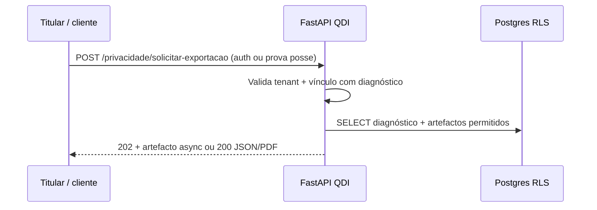
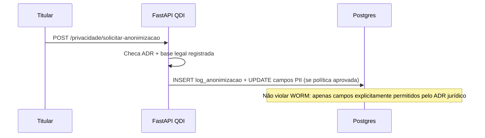
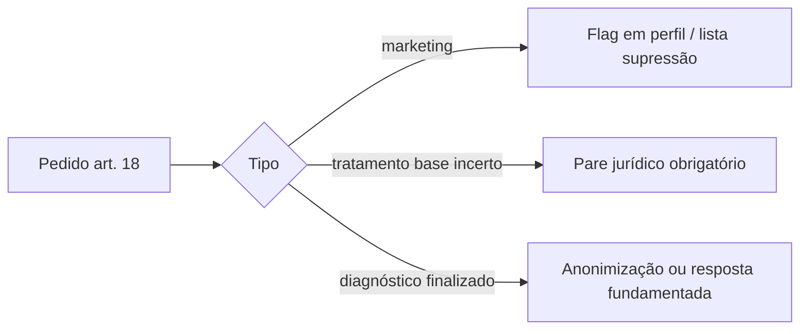

# ADR-012 — LGPD: WORM / evidências × direitos do titular (art. 18 Lei 13.709/2018)

Data: 2026-05-05 · **Atualização decisões produto:** 2026-05-10  
Estado: **aceite — decisões de produto formalizadas (§2)** · **RIPD escrito e registo formal junto do DPO** permanecem entregas jurídico-operacionais fora do código.

## Contexto

O QDI persiste diagnósticos com **imutabilidade pós-finalização** (WORM) em `diagnosticos` e trilhas **append-only** onde aplicável. A LGPD prevê direitos do titular (**acesso**, **correção**, **anonimização**, **eliminação**, **portabilidade**), sempre conforme **base legal** e **finalidade**.

## Decisões já assumidas no produto

- Fluxos **self-service** e **conta na plataforma** coexistem (`.cursor/rules/qdi-gravacao-diagnostico-email.mdc`).  
- Multi-tenant + RLS + auditoria conforme migrações listadas abaixo.

## Decisões de produto (formalizadas — art. 18 × WORM)

### 1. Quem é titular (self-service vs PJ / representante)

- **Titular de dados pessoais é sempre pessoa física** (LGPD, art. 5º, V) — **nunca a PJ enquanto titular**.
- **Self-service:** o titular é o **cadastrante PF** (ex.: identificado no fluxo com **CPF**); o **consentimento** é o dele.
- **Conta na plataforma / PJ:** dados da empresa podem constar no diagnóstico como contexto de negócio; **dados pessoais** (nome, e-mail, telefone de contacto identificável) seguem o titular PF; representação legal de PJ segue regras de prova de representação **fora deste ADR** (contrato / procuração — canal DPO).

### 2. Eliminação vs anonimização em diagnóstico `finalizado`

- **Conflito aparente:** WORM (imutabilidade auditável) × direito de eliminação (LGPD, art. 18, VI).
- **Desenho:** dois planos distintos:
  - **Diagnóstico finalizado** (hash SHA-256, registo append-only): mantido por **base legal de cumprimento de obrigação legal / regulatória** (LGPD, art. 7º, II), com horizonte de **prescrição decadencial** alinhado ao ordenamento tributário — referência **CTN, arts. 173 e 174** (**5 anos**) para o núcleo técnico auditável.
  - **Dados pessoais identificáveis** (nome, e-mail, telefone do titular): podem ser **anonimizados** nos termos do **LGPD, art. 12**, preservando o **conteúdo técnico agregado** do diagnóstico onde a obrigação legal o exija.

### 3. Prazo de retenção (política / RIPD)

Definir **dois prazos sobrepostos** no **RIPD** (relatório de impacto — tratamento em larga escala + decisão automatizada com score + dados sensíveis no domínio tributário ⇒ **RIPD obrigatório**, LGPD, art. 38):

| Categoria | Prazo orientador | Fundamento |
|-----------|------------------|------------|
| Diagnóstico finalizado (hash + conteúdo técnico) | **5 anos** | CTN, art. 174 (prescrição decadencial; referência para núcleo fiscal-auditável) |
| Dados pessoais do titular (consentimento) | **até cancelamento + 6 meses** | Revogação do consentimento (LGPD, art. 8º) + ciclo operacional de segurança |
| Logs de auditoria multi-tenant | **5 anos** | Marco Civil da Internet + LGPD, art. 37 (medidas de segurança e comprovação) |

> Engenharia implementa **políticas de retenção / rotinas** após fecho escrito no RIPD e env vars ou tabela de configuração versionada — sem inventar prazo em código sem este ADR + política publicada.

### 4. Portabilidade — formato mínimo fechado

- **JSON estruturado** (máquina-a-máquina — LGPD, art. 18, V), com **JSON Schema versionado** no repositório (ex.: `docs/schemas/qdi-diagnostico-v1.json`).
- **PDF/A-3** (ISO 19005-3) para leitura humana e arquivo de longa duração, **com o JSON embutido como anexo** (pacote único verificável).
- Inspiração de boas práticas: ecossistemas **SPED** (estrutura versionada) e **e-Social** (XSD/versionamento), sem obrigar formato SPED no QDI.

### 5. Correção pós-finalização (WORM)

- **Nunca** alterar o diagnóstico original persistido (Princípio QDI #4 — imutabilidade WORM).
- Emitir **diagnóstico complementar** em modo **append-only**, com:

| Campo | Significado |
|-------|-------------|
| `tipo` | Constante `RETIFICACAO` |
| `referencia_diagnostico_original` | Hash SHA-256 do diagnóstico original |
| `motivo_retificacao` | Texto obrigatório (motivo da correção) |
| Nova evidência | Novo SHA-256 + **carimbo de tempo** (quando disponível no produto) |

Analogia de negócio: **NF-e + Carta de Correção Eletrônica (CC-e)** — o original permanece; a **verdade operacional** é a **cadeia** original → retificação(ões). Em ERP: **contralançamento**, não `UPDATE` na linha original.

> **Backlog técnico:** modelo de dados e API para `RETIFICACAO` — milestone à parte; anonimização e solicitações já tramitam pelo fluxo `/privacidade/solicitacoes`.

**Workshop J4 (45 min):** incorporar esta ADR na ata; manter **evidência** de alinhamento DPO nos templates `docs/operacao/HANDOFF_DPO_RIPD_TEMPLATE.md`.

## Inventário técnico (repo — `src/infrastructure/db/migrations`)

| Artefacto | Ficheiros / notas |
|-----------|-------------------|
| WORM em `diagnosticos` | `0005b_worm_evidencia_audit.sql` — trigger `tr_diagnosticos_worm_update`; hash + score JSONB |
| WORM granular | `0006_worm_column_granular.sql`, `0012_aceite_lgpd_e_worm.sql`, `0016_locale_relatorio_pdf.sql`, `0017_empresa_faixa_faturamento_opcional.sql`, `0025_worm_permite_reatribuir_tenant_vinculo_lead.sql` — excepção controlada `tenant_id` para vínculo lead |
| Aceite LGPD persistido | `0012_aceite_lgpd_e_worm.sql` |
| Auditoria mutações | `0026_diagnostico_mutacao_audit.sql` — tabela `diagnostico_mutacao_audit`, append-only, RLS |
| WORM CNAE (domínio referência) | `0013_cnae_referencia.sql` — `fn_worm_30_dias`, triggers em tabelas CNAE |
| Solicitações titular LGPD | `0028` — `lgpd_titular_solicitacao` (tramitação) |
| Log anonimização | `0029` — `lgpd_anonimizacao_log` + políticas WORM associadas |
| Retificações append-only | `0035` — `diagnostico_retificacao` (INSERT/SELECT, RLS; sem UPDATE) |

Comando de varredura:

```bash
rg -n "worm|diagnostico_mutacao_audit|anonim|lgpd" src/infrastructure/db/migrations init.sql src/ --glob '*.{sql,py}'
```

## Fluxos art. 18 — desenho (Mermaid)

### Acesso / portabilidade (titular autenticado ou fluxo verificado por e-mail)



### Anonimização pedido (sem eliminação física do registo business)



### Limitação / oposição



> **Nota (2026-05):** endpoints **implementados** para tramitação operacional sob **`/privacidade/solicitacoes`** (Bearer + `Idempotency-Key` no POST — migração `0028`, testes em `tests/integration/test_privacidade_api.py`). Execução de anonimização **deferida**: **`/privacidade/diagnosticos/{id}/anonimizar-respondente`** (migração `0029`, testes dedicados). **Export portável** (§4): **`GET /privacidade/diagnosticos/{id}/export-portabilidade`** com JSON Schema `qdi-diagnostico-export-v1` e opção **PDF com anexo JSON** (`formato=pacote_pdf`). Os diagramas com URI `/privacidade/solicitar-*` permanecem **referência conceitual** para fluxos genéricos art. 18.

## Próximos passos (engenharia)

- [x] Publicar **JSON Schema** versionado (`docs/schemas/qdi-diagnostico-export-v1.schema.json`) + pipeline de **export** portável (**JSON** + **PDF com anexo JSON** via ReportLab + pikepdf — pacote verificável) — §4; API **`GET /privacidade/diagnosticos/{id}/export-portabilidade`** (`formato=json` \| `pacote_pdf`).
- [x] Modelo **retificação** append-only (`tipo: RETIFICACAO`, cadeia de hashes) — §5; migração **`0035_diagnostico_retificacao_append_only.sql`**, **`POST/GET /diagnosticos/{id}/retificacao(|es)`**.
- [x] Tramitação **`/privacidade/solicitacoes`** (POST/GET/PATCH).
- [x] Execução anonimização respondente + **`lgpd_anonimizacao_log`** — migração `0029` + rotas documentadas.
- [x] Suite integração — `tests/integration/test_privacidade_api.py`, `tests/integration/test_lgpd_anonimizacao_executor_postgres.py`.
- [x] Runbook — `docs/operacao/RUNBOOK_DIREITOS_TITULAR_RASCUNHO.md`

**Contrato OpenAPI (pós-ADR):** paths LGPD + retificação incluídos em `docs/api/openapi.generated.json`; regressão em `tests/unit/presentation/test_openapi_generated_contract.py`; `make go-live` executa smoke `GET /public/institucional` e `GET /diagnosticos/metodologia` após `/health`.

## Referências legais e normativas

- Lei **13.709/2018** (LGPD) — arts. **5º**, **7º**, **8º**, **12**, **18**, **37**, **38**, **46**.  
- **CTN** — arts. **173** e **174** (prescrição decadencial — referência para horizonte do núcleo fiscal-auditável).  
- **ISO 19005-3** (PDF/A-3).  
- LC **214/2025** / ABNT **17301:2026** — auditabilidade (contexto de evidências).

## Ligações

- Plano handoff: `docs/operacao/PLANO_HANDOFF_JANELA_23H_LGPD_PWA.md`  
- Runbook rascunho: `docs/operacao/RUNBOOK_DIREITOS_TITULAR_RASCUNHO.md`  
- Templates DPO/RIPD: `docs/operacao/HANDOFF_DPO_RIPD_TEMPLATE.md`  
