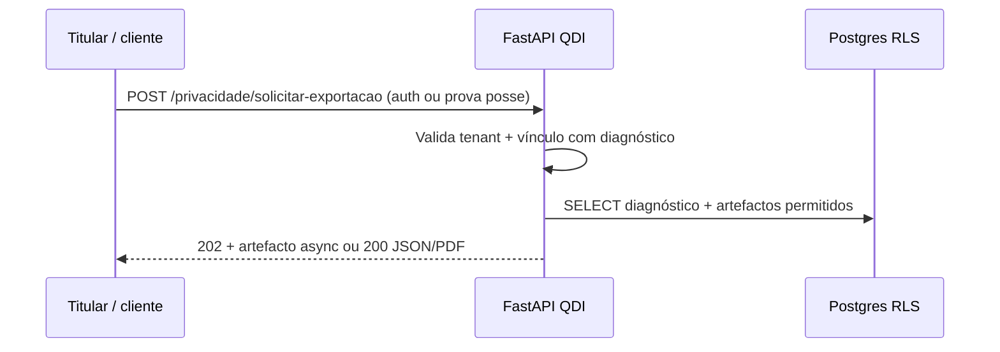
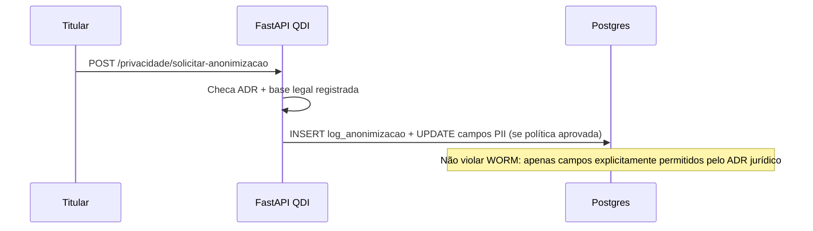
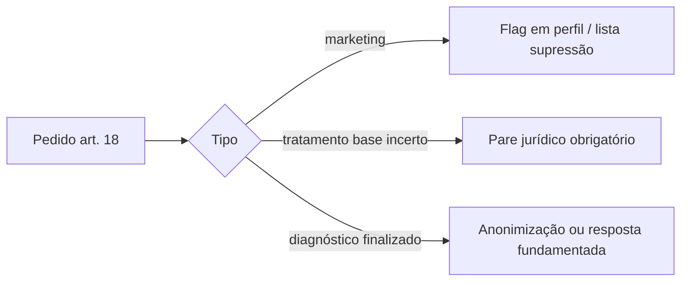

# ADR-012 — LGPD: WORM / evidências × direitos do titular (art. 18 Lei 13.709/2018)

Data: 2026-05-05  
Estado: **aceite para engenharia de desenho — decisões normativas finais bloqueadas a jurídico**

## Contexto

O QDI persiste diagnósticos com **imutabilidade pós-finalização** (WORM) em `diagnosticos` e trilhas **append-only** onde aplicável. A LGPD prevê direitos do titular (**acesso**, **correção**, **anonimização**, **eliminação**, **portabilidade**), sempre conforme **base legal** e **finalidade**.

## Decisões já assumidas no produto

- Fluxos **self-service** e **conta na plataforma** coexistem (`.cursor/rules/qdi-gravacao-diagnostico-email.mdc`).  
- Multi-tenant + RLS + auditoria conforme migrações listadas abaixo.

## Decisões em aberto — **pré-requisito jurídico antes de endpoints art. 18**

| # | Tema | Proposta operacional (eng.) até parecer | Bloqueio |
|---|------|----------------------------------------|----------|
| 1 | **Quem é titular** no self-service (PF/PJ, e-mail respondente, representante)? | Tratar **e-mail verificado do respondente** como canal principal de pedido; PJ com CNPJ: titular = empresa **e** representante conforme contrato — **validar com jurídico** | ✓ jurídico |
| 2 | **Eliminação vs anonimização** em diagnóstico `finalizado` | **Anonimização de PII** + manutenção de metadados agregados necessários a obrigação legal; eliminação física só onde base legal permitir | ✓ jurídico |
| 3 | **Prazo de retenção** | Definir na política de privacidade / RIPD; eng. apenas aplica TTL ou rotina após decisão | ✓ jurídico |
| 4 | **Portabilidade** | Mínimo: export JSON do diagnóstico + referência a PDF se existir; formato fechado após ADR+legal | ✓ jurídico |
| 5 | **Correção** pós-finalização | **Sem** alteração de respostas após `finalizado` (WORM); correções como **novo diagnóstico** ou **nota de contestação** armazenada separadamente — **validar** | ✓ jurídico |

**Workshop J4 (45 min):** gravar ata breve anexando decisões 1–5; até lá, engenharia limita-se a **desenho + runbook**, sem migrações novas de titular.

## Inventário técnico (repo — `src/infrastructure/db/migrations`)

| Artefacto | Ficheiros / notas |
|-----------|-------------------|
| WORM em `diagnosticos` | `0005b_worm_evidencia_audit.sql` — trigger `tr_diagnosticos_worm_update`; hash + score JSONB |
| WORM granular | `0006_worm_column_granular.sql`, `0012_aceite_lgpd_e_worm.sql`, `0016_locale_relatorio_pdf.sql`, `0017_empresa_faixa_faturamento_opcional.sql`, `0025_worm_permite_reatribuir_tenant_vinculo_lead.sql` — excepção controlada `tenant_id` para vínculo lead |
| Aceite LGPD persistido | `0012_aceite_lgpd_e_worm.sql` |
| Auditoria mutações | `0026_diagnostico_mutacao_audit.sql` — tabela `diagnostico_mutacao_audit`, append-only, RLS |
| WORM CNAE (domínio referência) | `0013_cnae_referencia.sql` — `fn_worm_30_dias`, triggers em tabelas CNAE |

Comando de varredura:

```bash
rg -n "worm|diagnostico_mutacao_audit|anonim" src/infrastructure/db/migrations init.sql src/ --glob '*.{sql,py}'
```

## Fluxos art. 18 — desenho (Mermaid)

### Acesso / portabilidade (titular autenticado ou fluxo verificado por e-mail)



### Anonimização pedido (sem eliminação física do registo business)



### Limitação / oposição



> **Nota (2026-05):** endpoints **implementados** para tramitação operacional sob **`/privacidade/solicitacoes`** (Bearer + `Idempotency-Key` no POST — migração `0028`, testes em `tests/integration/test_privacidade_api.py`). Os diagramas nomeiam URIs históricas de exportação/anónimização directa (`/privacidade/solicitar-*`) como **referência conceitual**; o modelo actual passa pelo registo typed de solicitação até evoluções WORM+PII.

## Próximos passos (engenharia **após** parecer jurídico)

- [ ] Modelo `log_anonimizacao` (ou equivalente) alinhado a RLS (execução automática/anónima ainda pendente conforme política).
- [x] Prefixo **`/privacidade`** com auth forte — rotas **`/solicitacoes`** (POST/GET/PATCH) MVP.
- [x] Suite integração LGPD específica — `tests/integration/test_privacidade_api.py` (isolamento por tenant JWT).
- [x] Runbook rascunho — `docs/operacao/RUNBOOK_DIREITOS_TITULAR_RASCUNHO.md`

## Referências legais

- Lei **13.709/2018** — arts. **18**, **16**, **46**.  
- LC **214/2025** / ABNT **17301:2026** — auditabilidade (contexto de evidências).

## Ligações

- Plano handoff: `docs/operacao/PLANO_HANDOFF_JANELA_23H_LGPD_PWA.md`  
- Runbook rascunho: `docs/operacao/RUNBOOK_DIREITOS_TITULAR_RASCUNHO.md`  
- Templates DPO/RIPD: `docs/operacao/HANDOFF_DPO_RIPD_TEMPLATE.md`  
