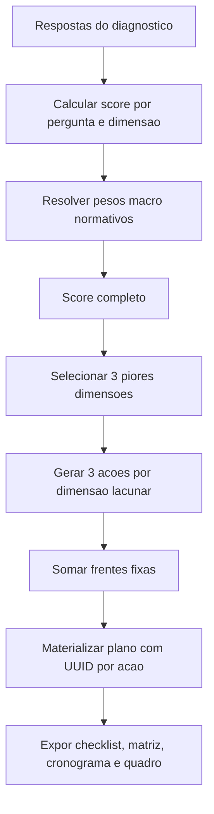

# Modelo Atual do Plano de Implantacao

## Definicoes

| Termo | Definicao no QDI |
|---|---|
| Diagnostico | Avaliacao da prontidao tributaria da empresa para a Reforma Tributaria. |
| Dimensao | Eixo de maturidade usado no score: fiscal, estrategica, contabil, financeira, operacional, tecnologica e compliance ABNT. |
| Pergunta | Item do catalogo com peso, tipo, base legal e condicao de exibicao. |
| Score por dimensao | Media ponderada das respostas aplicaveis dentro da dimensao. |
| Score geral | Media ponderada das dimensoes com pesos macro. |
| Frente de trabalho | Agrupador de acoes no checklist do plano. |
| Acao | Item operacional com descricao, responsavel sugerido, prazo, criticidade, base legal e prioridade. |
| Plano materializado | Snapshot persistido das linhas de acao, matriz e cronograma com UUID estavel por acao. |
| Quadro de implantacao | Visao editavel do plano no painel, com prazo meta, comentarios e descricao personalizada. |

## Como o motor decide as acoes hoje

## Quantidade de acoes geradas

| Perfil | Sem score dinamico | Com score dinamico |
|---|---:|---:|
| Empresa menor que medio/grande | 14 acoes | 23 acoes |
| Empresa medio/grande | 18 acoes | 27 acoes |

## Frentes fixas

| Frente | Quando aparece | Acoes |
|---|---|---|
| Governanca e Comite | Sempre | Constituir comite tributario; aprovar plano-mestre de implantacao. |
| TI / ERP / Sistema Fiscal | Apenas medio/grande | Mapear lacunas funcionais do ERP; aplicar patches do fornecedor. |
| Cadastros Mestres | Apenas medio/grande | Revisar cadastro de itens; atualizar CST CBS por item/servico. |
| Contratos e Clausulas Tributarias | Sempre | Padronizar clausula gross-up; negociar aditivos com fornecedores estrategicos. |
| Checklist ABNT NBR 17301 | Sempre | 10 controles binarios de politica, riscos, controles, monitoramento, PDCA, treinamento, nao conformidades, indicadores, terceiros e continuidade fiscal/TI. |

## Frente dinamica por lacunas do score

O motor ordena as dimensoes pelo menor score e escolhe as tres piores. Para cada uma, gera tres acoes. A criticidade e:

| Score da dimensao | Criticidade |
|---:|---|
| Menor que 45 | Critica |
| Maior ou igual a 45 | Alta |

## Acoes dinamicas por dimensao

| Dimensao | Acoes geradas quando a dimensao esta entre as 3 piores |
|---|---|
| Fiscal | Auditar cadastro fiscal; conduzir oficina fiscal/controladoria sobre creditos e regimes; definir roteiro de homologacao NF-e/NFS-e. |
| Financeira | Construir modelo mensal de fluxo de caixa CBS/IBS; recalcular margem por linha; rever clausulas de repasse e preco minimo. |
| Contabil | Parametrizar contas auxiliares CBS/IBS; instituir conciliacao mensal SPED x razao; documentar politica de estimativas e provisoes. |
| Estrategica | Preparar dossie executivo; alinhar calendario decisorio ao cronograma legal; mapear M&A/expansao face a riscos fiscais. |
| Operacional | Documentar POP pedido-faturamento-logistica-devolucao; executar inventario piloto; definir matriz RACI por unidade/ERP. |
| Tecnologica | Publicar roteiro tecnico ERP/modulo fiscal; dimensionar homologacao/mascaramento/carga; avaliar EDI/APIs com clientes e fornecedores. |
| Compliance ABNT | Executar analise formal de lacunas ABNT; implementar trilha PDCA de evidencias; agendar autoconferencia independente. |

## Matriz de impacto atual

| Departamento | Impacto resumido | Criticidade |
|---|---|---|
| Fiscal | Apuracao paralela de PIS/COFINS e CBS ao longo de 2026 | Critica |
| Comercial | Recalibragem de precificacao com novas aliquotas e creditos | Alta |
| TI | Adequacao do ERP e NF-e conforme NT 2025.002 | Critica |
| Juridico | Revisao e aditivos de contratos vigentes | Media |
| Financeiro / Controladoria | Projecao de fluxo de caixa com CBS/IBS | Alta |
| RH / Folha | Retencoes e beneficios com impacto em bases correlatas | Media |

## Cronograma atual

| Fase | Foco |
|---|---|
| Curto prazo (0-12 meses) | Governanca, comite tributario e mapeamento fiscal/TI. |
| Medio prazo (12-24 meses) | Cadastros, contratos e ERP. |
| Longo prazo (24-36 meses) | Apuracao paralela e creditos pre-reforma. |
| 36-60 meses | Convergencia de aliquotas e reducao de regimes especiais. |
| 60-96 meses | IBS/CBS plenos, politica de precos e conformidade tributaria. |

