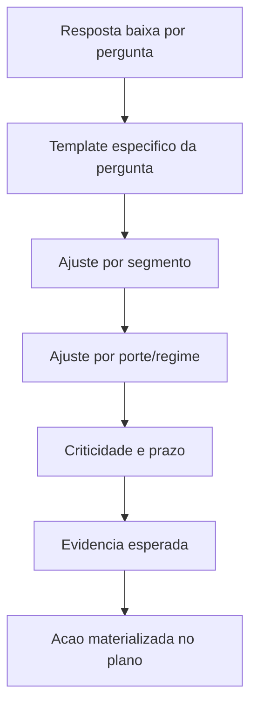

# Melhorias Recomendadas para o Plano de Implantacao

## Backlog priorizado

| Prioridade | Melhoria | Por que importa | Implementacao sugerida |
|---|---|---|---|
| P0 | Materializar acoes por pergunta critica | Aumenta explicabilidade e personalizacao do plano | Criar mapa `codigo_pergunta -> template_acao`; gerar acoes quando resposta for baixa. |
| P0 | Levar segmento para o checklist final | Hoje o segmento filtra perguntas, mas pouco muda o plano | Criar frentes setoriais: Varejo/ICMS-ST, Industria/cadeia, Servicos/NFS-e, Agro/credito presumido. |
| P0 | Associar cada acao a evidencia esperada | Transforma plano em auditoria executavel | Adicionar campos `evidencia_esperada`, `tipo_evidencia` e `criterio_conclusao`. |
| P1 | Criar status operacional por acao | O quadro hoje infere finalizacao por prazo + comentario | Adicionar status: pendente, em_andamento, bloqueada, concluida, cancelada. |
| P1 | Separar prazo sugerido de prazo meta | Ja existe prazo meta no quadro, mas a semantica pode ficar mais clara | Manter `prazo_sugerido_texto`; adicionar `prazo_sugerido_dias` para ordenacao. |
| P1 | Calcular criticidade por pergunta | Evita que toda dimensao vire critica por media | Criticidade = peso da pergunta + resposta + segmento + regime + porte. |
| P1 | Gerar matriz por departamento dinamica | Matriz fixa e boa para MVP, mas pouco personalizada | Criar matriz a partir das acoes geradas e nao de lista fixa. |
| P2 | Detalhar ABNT em PDCA | Diferencial QDI ainda aparece pouco no output | Mapear perguntas ABNT para Plan/Do/Check/Act e gerar plano por eixo. |
| P2 | Criar score de cobertura do plano | Mede se cada gap tem acao correspondente | `gaps_com_acao / gaps_identificados`. |
| P2 | Criar versao do motor de recomendacao | Facilita auditoria e comparacao historica | Persistir `versao_motor_plano`, `versao_catalogo` e `versao_pesos`. |

## Modelo de dados sugerido para v2

| Campo | Descricao |
|---|---|
| `pergunta_codigo` | Codigo da pergunta que originou a acao, quando aplicavel. |
| `dimensao` | Dimensao do gap. |
| `segmento_aplicavel` | Comercio, industria, servicos, agro ou geral. |
| `regime_aplicavel` | Simples, lucro presumido, lucro real ou geral. |
| `resposta_gatilho` | Valor que disparou a acao. |
| `evidencia_esperada` | Artefato minimo para considerar a acao concluida. |
| `criterio_conclusao` | Regra objetiva de aceite. |
| `prazo_sugerido_dias` | Prazo numerico para ordenacao e SLA. |
| `status` | Estado operacional da acao. |
| `dependencias` | Outras acoes que precisam ocorrer antes. |

## Regras de geracao recomendadas

## Quick wins

1. Criar um arquivo JSON/YAML de templates por pergunta sem alterar o motor de score.
2. Adicionar `evidencia_esperada` nas acoes dinamicas ja existentes.
3. Criar frentes setoriais no `ConsultoriaService` usando `empresa.setor_macro`.
4. Expor no PDF uma secao "por que esta acao apareceu", apontando dimensao, pergunta e resposta.
5. Atualizar o quadro de implantacao para mostrar origem: M07, ABNT10, pergunta especifica ou frente setorial.

## Criterios de aceite para a proxima evolucao

| Criterio | Meta |
|---|---|
| Cobertura de gaps | 100% das respostas `nao` ou escala 1-2 geram pelo menos uma acao. |
| Segmentacao | Comercio, industria, servicos e agro geram pelo menos uma frente propria quando aplicaveis. |
| Rastreabilidade | Toda acao dinamica aponta dimensao, pergunta ou origem editorial. |
| Auditoria | Toda acao possui base legal ou justificativa de melhores praticas. |
| Operacao | Toda acao possui evidencia esperada e criterio de conclusao. |

