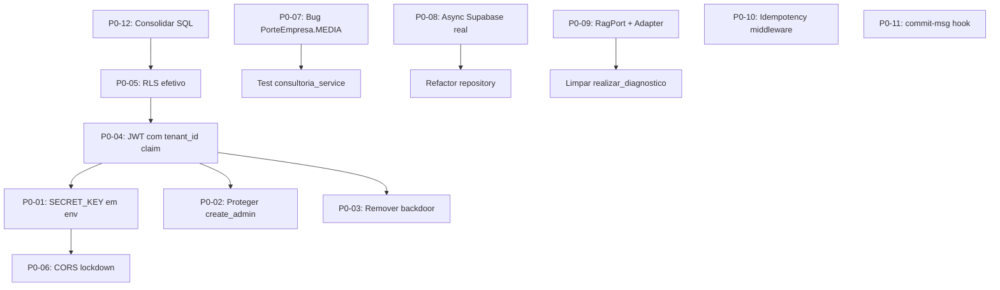

# Plano de Ação — Sprint S0.5 (Hardening)

| Campo | Valor |
|---|---|
| **Janela** | 01/05/2026 (sex) → 03/05/2026 (dom — folga) → 04/05/2026 (seg início S1) |
| **Duração efetiva** | 2 dias úteis × 5,5h = **~11h líquidas** |
| **Aceleração IA** | 2× → **~22h equivalentes** |
| **Demanda P0** | 14-18h equivalentes — **cabe** |
| **Resultado esperado** | Eliminar todos os 12 P0 antes da S1 |

> **Observação de saúde (Allan):** sexta 01/05 é feriado do Trabalhador. Domingo 03/05 é OFF inegociável. Sugiro concentrar o esforço em sábado 02/05 (manhã, ~5h) e segunda 04/05 manhã (3-4h) antes de iniciar formalmente a S1 à tarde.

---

## Premissas e ordem de execução

A ordem foi desenhada para **resolver dependências encadeadas** — alguns P0 desbloqueiam outros:



---

## DIA 1 — Sábado 02/05/2026 (manhã, 5h)

### Bloco 1 (08:00-09:30) — Schema SQL e RLS efetivo

**Objetivo:** consolidar fonte única de verdade de schema com RLS habilitado.

**Tarefas:**

1. **P0-12** — Decidir fonte da verdade entre `init.sql` e `001_initial_schema.sql`:
   - ✅ Manter `src/infrastructure/db/migrations/` (criar)
   - ❌ Deletar `init.sql` raiz
   - Criar `0001__criar_tabela_diagnosticos.sql` com colunas unificadas + RLS + constraints
   - Criar `0002__criar_tabela_admins.sql`
   - Atualizar `docker-compose.yml` para montar a pasta `migrations/`

2. **P0-05** — Habilitar RLS em ambiente de dev:
   - Adicionar `ALTER TABLE ... ENABLE ROW LEVEL SECURITY` em todas as tabelas `qdi.*`
   - Policies por papel (`anon`, `authenticated`, `service_role`)
   - Testar com `psql` que tenant_id != JWT.tenant_id NÃO retorna linhas

**Entregáveis:**

- `src/infrastructure/db/migrations/0001__criar_tabela_diagnosticos.sql`
- `src/infrastructure/db/migrations/0002__criar_tabela_admins.sql`
- `init.sql` removido
- `docker-compose.yml` ajustado

**Pausa:** 09:30-09:45 (hidratação + glicemia)

---

### Bloco 2 (09:45-11:30) — Auth seguro com JWT custom

**Objetivo:** transformar tenant_id em claim assinado.

**Tarefas:**

1. **P0-01** — Mover `SECRET_KEY` para env:
   ```python
   # src/infrastructure/config/settings.py (novo)
   from pydantic_settings import BaseSettings, SettingsConfigDict

   class Settings(BaseSettings):
       jwt_secret_key: str
       jwt_algorithm: str = "HS256"
       jwt_expire_minutes: int = 60 * 8  # 8h, não 24h
       model_config = SettingsConfigDict(env_file=".env", extra="ignore")

   settings = Settings()  # type: ignore
   ```
   - Gerar nova chave: `python -c "import secrets; print(secrets.token_urlsafe(64))"`
   - Adicionar `JWT_SECRET_KEY=...` em `.env` (gitignored)
   - Atualizar `.env.example` SEM o valor

2. **P0-04** — JWT custom claim com `tenant_id`:
   ```python
   # auth_router.py — login agora exige escolha de tenant
   def create_access_token(user_id: UUID, tenant_id: UUID) -> str:
       payload = {
           "sub": str(user_id),
           "tenant_id": str(tenant_id),
           "exp": datetime.now(UTC) + timedelta(minutes=settings.jwt_expire_minutes),
       }
       return jwt.encode(payload, settings.jwt_secret_key, settings.jwt_algorithm)
   ```

   ```python
   # dependencies.py — extrair tenant_id do JWT, NÃO do header cleartext
   from fastapi.security import HTTPBearer, HTTPAuthorizationCredentials

   bearer = HTTPBearer()

   def get_current_user_tenant(
       cred: Annotated[HTTPAuthorizationCredentials, Depends(bearer)]
   ) -> tuple[UUID, UUID]:
       try:
           payload = jwt.decode(cred.credentials, settings.jwt_secret_key, [settings.jwt_algorithm])
           return UUID(payload["sub"]), UUID(payload["tenant_id"])
       except (jwt.PyJWTError, KeyError, ValueError):
           raise HTTPException(status_code=401, detail="Token inválido ou expirado")
   ```

3. **P0-02** — Proteger `create_admin`:
   - Remover endpoint público
   - Criar comando CLI `python -m src.scripts.criar_admin`

4. **P0-03** — Remover backdoor:
   - Deletar linhas 64-66 do `auth_router.py`
   - Falhar limpo com 401

5. **P0-15** — Substituir `datetime.utcnow()` por `datetime.now(UTC)` (também em P1-15)

**Entregáveis:**

- `src/infrastructure/config/settings.py`
- `auth_router.py` refatorado
- `dependencies.py` com `get_current_user_tenant`
- `src/scripts/criar_admin.py`
- `.env.example` sem segredos
- Teste `tests/unit/presentation/test_auth_router.py` com 5 cenários

**Pausa:** 11:30-11:45 (almoço)

---

### Bloco 3 (12:30-13:00) — CORS lockdown

**Tarefa única:**

**P0-06** — Reescrever `CORSMiddleware`:

```python
# main.py
import os

ALLOWED_ORIGINS = os.getenv(
    "CORS_ALLOWED_ORIGINS",
    "http://localhost:3000"
).split(",")

app.add_middleware(
    CORSMiddleware,
    allow_origins=ALLOWED_ORIGINS,
    allow_credentials=True,
    allow_methods=["GET", "POST", "PUT", "PATCH", "DELETE"],
    allow_headers=["Content-Type", "Authorization", "Idempotency-Key"],
    max_age=3600,
)
```

**Entregável:** `main.py` ajustado + `.env.example` documentando `CORS_ALLOWED_ORIGINS`.

---

## DIA 2 — Segunda 04/05/2026 (manhã, 4h — antes de S1 oficial)

### Bloco 4 (08:00-09:30) — Bugs runtime + Clean Arch

**P0-07** — Corrigir `consultoria_service.py:44`:

```python
# Antes:
if diagnostico.empresa.porte in [PorteEmpresa.GRANDE, PorteEmpresa.MEDIA]:

# Depois:
if diagnostico.empresa.porte in (PorteEmpresa.GRANDE, PorteEmpresa.MEDIO, PorteEmpresa.ENTERPRISE):
```

Adicionar teste:

```python
# tests/unit/application/test_consultoria_service.py
def test_gerar_checklist_para_porte_medio_nao_explode():
    diag = _construir_diagnostico_fake(porte=PorteEmpresa.MEDIO)
    frentes = ConsultoriaService.gerar_checklist(diag)
    assert any(f.nome == "TI / ERP / Sistema Fiscal" for f in frentes)
```

**P0-08** — Migrar para `supabase.AsyncClient`:

```python
# dependencies.py
from supabase import create_async_client, AsyncClient

@lru_cache(maxsize=1)
async def _get_supabase_async_client() -> AsyncClient:
    return await create_async_client(
        settings.supabase_url,
        settings.supabase_anon_key,
    )
```

**P0-09** — Criar port `RagBaseConhecimentoPort`:

```python
# src/application/ports/rag_base_conhecimento.py
from abc import ABC, abstractmethod

class RagBaseConhecimentoPort(ABC):
    @abstractmethod
    async def buscar_evidencias(
        self, query: str, top_k: int = 3, score_minimo: float = 0.65
    ) -> list[Evidencia]:
        """Retorna evidências citáveis (princípio §10.7)."""
        ...

# src/infrastructure/adapters/rag_filesystem.py
class FileSystemRagAdapter(RagBaseConhecimentoPort):
    """Adapter MVP que lê arquivos texto. Será substituído por pgvector."""
    def __init__(self, base_dir: Path):
        self.base_dir = base_dir

    async def buscar_evidencias(...):
        # implementação simples por enquanto
```

Refatorar `realizar_diagnostico.py` para receber `rag_service: RagBaseConhecimentoPort` via DI e remover `os.path.join` da camada Application.

**Entregáveis:** 3 arquivos novos, 2 testes passando.

---

### Bloco 5 (09:30-10:30) — Idempotência + commits PT-BR

**P0-10** — Middleware de idempotência:

```python
# src/presentation/api/middleware/idempotency.py
from fastapi import Request, Response
from starlette.middleware.base import BaseHTTPMiddleware
import json
from cachetools import TTLCache

_cache = TTLCache(maxsize=10_000, ttl=3600)  # MVP — Redis na produção

class IdempotencyMiddleware(BaseHTTPMiddleware):
    async def dispatch(self, request: Request, call_next):
        if request.method != "POST":
            return await call_next(request)

        key = request.headers.get("Idempotency-Key")
        if not key:
            return Response(
                content=json.dumps({"detail": "Idempotency-Key header obrigatório"}),
                status_code=400,
                media_type="application/json",
            )

        if key in _cache:
            return Response(
                content=_cache[key]["body"],
                status_code=_cache[key]["status"],
                media_type="application/json",
                headers={"X-Idempotent-Replay": "true"},
            )

        response = await call_next(request)
        body = b"".join([chunk async for chunk in response.body_iterator])
        _cache[key] = {"body": body, "status": response.status_code}
        return Response(content=body, status_code=response.status_code, media_type="application/json")
```

Registrar no `main.py`.

**P0-11** — Hook `commit-msg`:

```bash
# .githooks/commit-msg
#!/bin/sh
PADRAO="^(feat|fix|chore|arch|refactor|test|docs|perf|build|ci)\(qdi(-[a-z]+)?\): .+$"
if ! grep -qE "$PADRAO" "$1"; then
    echo "❌ Mensagem de commit não segue Conventional Commits PT-BR"
    echo "   Formato: feat(qdi-domain): adicionar entidade Recomendacao"
    echo "   Tipos válidos: feat, fix, chore, arch, refactor, test, docs, perf, build, ci"
    exit 1
fi
```

```bash
git config core.hooksPath .githooks
chmod +x .githooks/commit-msg
```

**Entregáveis:** middleware + hook + atualização do README com convenção.

---

### Bloco 6 (10:30-11:30) — Validação e ADR-001

Rodar:

```bash
make test          # esperar todos passando
make lint          # zero erros
make type-check    # zero erros
make dev           # subir e bater /health
```

Criar **ADR-001 — Decisões fundacionais S0.5**:

```markdown
# ADR-001 — Decisões fundacionais (S0.5 Hardening)

Data: 2026-05-04 · Status: Aceito

## Contexto
Auditoria de 30/04/2026 identificou 12 P0. Esta S0.5 resolveu-os antes de S1.

## Decisões

1. **JWT com claim `tenant_id`** — header `X-Tenant-ID` cleartext eliminado
2. **Pasta `src/infrastructure/db/migrations/`** com Supabase CLI (futuramente Alembic)
3. **Padrão de port: `ABC` + `@abstractmethod`** (uniformizar de Protocol)
4. **Estrutura de pastas em minúsculas** — pragmática (Python idiomatic) — REVISITA na §10.9 INSTRUCAO_KICKOFF
5. **Idempotency-Key obrigatório em todo POST** — middleware no presentation
6. **Anthropic Claude como LLM primário, Ollama apenas em DEV**
7. **Commits PT-BR via hook `commit-msg`** com escopo `qdi-*`

## Consequências
- ✅ RLS multi-tenant funcional
- ✅ Dependências de infraestrutura saneadas
- ⚠️ Diverge do princípio §10.9 (PT-MAIÚSCULAS) — exige decisão executiva do Allan
```

---

## Critérios de aceitação da S0.5

- [ ] Todos os 12 P0 resolvidos com commit em PT-BR
- [ ] `make test` retorna 100% verde
- [ ] `make lint` retorna zero warnings
- [ ] `make type-check` retorna zero erros
- [ ] Endpoint `POST /diagnosticos/` exige JWT válido com `tenant_id` claim
- [ ] Endpoint `POST /diagnosticos/` exige `Idempotency-Key`
- [ ] `init.sql` removido; migrations rodam via Supabase CLI ou compose
- [ ] Hook `commit-msg` rejeita mensagens em inglês
- [ ] ADR-001 publicado em `docs/adrs/`
- [ ] Bug `PorteEmpresa.MEDIA` corrigido + teste
- [ ] Camada Application sem acesso a filesystem (RagPort introduzido)

---

## Após a S0.5 — entrada na S1

Com os P0 zerados, a S1 (04/05 → 15/05) pode focar nos seus objetivos originais sem dívida estrutural:

1. Domain entities completas (Recomendação, Finding, Evidencia)
2. Wizard core com 25-40 perguntas reais (P1-12)
3. RLS testado com 5 cenários de integration (P2-14)
4. RAG citável Anthropic Claude (P1-11)

**Sugestão estratégica:** consolidar a Sprint S0.5 num PR único (`feat(qdi-hardening): sprint S0.5 resolver 12 P0`) para deixar registro claro do hardening.

---

## Recursos públicos para estudo durante S0.5

- **Pydantic Settings v2** — configuração via env: `https://docs.pydantic.dev/latest/concepts/pydantic_settings/`
- **PyJWT vs python-jose** — comparativo: `https://pyjwt.readthedocs.io/en/stable/`
- **FastAPI Security** — JWT bearer: `https://fastapi.tiangolo.com/tutorial/security/`
- **Supabase Async client (Python)** — `https://supabase.com/docs/reference/python/async-api`
- **PostgreSQL Row Level Security best practices** — `https://supabase.com/docs/guides/database/postgres/row-level-security`
- **Conventional Commits oficial** — `https://www.conventionalcommits.org/pt-br/v1.0.0/`
- **OWASP API Security Top 10 (2023)** — relevante para P0-01..P0-06: `https://owasp.org/API-Security/editions/2023/en/0x11-t10/`
- **Idempotency in REST APIs (Stripe blog)** — referência canônica: `https://stripe.com/blog/idempotency`

---

**Autor:** Claude · **Data:** 30/04/2026 · **Próximo:** `04_CHECKLIST_PRINCIPIOS_NAO_NEGOCIAVEIS.md`
