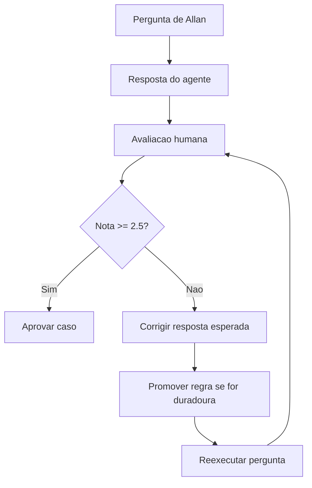

# Ensino Supervisionado da Memoria QDI

## Resposta direta

Ensinar o agente local nao significa treinar pesos do modelo. Significa criar um ciclo supervisionado de perguntas, respostas, correcao humana, promocao de regras para memoria e testes de regressao.

## Ciclo padrao



## Rubrica

Nota de 0 a 3:

| Criterio | Pergunta |
|---|---|
| Arquitetura | Respeitou Clean Architecture e paths reais? |
| Stack | Usou Python 3.12, FastAPI, Pydantic v2, Supabase quando aplicavel? |
| Fonte | Citou fonte ou declarou base insuficiente? |
| Escopo | Respeitou MVP do QDI? |
| Acionabilidade | A resposta permite executar? |
| Tom | Tratou Allan como tecnico experiente? |

Media:

```text
media = soma / 6
```

Interpretacao:

| Media | Decisao |
|---:|---|
| 0.0 a 1.4 | rejeitar e corrigir memoria |
| 1.5 a 2.4 | aceitar parcialmente |
| 2.5 a 3.0 | aprovar |

## Quando promover uma correcao para memoria

Promova se a regra for:

- recorrente;
- aplicavel a mais de um caso;
- alinhada ao `AGENTS.md`;
- validada por Allan;
- nao contradiz documentos oficiais.

Nao promova se for:

- opiniao momentanea;
- detalhe de uma tarefa isolada;
- regra ainda incerta;
- conteudo tributario sem fonte primaria.

## Primeiros 10 casos supervisionados

| Caso | Tema | Pergunta |
|---|---|---|
| SUP-001 | Escopo QDI | O que fica fora do MVP do QDI? |
| SUP-002 | Clean Architecture | Onde fica uma regra pura de score? |
| SUP-003 | Adapter LLM | Devemos criar adapter novo ou auditar existente? |
| SUP-004 | Fonte | Pode responder CBS/IBS sem fonte? |
| SUP-005 | RAG | O que fazer quando nao ha fonte suficiente? |
| SUP-006 | Multi-tenant | Como tratar tenant_id em IA? |
| SUP-007 | Evidencia | Como preservar auditabilidade? |
| SUP-008 | Stack | Quando usar Pydantic v2? |
| SUP-009 | Tom | Como explicar para Allan sem infantilizar? |
| SUP-010 | Roadmap | Qual fase vem antes de integrar ao produto? |

Use o template:

```text
templates/CASO_SUPERVISIONADO_TEMPLATE.md
```

