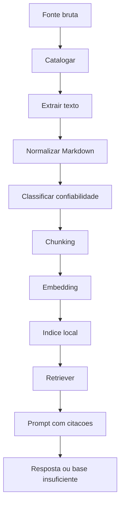

# Politica de Fontes e RAG Local

## Resposta direta

O Ollama nao le arquivos sozinho. As fontes precisam ser catalogadas, extraidas, normalizadas, quebradas em chunks, vetorizadas e injetadas no prompt por um script ou adapter.

Para o QDI, a regra e simples: **fonte tributaria sem citacao valida nao sustenta resposta**.

## Classificacao de fontes

| Classe | Tipo | Pode sustentar conclusao tributaria? |
|---|---|---|
| A | Constituicao, EC, LC, lei, ato oficial, nota tecnica oficial | Sim |
| B | Documentos QDI aprovados, ADRs, PRD, metodologia | Sim para arquitetura/produto |
| C | Aula, artigo, anotacao, transcricao, parecer nao validado | Nao sozinho |
| D | Conteudo incerto, rascunho, comentario solto | Nao |

## Politica de resposta

| Situacao | Resposta esperada |
|---|---|
| Fonte A encontrada | Responder citando fonte |
| Fonte B encontrada para tema de produto/codigo | Responder citando documento |
| Apenas fonte C encontrada | Explicar que precisa validar contra fonte primaria |
| Fontes conflitantes | Declarar conflito e pedir validacao |
| Sem fonte suficiente | Responder "base insuficiente" |

## Estrutura de fontes sugerida

```text
dominio_fiscal/
├── bruto/
│   ├── legislacao/
│   ├── notas_tecnicas/
│   ├── aulas/
│   └── artigos/
├── extraido/
│   ├── legislacao/
│   ├── notas_tecnicas/
│   ├── aulas/
│   └── artigos/
├── catalogo_fontes.yml
└── INDEX.md
```

## Metadados minimos

```yaml
id: FONTE-001
titulo: "Lei Complementar 214/2025"
tipo: "legislacao"
classe: "A"
origem: "Planalto"
url: "https://www.planalto.gov.br/"
data_acesso: "2026-05-17"
vigencia_inicio: null
vigencia_fim: null
status: "ativa"
restricoes: []
```

## Pipeline



## Corpus piloto recomendado

Comecar pequeno:

| ID | Fonte | Classe | Uso |
|---|---|---|---|
| FONTE-001 | EC 132/2023 | A | base constitucional |
| FONTE-002 | LC 214/2025 | A | regra principal CBS/IBS |
| FONTE-003 | `docs/refs/01_PRD_BASE.md` | B | escopo produto |
| FONTE-004 | `docs/refs/02_MOSCOW_FEATURES.md` | B | priorizacao |
| FONTE-005 | `docs/refs/03_GAP_ANALYSIS.md` | B | lacunas |

## Gate da Fase D

Toda resposta RAG deve retornar:

```md
## Resposta

...

## Fontes usadas

- FONTE-001 — titulo — trecho/secao/artigo

## Lacunas

- ...
```

Se nao houver fonte:

```text
Base insuficiente para responder com seguranca a partir das fontes locais.
```

