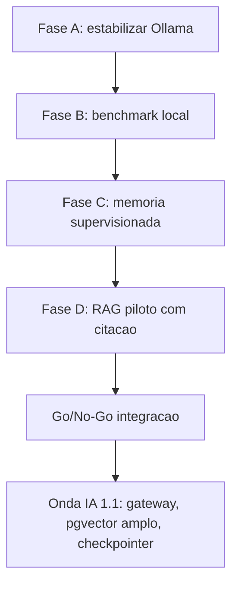

# Roadmap IA Local QDI V1

> **Status:** Proposto  
> **Horizonte:** Onda 1.0 ate 2026-06-30; Onda IA 1.1 pos-MVP  
> **Limite operacional:** 8 a 10h/semana

## Visao geral

## Onda 1.0 — ate 30/jun/2026

### Fase A — Estabilizar Ollama

Objetivo: garantir que o ambiente local responde de forma previsivel.

Entregaveis:

- `reports/FASE_A_RELATORIO.md`
- lista de modelos instalados;
- versao client/server do Ollama;
- smoke test simples;
- registro de problemas de porta, servidor duplicado ou divergencia de versao.

Documento operacional:

- `FASE_A_CHECKLIST_OLLAMA.md`

### Fase B — Benchmark local

Objetivo: escolher modelo por dados, nao por preferencia.

Entregaveis:

- `reports/FASE_B_BENCHMARK_MODELOS.md`
- matriz 3 modelos x 5 perguntas;
- decisao de modelo base;
- recomendacao de embedding inicial.

Documento operacional:

- `FASE_B_BENCHMARK_MODELOS.md`

### Fase C — Memoria supervisionada

Objetivo: criar ciclo de ensino humano controlado.

Entregaveis:

- 10 casos supervisionados;
- rubrica de avaliacao;
- regras promovidas para contexto;
- registro de correcoes rejeitadas.

Documento operacional:

- `ENSINO_SUPERVISIONADO_QDI.md`

### Fase D — RAG piloto com citacao

Objetivo: validar busca e resposta com fonte antes de ampliar corpus.

Entregaveis:

- catalogo inicial de fontes;
- chunks piloto;
- script local de pergunta;
- validacao: fonte valida ou base insuficiente;
- decisao go/no-go para ampliar corpus.

Documento operacional:

- `FONTES_E_RAG_POLITICA.md`

## Onda IA 1.1 — pos-MVP / apos dados reais

### Fase E — Integracao ao gateway LLM existente

Objetivo: evoluir `src/infrastructure/llm/gateway_router.py` e adapters existentes, sem duplicar arquitetura.

Pre-condicoes:

- benchmark concluido;
- RAG piloto validado;
- Allan aprovou DP-004.

### Fase F — RAG Lexiq ampliado

Objetivo: indexar fontes normativas e documentos internos com metadados de vigencia, hierarquia e confiabilidade.

### Fase G — Memoria estrutural do codigo

Objetivo: indexar `src/`, `docs/refs` e ADRs para perguntas sobre arquitetura do QDI.

### Fase H — Checkpointer e memoria episodica

Objetivo: persistir estado conversacional quando o wizard e o fluxo de produto justificarem.

## Calendario sugerido

| Periodo | Foco | Carga sugerida |
|---|---|---:|
| Semana 1 | Fase A | 4 a 6h |
| Semana 2 | Fase B | 6 a 8h |
| Semana 3 | Fase C | 6 a 8h |
| Semanas 4-5 | Fase D | 8 a 10h/semana |
| Semana 6 | consolidacao e go/no-go | 4 a 6h |

## Criterio de parada

Pare e reavalie se ocorrer qualquer item:

- Ollama instavel por mais de 2 blocos de trabalho;
- benchmark sem diferenca clara entre modelos;
- RAG retorna fonte errada em pergunta simples;
- desenvolvimento comeca a competir com tarefas MVP;
- carga semanal passa de 10h.

