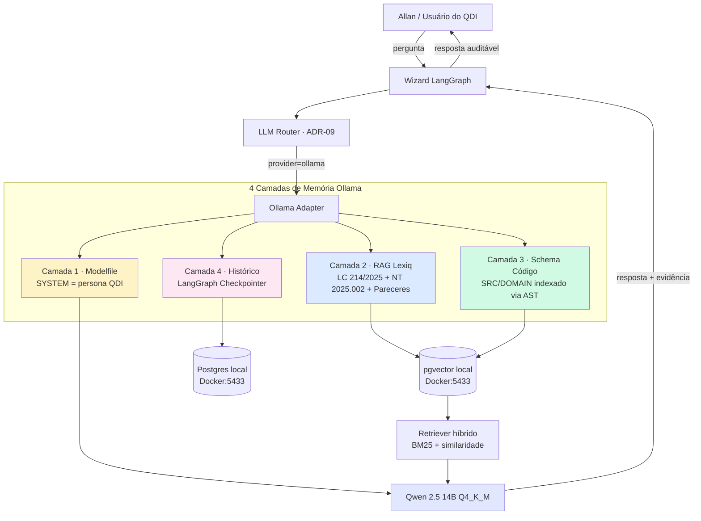

# 00 — Visão Geral: Arquitetura das 4 Camadas de Memória

> **Objetivo:** apresentar a arquitetura conceitual de memória e contexto do Ollama integrado ao QDI, antes de qualquer detalhamento de implementação.

---

## 1. Princípio Fundamental

Um LLM "puro" (modelo + pesos quantizados) é como um **banco Oracle recém-instalado**: o engine existe, mas não há schema, dados, índices ou stored procedures. Para que o Ollama "lembre" do QDI, precisamos popular **quatro camadas distintas de memória**, cada uma com propriedades técnicas próprias:

| Camada | Persistência | Latência leitura | Tamanho típico | Atualização |
|--------|--------------|------------------|----------------|-------------|
| 1 — Paramétrica (Modelfile) | Permanente | Zero (parte do contexto) | ~4-8 KB | Recompilação do modelo |
| 2 — Factual (RAG Lexiq) | Persistente em pgvector | ~50-200 ms por query | ~50-200 MB | Append-only |
| 3 — Estrutural (Schema código) | Persistente em pgvector | ~50-200 ms por query | ~10-30 MB | Reindexação por commit |
| 4 — Episódica (Checkpointer) | Persistente em Postgres | ~10-50 ms por query | Cresce por sessão | Append-only por turno |

---

## 2. Diagrama da Arquitetura



---

## 3. Detalhamento das Camadas

### Camada 1 — Memória Paramétrica (Modelfile)

**O quê:** prompt de sistema embutido permanentemente no modelo via `ollama create`.

**Equivalente Oracle:** `INIT.ORA` + triggers `AFTER LOGON ON SCHEMA` que injetam contexto em toda sessão.

**Contém:**
- Persona dual (Mentor + Arquiteto + Pair Programmer + Instrutor)
- Stack canônica QDI (Python 3.12, FastAPI, Supabase, pgvector...)
- 10 princípios não-negociáveis (multi-tenant, versionamento normativo, RAG citável...)
- Anti-padrões (sem `print()`, sem hardcode de alíquota, sem commit em inglês...)
- Padrão de resposta (Resposta direta → Fundamentação → Código → Próximo passo)

**Tamanho:** ~6 KB · permanente no modelo customizado.

**Atualização:** quando algum princípio QDI muda, recompilar o Modelfile e executar `ollama create qdi-mentor -f Modelfile.qdi-mentor`.

---

### Camada 2 — Memória Factual (RAG sobre Lexiq Tributária)

**O quê:** base vetorial com todos os documentos normativos da Reforma Tributária.

**Equivalente Oracle:** tabelas `TRIB_NORMA` + `TRIB_PARECER` + índice Oracle Text (`CONTEXT`) — só que aqui o índice é semântico (embeddings) ao invés de léxico.

**Documentos ingeridos:**

| Fonte | Volume estimado | Estratégia de chunking |
|-------|-----------------|------------------------|
| LC 214/2025 (texto integral) | ~400 páginas | Por artigo + parágrafos · chunk=800 char |
| EC 132/2023 | ~30 páginas | Por seção · chunk=600 char |
| LC 227/2026 | ~80 páginas | Por artigo · chunk=800 char |
| NT 2025.002 v1.33+ | ~250 páginas | Por seção técnica · chunk=1000 char |
| Pareceres internos PT-001 a PT-011 | 11 docs · ~15 pág cada | Por capítulo · chunk=800 char |
| Tabela cClassTrib | ~200 códigos | 1 chunk por código (com descrição) |
| Tabela cCredPres | ~50 códigos | 1 chunk por código |
| Tabela NCM (resumida) | ~500 grupos | 1 chunk por grupo |

**Total estimado:** ~8.000 chunks · ~50 MB de embeddings (nomic-embed-text 768d).

**Metadados obrigatórios em cada chunk:**

```python
{
    "documento": "LC_214_2025",
    "artigo": "Art. 23",
    "vigencia_inicio": "2027-01-01",
    "vigencia_fim": None,
    "hierarquia": "lei_complementar",
    "hash_sha256": "abc123...",  # imutabilidade WORM
    "tenant_id": "shared",  # base global, não por cliente
}
```

**Princípio QDI #7:** se nenhum chunk recuperado tiver score ≥ 0.65, a resposta DEVE ser `INDEFINIDO` — mesmo localmente.

---

### Camada 3 — Memória Estrutural (Schema do Código QDI)

**O quê:** indexação semântica do código-fonte do QDI, extraindo entities, value objects, ports, use cases e ADRs via AST Python.

**Equivalente Oracle:** views `USER_OBJECTS` + `USER_DEPENDENCIES` + comentários `COMMENT ON TABLE`, agora vetorizados.

**O que indexar:**

```
SRC/DOMAIN/          ← entities, value objects, ports (peso 3.0)
SRC/APPLICATION/     ← use cases (peso 2.5)
SRC/INFRASTRUCTURE/  ← adapters, repositories (peso 1.5)
SRC/PRESENTATION/    ← schemas, routers (peso 1.0)
docs/refs/           ← PRD, MoSCoW, Gap Analysis (peso 2.0)
docs/adrs/           ← Decisões arquiteturais (peso 3.0)
```

**Estratégia:** cada classe/função gera um chunk com `(assinatura + docstring + corpo resumido)` + metadados `(camada, módulo, tipo, peso)`.

**Permite ao Ollama responder:**
- "Qual entity representa o diagnóstico finalizado?"
- "Existe alguma port para persistência de evidências?"
- "Onde está implementado o cálculo de aderência ABNT 17301?"
- "Quais ADRs falam sobre RLS multi-tenant?"

**Re-indexação:** trigger pós-commit (Git hook) que reindexe apenas arquivos modificados — equivalente a `DBMS_STATS.GATHER_TABLE_STATS` incremental.

---

### Camada 4 — Memória Episódica (LangGraph Checkpointer)

**O quê:** persistência de estado conversacional entre sessões, incluindo decisões tomadas, código gerado e validações feitas.

**Equivalente Oracle:** tabela `AUDIT_TRAIL` com BLOB serializado + colunas `TENANT_ID`, `THREAD_ID`, `TURN_NUMBER`, `STATE_JSON`.

**Estrutura do Checkpoint:**

```python
class CheckpointQDI(BaseModel):
    """Estado serializado de uma sessão LangGraph."""

    thread_id: UUID  # identifica conversa (ex: "wizard-empresa-XYZ")
    tenant_id: UUID  # multi-tenant obrigatório
    turn_number: int
    timestamp: datetime  # com timezone BRT
    state: dict  # estado do grafo (nó atual, variáveis, contexto)
    parent_checkpoint_id: UUID | None  # permite branching
    hash_sha256: str  # WORM
```

**Permite continuidade do tipo:**
> *Sessão de 14/05 às 17:30:* "Allan, na semana passada modelamos a entity `Diagnostico` com os atributos X, Y, Z. Hoje você quer evoluir para incluir o cálculo de aderência ABNT?"

**Princípio QDI #4:** WORM (Write Once Read Many) — checkpoints são append-only, nunca sobrescritos.

---

## 4. Fluxo Completo de uma Pergunta

```
1. Allan pergunta no CLI/Wizard:
   "Como classificar uma venda interestadual de software como serviço?"

2. Wizard LangGraph:
   - Carrega último Checkpoint (Camada 4)
   - Detecta intenção: "classificação tributária"

3. LLM Router (ADR-09):
   - Escolhe provider=ollama (dev mode) ou provider=anthropic (prod)

4. Adapter Ollama:
   a) Camada 1 já está embutida (Modelfile)
   b) Camada 2 — busca pgvector:
      query_embedding = nomic-embed-text(pergunta)
      chunks = top_k(query_embedding, k=8, threshold=0.65)
      → 8 chunks da LC 214/2025 + PT-007 + cClassTrib

   c) Camada 3 — busca pgvector (código):
      → 2 chunks (entity Operacao + use case ClassificarOperacao)

   d) Camada 4 — recupera últimos 3 turnos da sessão

5. Montagem do prompt:
   [Modelfile SYSTEM] (Camada 1, sempre presente)
   [RAG normativo] (Camada 2)
   [RAG código] (Camada 3)
   [Histórico] (Camada 4)
   [Pergunta atual]

6. Qwen 2.5 14B gera resposta com citações obrigatórias

7. Wizard valida:
   - Citação presente? ✅
   - Score retriever ≥ 0.65? ✅
   - Coerência com tenant? ✅

8. Resposta retornada + novo Checkpoint salvo
```

---

## 5. Trade-offs Explícitos

| Decisão | Ganho | Custo |
|---------|-------|-------|
| Qwen 14B vs Llama 8B | +20% qualidade jurídica | +4 GB RAM, +30% latência |
| pgvector vs Chroma | Paridade com Supabase prod | +1 container Docker |
| nomic-embed vs bge-m3 | -75% tamanho, -50% latência | -5% recall em PT-BR |
| Modelfile vs prompt dinâmico | Zero overhead de contexto | Recompilação ao mudar persona |
| LangGraph Checkpointer | Continuidade real entre sessões | +1 tabela + hash overhead |

---

## 6. Próximo Passo

Continuar para `01_ESCOLHA_MODELO_BASE.md` para entender a justificativa técnica de Qwen 2.5 14B sobre alternativas, ou pular direto para `08_PLANO_EXECUCAO_FASEADO.md` se preferir o caminho prático.
