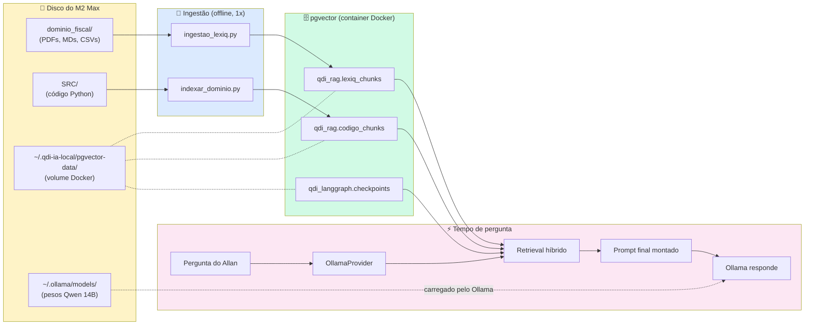

# 12 — Como Criar Memória, Contexto e Onde Deixar as Fontes na Máquina

> **Objetivo:** documento prático e direto respondendo à pergunta do controlador:
> *"Como crio memória e contexto para o Ollama? Onde deixo as fontes para que ele acesse e pesquise?"*

---

## 1. Resposta Direta

O Ollama **não lê arquivos do disco diretamente** — ele apenas:
1. Carrega o **modelo** (pesos) em memória
2. Recebe **texto** via API e gera **texto** como resposta

Portanto, "memória" e "fontes" funcionam assim:

| O que você quer | Onde fica fisicamente | Como o Ollama acessa |
|-----------------|------------------------|----------------------|
| **Persona permanente** | Modelfile (texto) embutido no modelo | Já está no contexto a cada chamada |
| **Fontes Lexiq (PDFs, leis)** | `~/000-PROJETOS/018-QUALIDIAGIQ/dominio_fiscal/` | Scripts Python leem → quebram em chunks → salvam embeddings no pgvector → no momento da pergunta, são buscadas e injetadas no prompt |
| **Código QDI** | `~/000-PROJETOS/018-QUALIDIAGIQ/SRC/` | Idem fontes (AST + embeddings → pgvector → injeção no prompt) |
| **Histórico de conversa** | Postgres `qdi_langgraph.checkpoints` | LangGraph recupera + injeta no prompt como mensagens prévias |

**Analogia Oracle:** o Ollama é um motor de cálculo (PL/SQL engine). O `dominio_fiscal/` é o equivalente a uma área de staging cheia de planilhas Excel. Você precisa de um **ETL** (ingestão Python) para transformar essas planilhas em tabelas (`pgvector`) que o motor consulta via SQL (busca de similaridade).

---

## 2. Estrutura Física Recomendada

```
/Users/allan/000-PROJETOS/018-QUALIDIAGIQ/        ← raiz do projeto QDI
│
├── dominio_fiscal/                                ← 📚 FONTES OLLAMA (raw)
│   │
│   ├── legislacao/
│   │   ├── LC_214_2025.pdf                       ← Lei Complementar 214/2025
│   │   ├── LC_214_2025.md                        ← texto extraído (opcional)
│   │   ├── EC_132_2023.pdf
│   │   ├── EC_132_2023.md
│   │   ├── LC_227_2026.pdf
│   │   └── LC_227_2026.md
│   │
│   ├── notas_tecnicas/
│   │   ├── NT_2025_002_v1.33.pdf
│   │   └── NT_2025_002_v1.33.md
│   │
│   ├── pareceres/
│   │   ├── PT-001_classificacao_cClassTrib.md
│   │   ├── PT-002_regime_transitorio.md
│   │   ├── PT-003_creditos_presumidos.md
│   │   ├── PT-004_split_payment.md
│   │   ├── PT-005_imunidades.md
│   │   ├── PT-006_simples_nacional_reforma.md
│   │   ├── PT-007_operacoes_interestaduais.md
│   │   ├── PT-008_servicos_digitais.md
│   │   ├── PT-009_combustiveis_regime_monofasico.md
│   │   ├── PT-010_setor_imobiliario.md
│   │   └── PT-011_zona_franca_manaus.md
│   │
│   ├── tabelas/
│   │   ├── cClassTrib.csv                        ← códigos de classificação
│   │   ├── cCredPres.csv                          ← créditos presumidos
│   │   ├── CST_CBS_IBS.csv                        ← códigos de situação tributária
│   │   └── NCM_resumido.csv                       ← classificação fiscal de mercadorias
│   │
│   ├── jurisprudencia/                            ← (opcional, futuro)
│   │   └── solucoes_consulta_rfb/
│   │
│   └── INDEX.md                                   ← inventário humano + metadados
│
├── SRC/                                           ← código-fonte (Camada 3)
│   ├── DOMAIN/
│   ├── APPLICATION/
│   ├── INFRASTRUCTURE/
│   └── PRESENTATION/
│
└── _DEVELOPER/IA_DIAG_AVANCADO/                  ← documentação + scripts
    ├── 02_MODELFILE_QDI_MENTOR.modelfile         ← persona (Camada 1)
    ├── docker-compose.yml
    ├── Makefile
    └── SCRIPTS/
        ├── ingestao_lexiq.py                      ← lê dominio_fiscal/ → grava pgvector
        ├── indexar_dominio.py                     ← lê SRC/ → grava pgvector
        └── golden_questions.py
```

**Princípios de organização:**

1. **PDFs originais sempre preservados** — nunca apague o original, sempre converta para `.md` ao lado.
2. **`.md` é a fonte preferencial para ingestão** — markdown estruturado tem chunking muito melhor que PDF cru.
3. **Tabelas em CSV** — granularidade máxima (1 linha = 1 chunk).
4. **`INDEX.md` da pasta** lista cada documento com vigência e versão.

---

## 3. O Modelo das 4 Memórias Aplicado na Prática

### 3.1 Memória 1 — Persona (Modelfile) → "memória de personalidade"

**Onde fica:** dentro do modelo `qdi-mentor` (gerado pelo `ollama create`).

**Como criar:**
```bash
cd /Users/allan/000-PROJETOS/018-QUALIDIAGIQ/_DEVELOPER/IA_DIAG_AVANCADO
ollama create qdi-mentor -f 02_MODELFILE_QDI_MENTOR.modelfile
```

**Como atualizar:** edite o `.modelfile` e rode novamente o comando — o modelo é **substituído**.

**Como consultar:**
```bash
ollama show qdi-mentor --system    # mostra o SYSTEM prompt atual
ollama show qdi-mentor --parameters # mostra parâmetros
```

**Vantagem:** zero overhead — a persona vai junto a cada chamada sem custo de contexto.
**Limitação:** ~4-8 KB de texto, não cabe muito mais.

---

### 3.2 Memória 2 — Fontes Lexiq (RAG) → "memória factual"

**Onde fica:**
- **Arquivos originais:** `dominio_fiscal/` (PDFs, MDs, CSVs)
- **Embeddings vetorizados:** Postgres em `qdi_rag.lexiq_chunks` (volume Docker em `/Users/allan/.qdi-ia-local/pgvector-data`)

**Como popular (passo a passo):**

```bash
# 1) Subir Postgres
cd /Users/allan/000-PROJETOS/018-QUALIDIAGIQ/_DEVELOPER/IA_DIAG_AVANCADO
make ollama-up

# 2) Garantir que arquivos estão em dominio_fiscal/
ls dominio_fiscal/legislacao/
# LC_214_2025.pdf  EC_132_2023.pdf  LC_227_2026.pdf

# 3) Rodar ingestão
make ingest-lexiq
# ou: python3.12 SCRIPTS/ingestao_lexiq.py
```

**Como o Ollama "acessa":** durante uma pergunta, o pipeline é:

```python
# Pseudocódigo do que acontece quando Allan pergunta
async def perguntar_ollama(pergunta: str):
    # Passo 1: gerar embedding da pergunta
    embedding_pergunta = await ollama.embeddings(pergunta)

    # Passo 2: buscar chunks similares no pgvector
    chunks_relevantes = await pg.fetch("""
        SELECT documento, artigo, conteudo,
               1 - (embedding <=> $1::vector) AS score
        FROM qdi_rag.lexiq_chunks
        ORDER BY embedding <=> $1::vector
        LIMIT 8
    """, embedding_pergunta)

    # Passo 3: filtrar por score mínimo (princípio QDI #6)
    chunks_validos = [c for c in chunks_relevantes if c['score'] >= 0.65]
    if not chunks_validos:
        return "INDEFINIDO — base normativa não cobre este caso."

    # Passo 4: injetar contexto no prompt
    contexto_rag = "\n\n".join(
        f"[{c['documento']}, {c['artigo']}] {c['conteudo']}"
        for c in chunks_validos
    )

    # Passo 5: enviar para o Ollama com o RAG no prompt
    resposta = await ollama.chat(
        model="qdi-mentor",
        messages=[
            {"role": "system", "content": f"Evidências disponíveis:\n{contexto_rag}"},
            {"role": "user", "content": pergunta},
        ]
    )
    return resposta
```

**Resumo conceitual:**
- O **Ollama** não enxerga `dominio_fiscal/` diretamente
- Seu **script Python** faz a ponte: lê arquivos → gera embeddings → grava no Postgres
- No momento da pergunta, o **Postgres** devolve os trechos relevantes → seu código os **injeta no prompt** → o **Ollama** responde com base nos trechos

---

### 3.3 Memória 3 — Código QDI (Camada estrutural)

**Onde fica:**
- **Arquivos originais:** `SRC/` e `docs/` (gerenciados pelo Git)
- **Embeddings vetorizados:** Postgres em `qdi_rag.codigo_chunks`

**Como popular:**
```bash
make index-dominio
# ou: python3.12 SCRIPTS/indexar_dominio.py
```

**Atualização automática:** após instalar o `.git/hooks/post-commit` (vide `05_INDEXACAO_DOMINIO.md`), todo `git commit` reindexe automaticamente os arquivos modificados.

---

### 3.4 Memória 4 — Histórico Conversacional (LangGraph Checkpointer)

**Onde fica:**
- Postgres em `qdi_langgraph.checkpoints` + `qdi_langgraph.mensagens`
- Volume físico: `/Users/allan/.qdi-ia-local/pgvector-data/`

**Como funciona:**
- Cada turno do wizard é salvo automaticamente pelo `AsyncPostgresSaver`
- A sessão pode ser retomada por `thread_id`
- Histórico é injetado nas próximas chamadas como mensagens prévias

**Não exige ingestão manual** — é criado em tempo de execução pelo LangGraph.

---

## 4. Diagrama Completo: Do Arquivo Físico à Resposta do Ollama



---

## 5. Receita de Bolo — Passo a Passo Mínimo

Para Allan executar **hoje** e ter um Ollama com memória + contexto:

### Passo 1: Setup (uma vez só)
```bash
# 1.1 Instalar Ollama
brew install ollama
brew services start ollama

# 1.2 Instalar OrbStack (se ainda não)
brew install --cask orbstack

# 1.3 Baixar modelos
ollama pull qwen2.5:14b-instruct-q4_K_M
ollama pull nomic-embed-text
```

### Passo 2: Criar persona QDI
```bash
cd /Users/allan/000-PROJETOS/018-QUALIDIAGIQ/_DEVELOPER/IA_DIAG_AVANCADO
ollama create qdi-mentor -f 02_MODELFILE_QDI_MENTOR.modelfile
ollama run qdi-mentor "Olá! Apresente-se."
```

### Passo 3: Organizar fontes
```bash
mkdir -p /Users/allan/000-PROJETOS/018-QUALIDIAGIQ/dominio_fiscal/{legislacao,notas_tecnicas,pareceres,tabelas}

# Copiar PDFs/MDs/CSVs para essas pastas
# (Allan pega os arquivos da pesquisa-fonte original)
```

### Passo 4: Subir banco e ingerir
```bash
cd /Users/allan/000-PROJETOS/018-QUALIDIAGIQ/_DEVELOPER/IA_DIAG_AVANCADO
make ollama-up
make ingest-lexiq
make index-dominio
```

### Passo 5: Testar com pergunta real
```bash
# Via REPL Python
python3.12 -c "
import asyncio
from src.infrastructure.adapters.llm.ollama_provider import OllamaProvider, OllamaConfig
# ... código de teste
"

# Ou diretamente via curl no FastAPI
curl -X POST http://localhost:8006/api/v1/ia/chat \
  -H 'Content-Type: application/json' \
  -d '{\"pergunta\":\"O que é cClassTrib na LC 214/2025?\"}'
```

---

## 6. Onde NÃO Colocar Fontes

⚠️ **Evite estes caminhos:**

| Caminho | Por quê não |
|---------|-------------|
| `/Users/allan/Downloads/` | Volátil — sujeito a limpeza |
| `iCloud Drive/` | Sincronização interfere com `mtime` e bloqueia leitura |
| `Desktop/` | Sem versionamento Git |
| Dentro de containers | Volume não persiste entre rebuilds |
| `~/.ollama/` | Reservado ao Ollama, não para suas fontes |

✅ **Use sempre:** `/Users/allan/000-PROJETOS/018-QUALIDIAGIQ/dominio_fiscal/` (versionado em Git via LFS para PDFs grandes).

---

## 7. Limpeza e Manutenção

```bash
# Ver quantos chunks estão indexados
make ollama-status

# Limpar TUDO e começar do zero (cuidado!)
make clean-all

# Reindexar só um documento específico
python3.12 SCRIPTS/ingestao_lexiq.py --documento LC_214_2025

# Backup do banco
docker exec qdi_pgvector pg_dump -U qdi qdi_rag > backup_$(date +%Y%m%d).sql

# Restaurar
docker exec -i qdi_pgvector psql -U qdi qdi_rag < backup_20260517.sql
```

---

## 8. Tamanhos Esperados em Disco

| Item | Onde | Tamanho |
|------|------|---------|
| Modelos Ollama | `~/.ollama/models/` | ~10 GB |
| pgvector data | `~/.qdi-ia-local/pgvector-data/` | ~500 MB (após ingestão completa) |
| Fontes brutas | `~/000-PROJETOS/018-QUALIDIAGIQ/dominio_fiscal/` | ~50-100 MB |
| Jaeger traces | `~/.qdi-ia-local/jaeger-data/` | ~200 MB/mês |
| **Total** | | **~11 GB** |

---

## 9. Resumo em Uma Frase

> **O Ollama lê apenas o que você injeta no prompt. Tudo que está no disco (`dominio_fiscal/`, `SRC/`) precisa antes passar por um pipeline Python que extrai → vetoriza → grava no pgvector → busca por similaridade → injeta no prompt no momento certo.**

A "mágica" não é o Ollama "pesquisando" — é o seu código Python orquestrando a busca e a injeção. Mas, do ponto de vista do usuário final, parece que o modelo "conhece" toda a Lexiq.

---

## 10. Próximo Passo Recomendado

1. Ler este arquivo na íntegra ✅
2. Executar **Sprint 1** do `08_PLANO_EXECUCAO_FASEADO.md` (Setup + Persona)
3. Voltar aqui e executar **Passo 3** (organizar fontes) — momento em que você de fato precisa decidir quais documentos da Lexiq ingerir primeiro
