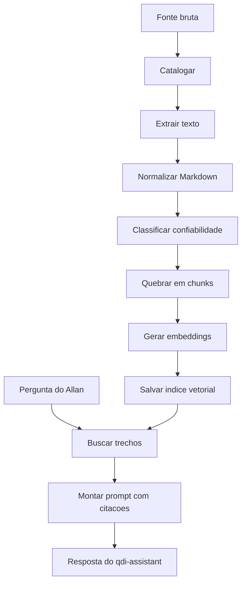

# 14 - Pipeline de Fontes para RAG Local

## Objetivo

Definir um processo repetivel para transformar conteudo bruto em fonte pesquisavel pelo agente local.

## Pipeline geral



## Estrutura de pastas sugerida

```text
fontes/
├── bruto/
│   ├── legislacao/
│   ├── aulas/
│   ├── artigos/
│   └── internos/
├── extraido/
│   ├── legislacao/
│   ├── aulas/
│   ├── artigos/
│   └── internos/
├── catalogo_fontes.yml
└── README.md

.ollama-rag/
├── index/
├── chunks/
├── scripts/
│   ├── build_index.py
│   ├── ask_rag.py
│   └── validate_sources.py
└── README.md
```

## Etapa 1 - Catalogar

Antes de indexar, registre a fonte.

Campos minimos:

- ID
- titulo
- tipo
- confiabilidade
- origem
- data de acesso
- status
- restricoes

Exemplo:

```yaml
id: FONTE-010
titulo: "Aula - Transicao IBS/CBS"
tipo: "aula"
confiabilidade: "C"
status: "verificar"
origem: "Curso X"
data_acesso: "2026-05-17"
restricoes:
  - "Validar contra legislacao oficial antes de usar como regra"
```

## Etapa 2 - Extrair texto

PDF:

```bash
pdftotext arquivo.pdf arquivo.txt
```

Audio/video:

```bash
whisper aula.mp4 --language Portuguese --output_format txt
```

HTML:

```bash
pandoc pagina.html -t markdown -o pagina.md
```

Observacao: escolha a ferramenta disponivel no ambiente. O importante e chegar em Markdown limpo.

## Etapa 3 - Normalizar Markdown

Padrao:

```md
# <titulo da fonte>

Metadados:
- ID:
- Tipo:
- Confiabilidade:
- Origem:
- Data de acesso:

## Resumo

## Conteudo

## Aplicacao no QDI

## Restricoes
```

## Etapa 4 - Separar fonte primaria de interpretacao

Para aula ou artigo:

```md
## Fatos citados

## Interpretacao do autor/professor

## Fontes primarias mencionadas

## Pendencias de validacao
```

Isso evita que o agente confunda opiniao com lei.

## Etapa 5 - Quebrar em chunks

Regras sugeridas:

- 500 a 1.000 tokens por chunk.
- manter titulo e subtitulo no chunk.
- preservar metadados da fonte.
- nao quebrar artigo legal no meio se puder evitar.
- para tabela, manter cabecalho junto.

Metadados por chunk:

```yaml
chunk_id: FONTE-010-CHUNK-003
source_id: FONTE-010
source_type: aula
reliability: C
title: Aula - Transicao IBS/CBS
section: "Impactos no varejo"
```

## Etapa 6 - Embeddings

Modelo local ja identificado:

```text
mxbai-embed-large:latest
```

Uso futuro via Ollama API:

```bash
curl http://localhost:11434/api/embeddings \
  -d '{
    "model": "mxbai-embed-large",
    "prompt": "texto do chunk"
  }'
```

## Etapa 7 - Resposta com citacoes

Toda resposta gerada por RAG deve conter:

- resposta direta;
- fontes usadas;
- confiabilidade das fontes;
- lacunas se houver.

Modelo:

```md
## Resposta

<resposta>

## Fontes usadas

- FONTE-001, tipo legislacao, confiabilidade A, secao X
- FONTE-010, tipo aula, confiabilidade C, trecho Y

## Lacunas

- <o que ainda precisa validar>
```

## Politica de seguranca para conteudo tributario

O agente deve responder:

```text
Nao encontrei fonte primaria suficiente na base local para sustentar essa conclusao.
```

quando:

- a pergunta exige lei vigente;
- a busca retornou apenas aula ou anotacao;
- ha conflito entre fontes;
- a vigencia esta incerta.

## Mini-plano de implantacao

| Passo | Entrega |
|---|---|
| 1 | Criar `fontes/catalogo_fontes.yml` |
| 2 | Colocar 3 fontes piloto: AGENTS, PRD, uma aula |
| 3 | Extrair tudo para Markdown |
| 4 | Criar script de chunking |
| 5 | Gerar embeddings com `mxbai-embed-large` |
| 6 | Criar `ask_rag.py` |
| 7 | Exigir citacao na resposta |

## Fontes piloto recomendadas

Comece pequeno:

1. `AGENTS.md`
2. `docs/refs/01_PRD_BASE.md`
3. Uma aula transcrita ou anotacao sua sobre Reforma Tributaria

Depois amplie para legislacao e normas.
