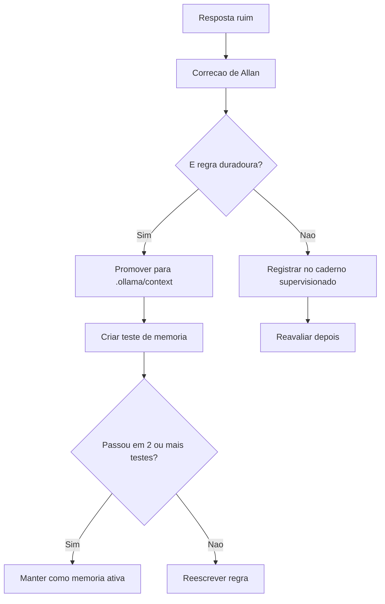

# 15 - Ensino Supervisionado da Memoria do Agente

## Resposta direta

Ensino supervisionado, neste contexto, nao significa treinar novamente os pesos do modelo. Significa criar um ciclo controlado em que Allan faz perguntas, avalia respostas, corrige erros, registra a correcao na memoria/contexto e cria testes para impedir regressao.

## Analogia com ERP/Oracle

Pense como homologar uma regra fiscal no Winthor:

1. Voce cadastra a regra.
2. Executa um caso de teste.
3. Confere o resultado.
4. Corrige parametro ou codigo.
5. Reexecuta.
6. So entao libera para uso.

Com o agente e igual:

```text
pergunta -> resposta -> avaliacao humana -> correcao -> memoria -> novo teste
```

## O que supervisionar

| Area | Exemplo de erro | Como corrigir |
|---|---|---|
| Arquitetura | Colocar schema FastAPI no domain | Reforcar regra em `architecture.md` |
| Stack | Sugerir dataclass para request externo | Reforcar `Pydantic v2` em `coding_rules.md` |
| Escopo | Sugerir apuracao CBS/IBS no QDI | Registrar fora de escopo em `qdi_context.md` |
| Legislacao | Afirmar sem fonte | Exigir fonte primaria ou resposta insuficiente |
| Produto | Ignorar lead magnet/MVP | Registrar decisao de produto |
| Tom | Tratar Allan como iniciante | Ajustar `Modelfile` |

## Ciclo supervisionado em 7 passos

### 1. Definir objetivo de ensino

Exemplo:

```text
Ensinar o agente que regra de score tributario pertence ao domain quando for regra pura, e ao application quando for orquestracao de caso de uso.
```

### 2. Criar uma pergunta de teste

```text
Onde devo implementar o calculo do score de prontidao tributaria no QDI?
```

### 3. Rodar o agente

```bash
.ollama/scripts/ask_qdi.sh "Onde devo implementar o calculo do score de prontidao tributaria no QDI?"
```

### 4. Avaliar com rubrica

Use nota de 0 a 3:

| Nota | Significado |
|---:|---|
| 0 | Errado ou perigoso |
| 1 | Generico demais |
| 2 | Parcialmente correto |
| 3 | Correto e acionavel |

### 5. Escrever a resposta esperada

```md
Resposta esperada:
O calculo puro do score deve ficar no domain se representar regra de negocio sem dependencia externa.
O caso de uso que coleta respostas, chama calculo e salva resultado deve ficar em application.
Persistencia concreta fica em infrastructure.
Schemas de entrada/saida HTTP ficam em presentation com Pydantic v2.
```

### 6. Registrar a correcao na memoria

Se for regra arquitetural:

```text
.ollama/context/architecture.md
```

Se for regra de codigo:

```text
.ollama/context/coding_rules.md
```

Se for decisao de produto:

```text
.ollama/context/qdi_context.md
```

### 7. Reexecutar o teste

```bash
.ollama/scripts/ask_qdi.sh "Onde devo implementar o calculo do score de prontidao tributaria no QDI?"
```

Se atingir nota 3, registre como teste aprovado.

## Fluxo de promocao de conhecimento

Nem toda correcao deve virar regra permanente.



## Tipos de correcao

### Correcao factual

Quando o modelo erra um fato.

Exemplo:

```md
Erro:
O agente afirmou que split payment pertence ao QDI.

Correcao:
Split payment orquestrador pertence ao QFC, nao ao MVP do QDI.
```

### Correcao arquitetural

Quando o modelo sugere camada errada.

```md
Erro:
O agente colocou repository concreto no domain.

Correcao:
Domain pode definir porta/interface; implementacao concreta fica em infrastructure.
```

### Correcao de fonte

Quando o modelo afirma sem citar.

```md
Erro:
O agente concluiu regra tributaria sem fonte.

Correcao:
Resposta tributaria deve citar fonte primaria ou declarar base insuficiente.
```

### Correcao de tom

Quando o modelo explica de forma inadequada para Allan.

```md
Erro:
Resposta tratou Allan como iniciante.

Correcao:
Responder como colaborador tecnico experiente, com explicacoes objetivas e analogias quando agregarem.
```

## Rubrica padrao de avaliacao

Use esta rubrica para cada resposta supervisionada:

| Criterio | Pergunta de avaliacao | Nota 0-3 |
|---|---|---:|
| Arquitetura | Respeitou Clean Architecture? | |
| Stack | Usou stack obrigatoria? | |
| Fonte | Citou ou pediu fonte quando necessario? | |
| Escopo | Respeitou MVP do QDI? | |
| Acionabilidade | A resposta permite implementar? | |
| Tom | Falou com Allan no nivel correto? | |

Nota final:

```text
media = soma / 6
```

Interpretacao:

| Media | Decisao |
|---:|---|
| 0.0 a 1.4 | Rejeitar resposta e corrigir memoria |
| 1.5 a 2.4 | Aceitar parcialmente e refinar |
| 2.5 a 3.0 | Aprovar |

## Como criar um dataset supervisionado

Crie pares:

```text
pergunta -> resposta esperada -> criterio de avaliacao -> fonte
```

Exemplo:

```md
## Caso SUP-001

Tema: Clean Architecture

Pergunta:
Onde fica a entidade DiagnosticoTributario?

Resposta esperada:
Em `src/domain`, sem dependencia de FastAPI, Supabase ou Pydantic de API. Casos de uso ficam em `src/application`, persistencia concreta em `src/infrastructure`, schemas HTTP em `src/presentation`.

Criterios:
- Deve citar `src/domain`.
- Deve proibir dependencia externa no domain.
- Deve separar application/infrastructure/presentation.

Fonte:
- AGENTS.md
- .ollama/context/architecture.md
```

## Rotina semanal sugerida

Tempo: 45 minutos.

1. Escolha 5 perguntas importantes.
2. Rode o agente.
3. Dê nota pela rubrica.
4. Corrija respostas ruins.
5. Promova somente regras duradouras para `.ollama/context`.
6. Registre os casos no caderno supervisionado.

## Regra de maturidade

Uma memoria so deve ser considerada ensinada quando:

- passou em pelo menos 2 perguntas diferentes;
- nao criou contradicao;
- tem fonte ou justificativa;
- sabe dizer quando nao sabe.

## O que nao fazer

- Nao copiar respostas enormes para o `Modelfile`.
- Nao transformar toda opiniao de aula em regra.
- Nao corrigir so no chat e esquecer de registrar.
- Nao misturar regra de sprint com regra permanente.
- Nao aceitar resposta bonita sem verificar fonte.

## Proximo passo recomendado

Usar o arquivo `16_caderno_treino_supervisionado.md` para registrar os primeiros 10 casos supervisionados.
