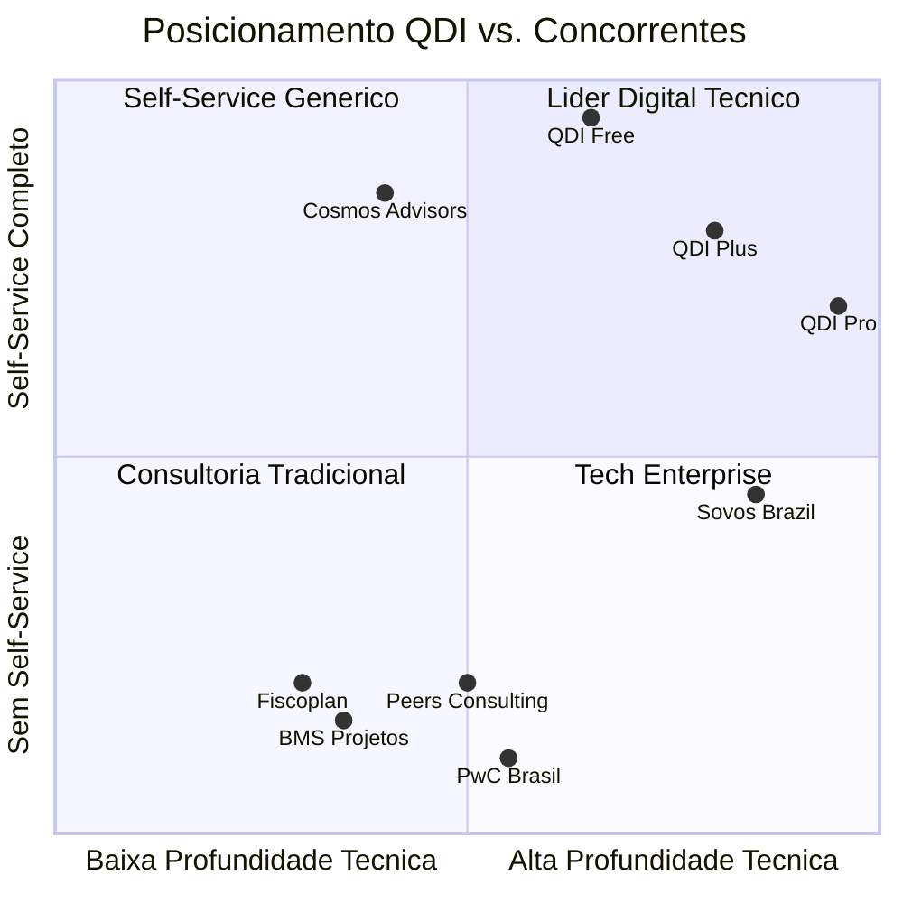
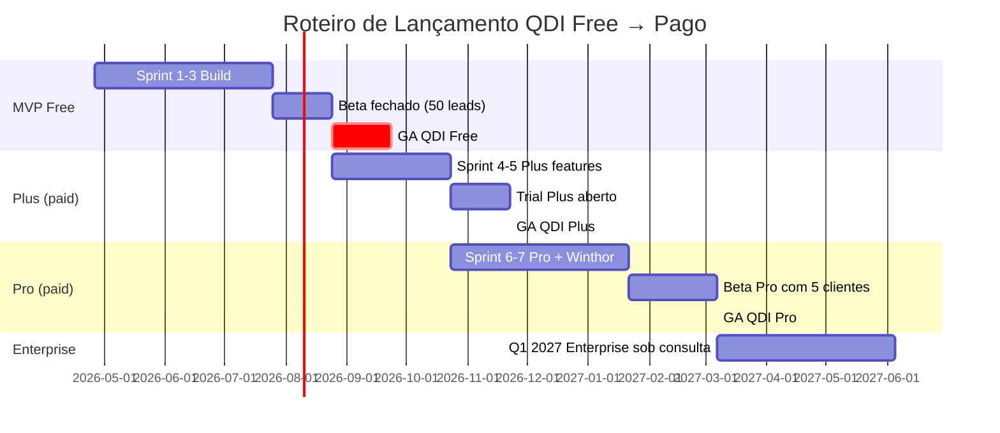

# 01 — Estratégia Geral do QualiDiagIQ

## 1. Resposta Direta

O QDI é o **lead magnet self-service** do ecossistema Tributiq, posicionado como **diagnóstico tributário gratuito de profundidade real** que, ao entregar valor genuíno na versão Free, cria upgrade natural para tiers pagos com **simulação financeira (Plus)**, **integração ERP + ABNT 17301 (Pro)** e **white-label (Enterprise)**. O posicionamento de mercado captura a fraqueza dos concorrentes diretos: **Cosmos Advisors** (raso, low-code) e **consultorias tradicionais** (BMS, Peers, Fiscoplan — sem produto digital).

## 2. Fundamentação & Analogia

Pense no QDI como **TurboTax Free Edition + TurboTax Premium** aplicado ao contexto brasileiro de Reforma Tributária. O Free Edition do TurboTax atende ~80% dos contribuintes pessoa física e gera funil massivo; o upgrade Premium captura quem tem complexidade real (investimentos, autônomos, holding). No QDI:

- **QDI Free** atende ~80% das PMEs que precisam apenas saber "estou em risco?"
- **QDI Plus / Pro** captura quem precisa de **número exato** (CFO de R$ 100M+) ou **certificação formal** (compliance ABNT)

Analogia direta com o universo **Winthor/Oracle** que você domina: pense no Free como o "frontend de cadastro básico de NF-e" (necessário para todos) e no Plus/Pro como a "Suite Fiscal Avançada" do Winthor (módulo opcional pago para quem opera SPED, EFD, ECF de forma intensiva).

## 3. Visão de Produto

### 3.1. Visão em 1 frase

> *"O QDI é o primeiro passo público que toda empresa brasileira dá para entender seu próprio risco frente à Reforma Tributária."*

### 3.2. Visão em 1 parágrafo

O QualiDiagIQ democratiza o diagnóstico tributário da Reforma Brasileira, oferecendo gratuitamente o que hoje custa R$ 30 mil em consultorias tradicionais. Em 15 minutos, qualquer empresa de qualquer porte recebe um relatório com **score 0-100 em 7 dimensões**, **plano de ação macro** e **citação dispositivo a dispositivo** das LCs 214/2025 e EC 132/2023. Para quem quer profundidade — simulação financeira por SKU, integração com ERP, pré-auditoria ABNT NBR 17301 — o upgrade pago oferece tiers calibrados por porte (de R$ 297/mês a Enterprise sob consulta). Diferentemente de Cosmos Advisors (gratuito mas raso) e Sovos (caro e enterprise), o QDI é a única ferramenta brasileira **IA-native + ABNT-aderente + ERP-conectada**.

### 3.3. Missão

Acelerar a prontidão do tecido empresarial brasileiro para a Reforma Tributária do Consumo, eliminando a barreira financeira e de conhecimento que impede PMEs de iniciarem sua adequação.

### 3.4. North Star Metric

> **Diagnósticos completados por mês**

Métrica única que reflete simultaneamente alcance (volume), qualidade (taxa de conclusão) e valor entregue (PDF lido).

## 4. Posicionamento Competitivo (lembrete da matriz)

**Movimento estratégico do QDI:**
- **QDI Free** ataca diretamente Cosmos Advisors (mesmo modelo gratuito, mais profundidade)
- **QDI Plus** ocupa quadrante vazio entre Cosmos e Sovos
- **QDI Pro** desafia Sovos por baixo (mais self-service e menor ticket)

## 5. Personas-Alvo

### 5.1. Personas-Primárias (geram volume)

| Persona | Cargo | Tier-alvo | Por que entra |
|---------|-------|-----------|---------------|
| **CFO Pragmática** | CFO de empresa média (R$ 50M–R$ 500M) | Plus | Quantificar exposição financeira |
| **Contador Externo** | Sócio de escritório contábil | Pro/Enterprise | Diagnosticar carteira de clientes |
| **Dono de PME** | Empresário (R$ 5M–R$ 50M) | Free | Entender se a Reforma vai "machucar" |
| **Diretor de TI** | CIO / Diretor de TI | Pro | Avaliar prontidão do ERP atual |

### 5.2. Personas Secundárias (alavancagem indireta)

| Persona | Como o QDI alcança |
|---------|---------------------|
| **Advogado tributarista** | White-label do escritório (Enterprise) |
| **Auditoria interna** | Pré-auditoria ABNT NBR 17301 (Pro) |
| **Investidor/M&A** | Due diligence tributária (Enterprise) |

## 6. Proposta de Valor por Tier

### 6.1. QDI Free — *"Saiba sem pagar nada se sua empresa está em risco"*

| Para quem | O que recebe | Por que é bom |
|-----------|--------------|---------------|
| Toda empresa que ainda não diagnosticou seu risco frente à Reforma | Score 0-100, 7 dimensões avaliadas, plano de ação macro, PDF de até 8 páginas, ancoragem em LC 214/2025 | É **o** diagnóstico brasileiro mais profundo gratuito; em 15 minutos vale o que consultorias cobram R$ 30k |

### 6.2. QDI Plus — *"Quanto exatamente sua empresa vai pagar?"*

| Para quem | O que recebe (além do Free) | Por que é bom |
|-----------|------------------------------|---------------|
| Empresa que quer **número exato em R$**, não estimativa qualitativa | Simulação CBS+IBS+IS por categoria, estimativa de exposição em R$ por gap, benchmark setorial anônimo, plano de ação personalizado por IA, templates de documentos prontos | Substitui um relatório de consultoria de R$ 15-30k por R$ 297/mês renovável |

### 6.3. QDI Pro — *"Conecte ao ERP e prepare-se para certificar"*

| Para quem | O que recebe (além do Plus) | Por que é bom |
|-----------|------------------------------|---------------|
| Empresa com Winthor/TOTVS que quer diagnóstico baseado em dados reais | Conector nativo Winthor/TOTVS, leitura XML últimas 12 NF-e, pré-auditoria ABNT NBR 17301 com plano de remediação, dashboard navegável com simulação ajustável | Único produto brasileiro que combina ERP + ABNT 17301 + IA |

### 6.4. QDI Enterprise — *"Sua marca, seu funil, sua escala"*

| Para quem | O que recebe (além do Pro) | Por que é bom |
|-----------|-----------------------------|---------------|
| Escritórios de contabilidade, consultorias, ERPs, ICs | White-label total, API pública, multi-empresa, SLA dedicado, customização por setor | Os concorrentes (Cosmos/Sovos) não oferecem white-label |

## 7. Roteiro de Lançamento

**Marcos:**
- **GA QDI Free:** Q3 2026 (~150 dias do início)
- **GA QDI Plus:** Q4 2026 (+90 dias)
- **GA QDI Pro:** Q1 2027 (+135 dias)
- **Enterprise:** Q2 2027 (case-by-case)

## 8. Decisões Estratégicas-Chave

| Decisão | Escolha | Justificativa |
|---------|---------|---------------|
| **Tier gratuito é demo ou completo?** | **Completo** (com limitações claras) | Diferencial de mercado; Cosmos é raso |
| **Captura de e-mail é obrigatória?** | **No final do diagnóstico**, não no início | Reduz atrito do funil; aumenta conversão para 60-70% |
| **Quem precifica?** | **Pricing público** dos tiers Plus e Pro; Enterprise sob consulta | Transparência reduz ciclo de vendas |
| **Trial pago?** | **14 dias gratuitos do Plus**, automatizado pós-relatório Free | Padrão SaaS comprovado |
| **Churn-back?** | **Tier "QDI Watch"** (R$ 47/mês) — só monitora alíquotas + alertas legislativos | Captura quem não converte para Plus mas não quer abandonar |
| **Idioma** | **PT-BR exclusivo até 2028** | Foco mercado brasileiro; recursos limitados |
| **Mobile-first?** | **Não** — desktop-first; mobile responsivo | Personas-alvo usam desktop em ambiente corporativo |
| **App nativo?** | **Não no MVP** | Web Progressive (PWA) suficiente |

## 9. Métricas de Sucesso por Fase

| Fase | Métrica primária | Meta | Métrica secundária |
|------|------------------|------|---------------------|
| **GA QDI Free (90 dias)** | Diagnósticos completados | 500 | Taxa de conclusão ≥ 50% |
| **GA QDI Free (180 dias)** | Diagnósticos completados | 2.000 | Coleta de e-mail ≥ 60% |
| **Beta QDI Plus (60 dias)** | MRR (Monthly Recurring Revenue) | R$ 5k | Trial → Pago ≥ 5% |
| **GA QDI Plus (180 dias)** | MRR | R$ 30k | LTV > 12× CAC |
| **GA QDI Pro (180 dias)** | MRR | R$ 100k | NPS Pro ≥ 50 |
| **Enterprise (Q2 2027)** | Contratos assinados | 5 | Ticket médio R$ 30k+/mês |

## 10. Riscos da Estratégia

| Risco | Probabilidade | Impacto | Mitigação |
|-------|---------------|---------|-----------|
| Cosmos Advisors melhorar muito antes do QDI Free lançar | Média | Alto | Acelerar MVP em 90 dias; lock-in via integração ERP |
| QDI Free canibalizar QDI Plus (quem usa Free não converte) | Alta | Médio | Limitação clara da simulação numérica + benchmark setorial só no Plus |
| Mercado não enxergar diferença entre Free e Plus | Alta | Alto | Comparação visual lado-a-lado no marketing; cases concretos |
| Concorrência imitar tiers Free generosos | Média | Médio | Alavancar moats (ERP integration, ABNT, multi-tenant benchmark) |
| Receita inicial baixa (Free não gera $) | Alta | Alto | Plano financeiro tolerante; aceitar 6 meses de zero receita pós-lançamento |
| Tributiq não conseguir suportar custo de IA (LLM) no Free | Média | Alto | Free usa apenas regras determinísticas; IA só no Plus |

## 11. Princípios Não-Negociáveis

Alguns princípios que **nunca** podem ser violados, mesmo sob pressão comercial:

1. **Free é genuíno** — não capar artificialmente, não criar paywall escondido
2. **Sem dark patterns** — captura de e-mail no final, não no meio; sem checkout enganoso
3. **Citação de base legal sempre presente** — gratuita ou paga, toda recomendação cita LC/EC/NT
4. **Sem promessa de redução milagrosa** — QDI não promete "redução 100% de impostos"; apenas conformidade + otimização legítima
5. **Privacidade first** — dados anonimizados no benchmark; LGPD compliance estrito
6. **Transparência metodológica** — manifesto público de pesos sempre acessível em `/metodologia`

## 12. Links de Referência

- **Modelo Freemium para SaaS B2B (HBR):** https://hbr.org/2014/12/whats-your-freemium-model
- **TurboTax Free Edition (referência de funil):** https://turbotax.intuit.com/personal-taxes/online/free-edition.jsp
- **First Round Review — GTM B2B:** https://review.firstround.com/
- **PwC Brasil — Tributos no Centro:** https://www.pwc.com.br/pt/sala-de-imprensa/release/

## 13. Próximo Passo

Ler [`02_DIAGNOSTICO_GRATUITO.md`](02_DIAGNOSTICO_GRATUITO.md) para entender exatamente **o que** o tier Free entrega — escopo, perguntas, outputs e limitações.
