# 02 — Diagnóstico Gratuito (QDI Free)

## 1. Resposta Direta

O **QDI Free** entrega um diagnóstico **funcionalmente completo** em ~15 minutos: questionário adaptativo de **~25 perguntas** com **score 0-100 em 7 dimensões** (Fiscal, Estratégica, Contábil, Financeira, Operacional, Tecnológica, **Compliance ABNT 17301**), heatmap qualitativo, **plano de ação macro** com 10-15 ações priorizadas e PDF executivo de até 8 páginas. Limitações intencionais: **sem simulação numérica em R$**, **sem benchmark setorial**, **sem integração ERP** e **sem IA personalizada** — esses ficam para os tiers pagos.

## 2. O Que o Free Diagnostica

### 2.1. As 7 Dimensões Avaliadas

| # | Dimensão | O que mede | Profundidade Free |
|---|----------|------------|---------------------|
| 1 | **Fiscal** | Apuração, créditos, tributação destino, regimes especiais | 4 perguntas qualitativas |
| 2 | **Estratégica** | Posicionamento, mix, precificação, cadeia logística | 3 perguntas |
| 3 | **Contábil** | ECD, ECF, qualidade do plano de contas, conciliações | 3 perguntas |
| 4 | **Financeira** | Fluxo de caixa, capital de giro, EBITDA esperado | 3 perguntas |
| 5 | **Operacional** | Processos fiscais, equipes mobilizadas, capacitação | 3 perguntas |
| 6 | **Tecnológica** | ERP, motor tributário, NF-e/NFC-e, layouts atualizados | 4 perguntas |
| 7 | **Compliance ABNT 17301** | PDCA × 7 eixos da norma, prontidão para certificação | 5 perguntas |

**Total: ~25 perguntas adaptativas** (algumas só aparecem por segmento+regime+porte+UF).

### 2.2. Score 0-100

- **Score Geral** (média ponderada das 7 dimensões)
- **Score por Dimensão** (radar visual)
- **Nível de Maturidade** — Crítico (0-20) / Inicial (21-40) / Intermediário (41-60) / Avançado (61-80) / Exemplar (81-100)
- **Score de Aderência ABNT 17301** — escala PDCA × 7 eixos

### 2.3. Heatmap Qualitativo

Matriz visual: **dimensão × criticidade** (Alta/Média/Baixa).
Sem números absolutos em R$ — apenas semáforo (vermelho/amarelo/verde).

### 2.4. Plano de Ação Macro

10-15 ações priorizadas em **3 horizontes**:
- **Curto prazo (3-6 meses)** — 4-5 ações urgentes
- **Médio prazo (6-12 meses)** — 3-5 ações estruturantes
- **Longo prazo (12+ meses)** — 2-5 ações estratégicas

Cada ação contém:
- Título + descrição (1 frase)
- Dimensão a que pertence
- Criticidade (Alta/Média/Baixa)
- **Base legal citada** (ex: "LC 214/2025 art. 5º, § 2º")
- Indicação se vira diferencial pago no QDI Plus

### 2.5. Cronograma Macro

Linha do tempo simplificada com **5 marcos** (alinhados ao calendário oficial da Reforma):
- 2026 — Início de testes IBS
- 2027 — Primeira apuração CBS
- 2029 — Convivência ICMS+IBS
- 2032 — Fim transição ICMS
- 2033 — Sistema definitivo

## 3. O Que o Free NÃO Inclui (intencionalmente)

| Funcionalidade | Por que NÃO está no Free | Disponível em |
|----------------|---------------------------|---------------|
| Simulação numérica em R$ (CBS+IBS+IS) | Custo computacional + valor percebido alto | **QDI Plus** |
| Benchmark setorial anônimo | Requer base de dados crescente; vantagem competitiva | **QDI Plus** |
| Plano de ação gerado por LLM personalizado | Custo Anthropic Claude API por relatório | **QDI Plus** |
| Templates de documentos (políticas, ITs) | Diferencial premium | **QDI Plus** |
| Estimativa em R$ por gap | Profundidade quantitativa = pago | **QDI Plus** |
| Cronograma detalhado por área | Nível de granularidade alto = pago | **QDI Plus** |
| Integração ERP nativa (Winthor, TOTVS) | Diferencial técnico = Pro | **QDI Pro** |
| Pré-auditoria ABNT NBR 17301 detalhada | Profissional/certificação = Pro | **QDI Pro** |
| Dashboard navegável com simulação ajustável | Funcionalidade interativa = Pro | **QDI Pro** |
| Re-diagnóstico mensal com tracking | Recorrência = Pro | **QDI Pro** |
| Multi-empresa / White-label | Caso de uso enterprise | **QDI Enterprise** |
| API pública | Integração = Enterprise | **QDI Enterprise** |

## 4. Output do Diagnóstico Free

### 4.1. Dashboard de Resultado (Web)

Página única, não interativa, com:
- **Hero:** Score Geral em tipografia grande (ex: "Score: 47/100 — Inicial")
- **Radar das 7 dimensões** (recharts)
- **Heatmap de criticidade** (3 cores: verde/amarelo/vermelho)
- **Top 5 alertas** (gaps mais críticos)
- **Botão "Baixar PDF executivo"**
- **CTA "Ver simulação financeira no QDI Plus →"** (gatilho de upgrade)

### 4.2. PDF Executivo (8 páginas)

Estrutura padronizada:

| Página | Conteúdo |
|--------|----------|
| 1 | Capa: logo Tributiq + razão social cliente + CNPJ + data |
| 2 | Sumário executivo (3 parágrafos) |
| 3 | Score Geral + Nível de Maturidade + Score por Dimensão (radar) |
| 4 | Heatmap de criticidade + 5 alertas críticos |
| 5 | Score ABNT 17301 — PDCA × 7 eixos (gráfico) |
| 6-7 | Plano de Ação Macro (10-15 itens com base legal) |
| 8 | Cronograma 2026-2033 + CTA upgrade Plus |

**Características técnicas do PDF:**
- Gerado server-side com WeasyPrint (HTML/CSS → PDF)
- Branding Tributiq (cores, tipografia, logo)
- Citação dispositivo a dispositivo (LC 214/2025, EC 132/2023, NT 2025.002)
- Watermark sutil "QDI Free" no rodapé
- Link para `/metodologia` (manifesto público de pesos)

### 4.3. E-mail Pós-Diagnóstico

Enviado automaticamente após captura de e-mail:
- Link único para o dashboard (não-expirável)
- PDF anexado
- 3 CTAs: (a) "Ver simulação financeira no Plus" (b) "Indicar para um colega" (c) "Falar com um especialista"

## 5. Restrições e Limites do Free

### 5.1. Limites de Uso

| Limite | Free | Plus | Pro |
|--------|------|------|-----|
| Diagnósticos por CNPJ por mês | 1 | 5 | Ilimitado |
| Re-diagnóstico (refazer) | A cada 30 dias | A cada 7 dias | A qualquer momento |
| Histórico de diagnósticos | 30 dias | 12 meses | Ilimitado |
| Relatório PDF | Sim, 8 páginas | Sim, 16+ páginas | Sim, 30+ páginas |
| Compartilhamento por link | Não | Sim | Sim |
| Login de múltiplos usuários | Não (1 e-mail por CNPJ) | Até 3 usuários | Ilimitado |

### 5.2. Tratamento de Dados (LGPD)

- **Free:** dados retidos por 180 dias após último acesso; depois anonimizados
- **Plus/Pro:** retenção contratual (até 7 anos para fins fiscais)
- **Enterprise:** retenção definida em contrato

## 6. Critérios de Sucesso do Free

Para considerar que o tier Free está **performando bem**:

| Métrica | Meta MVP | Meta GA |
|---------|----------|---------|
| Taxa de conclusão (start → finalizado) | 40% | 60% |
| Tempo médio de preenchimento | <15 min | <12 min |
| Taxa de captura de e-mail | 50% | 70% |
| Taxa de download do PDF | 30% | 50% |
| NPS pós-relatório | 30+ | 50+ |
| Diagnósticos completados / mês | 50 (MVP) | 1.000 (GA) |
| Taxa de upgrade Free → trial Plus | 2% | 5% |

## 7. Comparativo Visual Free vs. Pago

```mermaid
graph LR
    subgraph FREE[QDI Free]
        F1[Score 0-100]
        F2[7 dimensoes qualitativas]
        F3[~25 perguntas]
        F4[Heatmap qualitativo]
        F5[Plano de acao macro]
        F6[PDF 8 paginas]
        F7[Base legal citada]
    end

    subgraph PLUS[QDI Plus +]
        P1[Simulacao R$ por categoria]
        P2[Benchmark setorial]
        P3[IA personalizada por persona]
        P4[Templates documentos]
        P5[Cronograma detalhado]
        P6[PDF 16+ paginas]
    end

    subgraph PRO[QDI Pro +]
        R1[Conector Winthor/TOTVS]
        R2[Pre-auditoria ABNT]
        R3[Dashboard navegavel]
        R4[Re-diagnostico mensal]
    end

    FREE -.upgrade.-> PLUS
    PLUS -.upgrade.-> PRO

    style FREE fill:#22c55e,color:#fff
    style PLUS fill:#3b82f6,color:#fff
    style PRO fill:#a78bfa,color:#fff
```

## 8. UX do Diagnóstico Gratuito (resumo)

8 telas, sem login obrigatório:

| # | Tela | Tempo |
|---|------|-------|
| 1 | Landing page (pitch + CTA "Iniciar") | 30s |
| 2 | Dados da empresa (CNPJ + setor + porte + regime + UF) | 2 min |
| 3 | Wizard adaptativo — Bloco Fiscal | 3 min |
| 4 | Wizard adaptativo — Bloco Tecnológico | 2 min |
| 5 | Wizard adaptativo — Blocos restantes (mais 4 dimensões) | 5 min |
| 6 | Wizard adaptativo — Bloco ABNT 17301 | 2 min |
| 7 | Captura de e-mail (após score calculado) | 30s |
| 8 | Dashboard de resultado + download PDF | livre |

**Tempo total esperado:** 12-15 minutos.

## 9. Princípios da Gratuidade

A gratuidade do QDI Free segue **5 princípios não-negociáveis**:

1. **Não é demo** — é uma ferramenta funcional completa para a maioria das PMEs
2. **Sem paywall escondido** — tudo o que está no escopo Free é entregue ao final, sem cobrança
3. **Sem dark patterns** — captura de e-mail no fim do diagnóstico (não obrigatório no início)
4. **Sem promessas falsas** — nada de "redução de 100% dos impostos"; apenas conformidade + otimização legítima
5. **Citação legal sempre** — todo gap/ação cita LC, EC, NT ou ABNT — gratuita também tem rigor

## 10. Próximo Passo

Ler [`03_EVOLUCAO_PAGA.md`](03_EVOLUCAO_PAGA.md) para entender como o Free evolui para Plus, Pro e Enterprise — gatilhos de upgrade, pricing e diferenciais técnicos.
