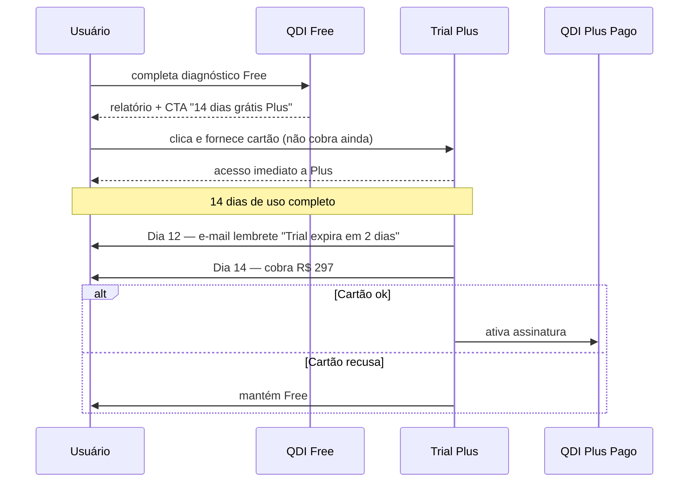

# 03 — Evolução para Versão Paga

## 1. Resposta Direta

A monetização do QDI segue modelo **freemium clássico de 4 tiers**: **Free → Plus (R$ 297/mês) → Pro (R$ 997/mês) → Enterprise (sob consulta)**. Cada tier desbloqueia capacidades de **maior valor agregado** (não apenas "mais perguntas"): Plus adiciona simulação financeira numérica + IA, Pro adiciona integração ERP + ABNT, Enterprise adiciona white-label + API. **Gatilhos contextuais de upgrade** aparecem no relatório Free quando o usuário faria mais valor com o tier seguinte (ex: "Quer ver isso em R$? → QDI Plus").

## 2. Os 4 Tiers — Detalhamento

### 2.1. QDI Free — R$ 0 (lead magnet)

Já detalhado em [`02_DIAGNOSTICO_GRATUITO.md`](02_DIAGNOSTICO_GRATUITO.md).

**Função:** captura de leads + pesquisa de mercado + autoridade técnica.

### 2.2. QDI Plus — R$ 297/mês (PME)

#### 2.2.1. Para quem é

CFO ou contador externo de **empresa de R$ 5M – R$ 100M de faturamento** que precisa de **número exato em R$** e plano personalizado.

#### 2.2.2. O que adiciona ao Free

| Feature | Descrição | Tempo de uso |
|---------|-----------|--------------|
| **Simulação CBS+IBS+IS por categoria** | Cliente fornece breakdown de receita por categoria (ex: 60% serviços + 30% mercadorias + 10% importações); QDI calcula carga estimada IBS+CBS+IS por cenário (otimista/realista/pessimista) | 5 min adicional |
| **Estimativa de exposição em R$ por gap** | Cada gap detectado é traduzido em valor monetário aproximado (ex: "perda potencial de crédito de R$ 240k/ano") | Automático |
| **Benchmark setorial anônimo** | "Sua empresa está no percentil 35 entre varejistas do Sul de mesmo porte" | Automático |
| **Plano de ação personalizado por IA** | LLM (Anthropic Claude) gera plano detalhado por persona (CFO/Contador/Dono) com tom e profundidade ajustados | 30s de geração |
| **Templates de documentos prontos** | Política de Compliance Tributário, Instrução de Trabalho de Apuração CBS, Plano de Remediação ABNT, Termo de Repactuação Tributária — gerados pré-preenchidos | Sob demanda |
| **Cronograma 2026-2033 detalhado** | Não apenas curto/médio/longo; explode em quinzenas com responsável sugerido por área | Automático |
| **PDF expandido (16+ páginas)** | Inclui simulação numérica + benchmark + cronograma detalhado + apêndices legais | Geração ~60s |
| **Re-diagnóstico a cada 7 dias** | Acompanhamento da evolução do score | Sob demanda |
| **Histórico de 12 meses** | Visualizar evolução temporal do score | Acessível 24/7 |
| **Compartilhamento por link** | Compartilhar relatório com sócios/contador/jurídico | Sob demanda |

#### 2.2.3. Pricing

- **Mensal:** R$ 297/mês
- **Anual:** R$ 2.970/ano (16% off, equivalente a 2 meses grátis)
- **Trial:** 14 dias gratuitos automáticos pós-relatório Free
- **Cancelamento:** a qualquer momento, sem multa

#### 2.2.4. Por que R$ 297?

- **Benchmark de mercado:** consultorias cobram R$ 15-30k por relatório similar; SaaS Plus a R$ 297/mês = R$ 3.564/ano (10% do consultoria)
- **Benchmark concorrente:** Cosmos é gratuito (limitado); Sovos enterprise > R$ 5k/mês — Plus ocupa o vácuo entre os dois
- **Psicologia de pricing:** R$ 297/mês está abaixo do limiar de R$ 500/mês (decisão sem comitê em PME)
- **Margem unitária:** custo marginal por usuário ~R$ 30/mês (LLM + storage + computação) → margem 90%

### 2.3. QDI Pro — R$ 997/mês (média/grande)

#### 2.3.1. Para quem é

**Empresa de R$ 100M – R$ 500M** que opera com Winthor, TOTVS ou SAP B1 e quer:
1. Diagnóstico baseado em **dados reais do ERP** (não auto-declarado)
2. **Pré-auditoria ABNT NBR 17301** com plano de remediação
3. **Re-diagnóstico mensal automatizado**

#### 2.3.2. O que adiciona ao Plus

| Feature | Descrição |
|---------|-----------|
| **Conector ERP nativo** | Leitura direta XMLs de NF-e (últimas 12 meses), classificação fiscal, saldo de créditos, regimes especiais aplicados |
| **Diagnóstico baseado em dados reais** | Sem precisar responder questionário — sistema detecta NCM/CST/CFOP atual, % faturamento por UF, exposição ICMS-ST |
| **Pré-auditoria ABNT NBR 17301 completa** | Avaliação granular dos 7 eixos da norma + plano de remediação + relatório de gaps |
| **Dashboard navegável** | Permite o usuário **ajustar premissas** (ex: alíquota IBS estimada) e ver score recalculado em tempo real |
| **Re-diagnóstico mensal automatizado** | Sistema agenda novo diagnóstico mensal; alerta CFO quando score muda > 5 pontos |
| **Suporte prioritário** | E-mail + Slack/WhatsApp; SLA de resposta < 4h úteis |
| **Análise ICMS-ST → IBS/CBS** | Cálculo de capital de giro afetado pela transição ST → não-cumulatividade |
| **Order to Cash sob split payment** | Diagnóstico de impacto na conciliação de recebíveis |
| **Histórico ilimitado** | Auditoria completa de toda a jornada |
| **Múltiplos usuários** | Até 5 usuários por conta (CFO + contador + diretor TI + jurídico + operações) |

#### 2.3.3. Pricing

- **Mensal:** R$ 997/mês
- **Anual:** R$ 9.970/ano (16% off)
- **Trial:** 30 dias após contratação Plus → upgrade Pro
- **Setup integração ERP:** R$ 2.500 one-time (Winthor); negociável para outros ERPs

#### 2.3.4. Por que R$ 997?

- **Benchmark consultoria:** auditoria fiscal completa de empresa média = R$ 80-150k/ano
- **Benchmark Sovos:** suite fiscal de grande empresa = R$ 5-20k/mês
- **Pro a R$ 997/mês = R$ 11.964/ano** = ~10-15% do custo de consultoria; ~5% de Sovos
- **Margem:** ~75% (custo marginal Pro = ~R$ 250/mês com integração ERP + Anthropic + storage)

### 2.4. QDI Enterprise — sob consulta (escala)

#### 2.4.1. Para quem é

- **Escritórios de contabilidade** (10+ clientes empresariais) — querem white-label
- **Consultorias tributárias** (BMS, Tributalis, Mazars-tipo) — querem ferramenta para clientes
- **ERPs e ICs** — querem embed do diagnóstico
- **Empresas Enterprise** (R$ 500M+) — querem multi-CNPJ, customização setorial

#### 2.4.2. O que adiciona ao Pro

| Feature | Descrição |
|---------|-----------|
| **White-label total** | Logo, cores, domínio próprio (`diagnostico.escritoriocontabil.com.br`) |
| **API pública** | OpenAPI 3.1 com rate limit; integração programática com sistemas próprios |
| **Multi-empresa** | Conta-pai gerencia N CNPJs filhos com dashboards consolidados |
| **Customização setorial** | Questionário customizado por vertical (varejo, saúde, agro, etc.) |
| **SLA dedicado** | Uptime 99.95% contratual, suporte 24/7, gerente de conta |
| **Treinamento on-site** | Para equipe interna (até 8h, equipe do Allan + parceiros) |
| **Co-branding em conteúdo** | Webinars, white papers, casos de uso conjuntos |

#### 2.4.3. Pricing Enterprise

- **Modelo:** anual contratual, escalonado por volume de diagnósticos/mês ou por número de CNPJs gerenciados
- **Faixa indicativa inicial:** R$ 30k – R$ 150k/ano
- **Setup:** entre R$ 10k e R$ 50k one-time (depende de customização)

## 3. Gatilhos Contextuais de Upgrade (no QDI Free)

A jornada Free → Plus precisa ser **suave e contextual**, não invasiva. Os gatilhos:

### 3.1. No Dashboard de Resultado Free

Cada elemento do dashboard tem **micro-CTA contextual** quando relevante:

| Elemento | Gatilho contextual |
|----------|---------------------|
| Score Geral baixo (<50) | *"Score crítico. Quer ver quanto isso vai custar à sua empresa em R$? → QDI Plus 14 dias grátis"* |
| Heatmap com áreas vermelhas | *"Detalhe técnico desses gaps com plano de remediação por IA → QDI Plus"* |
| Plano de Ação macro | *"Ver versão personalizada com templates de documentos → QDI Plus"* |
| ABNT 17301 baixa aderência | *"Pré-auditoria completa da norma → QDI Pro"* |

### 3.2. No PDF Free (rodapé das páginas-chave)

| Página | Gatilho |
|--------|---------|
| Página 3 (score) | *"Esse score em R$ exato? Comparado a empresas iguais à sua? → Plus"* |
| Página 4 (alertas) | *"Plano de ação técnico via IA → Plus"* |
| Página 5 (ABNT) | *"Pré-auditoria oficial preparatória → Pro"* |

### 3.3. E-mail Pós-Relatório (sequência de 5 e-mails)

| Dia | Tema | CTA |
|-----|------|-----|
| Dia 0 | Relatório Free entregue | "Faça login e baixe o PDF" |
| Dia 1 | Educacional: "O que é cClassTrib?" | Conteúdo gratuito |
| Dia 3 | "Quanto sua empresa paga a mais sem QDI Plus?" | "Iniciar 14 dias grátis" |
| Dia 7 | Case real (anônimo): empresa parecida economizou R$ X | "Iniciar 14 dias grátis" |
| Dia 14 | "Última chance: trial Plus expira" | "Iniciar agora" |

### 3.4. Comportamental (in-app)

- **Re-diagnóstico tentativo no Free** após 30 dias → bloqueado → pop-up oferecendo trial Plus
- **3+ logins em 30 dias** → e-mail "Vejo que você usa muito o QDI — que tal o Plus?"

## 4. Trial Plus — Mecânica

**Política de cancelamento:**
- Cancelar antes do Dia 14 = não cobra
- Cancelar após Dia 14 = cobra mês corrente, sem renovação
- Sem multa, sem fidelidade

## 5. Modelo de Receita Esperada (estimativa)

### 5.1. Cenário Conservador (Q1 2027)

| Tier | Usuários | Ticket | MRR | Anual |
|------|----------|--------|-----|-------|
| Free | 5.000 | R$ 0 | R$ 0 | R$ 0 |
| Plus | 80 | R$ 297 | R$ 23.760 | R$ 285.120 |
| Pro | 8 | R$ 997 | R$ 7.976 | R$ 95.712 |
| Enterprise | 1 | R$ 5.000 | R$ 5.000 | R$ 60.000 |
| **Total** | | | **R$ 36.736** | **R$ 440.832** |

Taxa de conversão Free → Plus = 1.6% · Plus → Pro = 10%.

### 5.2. Cenário Otimista (Q1 2028)

| Tier | Usuários | Ticket | MRR | Anual |
|------|----------|--------|-----|-------|
| Free | 30.000 | R$ 0 | R$ 0 | R$ 0 |
| Plus | 600 | R$ 297 | R$ 178.200 | R$ 2.138.400 |
| Pro | 80 | R$ 997 | R$ 79.760 | R$ 957.120 |
| Enterprise | 8 | R$ 8.000 | R$ 64.000 | R$ 768.000 |
| **Total** | | | **R$ 321.960** | **R$ 3.863.520** |

Taxa de conversão Free → Plus = 2% · Plus → Pro = 13%.

## 6. Estrutura de Custos por Tier

| Tier | Custo marginal/mês | Margem bruta |
|------|---------------------|--------------|
| Free | ~R$ 8 (storage + compute + email) | -100% (loss leader) |
| Plus | ~R$ 30 (acima + LLM Anthropic) | 90% |
| Pro | ~R$ 250 (acima + ERP integration + Pro support) | 75% |
| Enterprise | varia | 60-80% (depende customização) |

**Cálculo do break-even Free:**
- 1 conversão Plus paga ~37 usuários Free pelo mês
- 1 conversão Pro paga ~125 usuários Free pelo mês
- Com 1.6% de conversão Plus, cada 100 Free gera ~R$ 475 MRR

## 7. Concorrência Pricing

| Concorrente | Modelo | Ticket aproximado | QDI compete em |
|-------------|--------|--------------------|----------------|
| Cosmos Advisors | Gratuito (sem paid) | R$ 0 | Free (mais profundo) |
| Sovos | Enterprise SaaS | R$ 5k–R$ 50k/mês | Pro (mais self-service e barato) |
| BMS / Peers / Fiscoplan | Consultoria projeto | R$ 30-150k/projeto | Plus + Pro (entrega digital escalável) |
| ONESOURCE Thomson Reuters | Enterprise SaaS | R$ 10k+/mês | Enterprise |
| Synchro / Avalara | Enterprise SaaS | R$ 5k+/mês | Pro + Enterprise |

**Vantagem do QDI:**
- **Único Freemium real do mercado** (Cosmos é apenas gratuito; Sovos é apenas enterprise)
- **Único com pricing público para Plus e Pro** (concorrentes pedem para "falar com vendas")
- **Único com trial gratuito automatizado de 14 dias**

## 8. Estratégia de Cancelamento Defensivo

Quando cliente Plus tenta cancelar, oferecer **3 opções defensivas** antes de aceitar:

1. **Pause** — pausar 1-3 meses sem cobrar (mantém dados)
2. **Downgrade para QDI Watch** — R$ 47/mês (só monitora alíquotas + alertas legislativos; sem diagnóstico)
3. **Downgrade para Free** — perde features Plus mas mantém histórico 30 dias

Apenas após recusar essas 3 opções, cancelamento total ocorre.

## 9. Programa de Indicação (Plus e Pro)

Clientes pagantes ganham:
- **30 dias gratuitos** por cada indicação que vira Plus
- **3 meses gratuitos** por cada indicação que vira Pro
- **6 meses gratuitos** por cada indicação que vira Enterprise

Implementação simples: link único compartilhável; tracking via tag UTM.

## 10. Princípios Comerciais Não-Negociáveis

1. **Pricing público sempre** (exceto Enterprise) — sem "agendar reunião para saber preço"
2. **Sem fidelidade contratual** em Plus e Pro (cancelamento livre)
3. **Trial gratuito automatizado** sem pré-aprovação
4. **Mesmo diagnóstico técnico em todos os tiers** (Free não é "tier técnico inferior" — é "tier funcional reduzido")
5. **Sem cobrança escondida** — preço final na tela = preço final na fatura
6. **LGPD strict** — exclusão de dados a qualquer momento (sem retenção contratual abusiva)

## 11. Próximo Passo

Ler [`04_METODOLOGIA_PASSO_A_PASSO.md`](04_METODOLOGIA_PASSO_A_PASSO.md) para entender exatamente **como** o diagnóstico é executado — fluxograma, lógica, UX detalhada.
