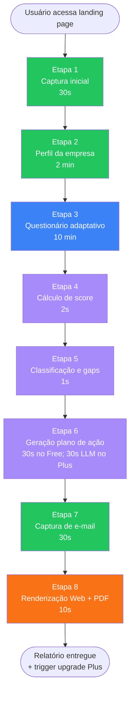
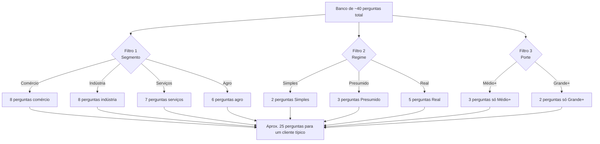
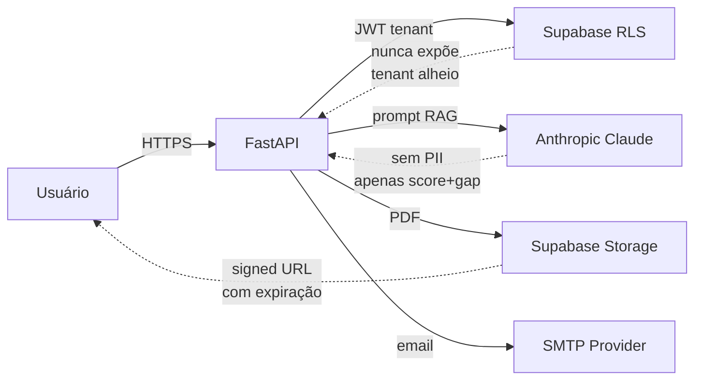

# 04 — Metodologia Passo a Passo

## 1. Resposta Direta

A metodologia do QDI executa o diagnóstico em **8 etapas sequenciais** (~12-15 min), combinando **questionário adaptativo**, **cálculo de score com pesos transparentes**, **classificação por dimensão**, **geração de plano de ação** (regras determinísticas no Free + IA no Plus) e **renderização de relatório** (Web + PDF). Cada etapa tem inputs, lógica e outputs documentados; a transparência metodológica é **princípio não-negociável** (manifesto público em `/metodologia`).

## 2. Fluxograma End-to-End



## 3. Detalhamento por Etapa

### Etapa 1 — Captura Inicial (30s)

**Inputs:** clique em "Iniciar diagnóstico"
**Lógica:** apenas geração de UUID de sessão (anônima — sem login)
**Outputs:**
- `session_id` (UUID)
- Cookie httpOnly com sessão
- Estado inicial: `EM_ANDAMENTO`

**UX:**
- Landing page com pitch claro + CTA único
- Sem campo obrigatório nesta tela
- Botão único: "Iniciar diagnóstico de 15 minutos"

**Princípios:**
- Sem solicitação de e-mail antes de entregar valor
- Sem login social obrigatório
- Sem captcha (em MVP — adicionar se houver abuso)

---

### Etapa 2 — Perfil da Empresa (2 min)

**Inputs (formulário enxuto):**

| Campo | Tipo | Validação |
|-------|------|-----------|
| **Razão social** | string | Mín. 3 caracteres |
| **CNPJ** | string | 14 dígitos + algoritmo Receita Federal |
| **Faturamento anual estimado** | enum | até R$ 360k / até R$ 4.8M / até R$ 100M / até R$ 500M / R$ 500M+ |
| **Regime tributário** | enum | Simples Nacional / Lucro Presumido / Lucro Real / MEI |
| **CNAE principal** | autocomplete | Tabela CNAE 2.3 (autocomplete a partir do 2º dígito) |
| **UF** | enum | 27 UFs |
| **Setor macro** | enum | Comércio / Indústria / Serviços / Agro / Consumo |

**Lógica:**
1. Validação CNPJ (algoritmo Receita Federal) — se inválido, permitir continuar marcando como "não validado"
2. Inferência de **porte** automática a partir do faturamento + Lei do Simples Nacional
3. Cruzamento CNAE → setor macro (default; permite ajuste manual)
4. Tudo armazenado em `qdi.tenants` (Supabase + RLS)

**Outputs:**
- Registro `tenants` criado com `tenant_id` (UUID)
- `app.tenant_id` configurado na sessão PostgreSQL

**Validações de negócio:**
- CNPJ duplicado nos últimos 30 dias = bloqueio (Free) ou OK (Plus/Pro)
- CNAE inexistente = warning, mas não bloqueia
- Faturamento + Regime incompatível (ex: Simples + R$ 500M) = warning

---

### Etapa 3 — Questionário Adaptativo (~10 min)

**Inputs:** perfil da empresa (Etapa 2)

**Lógica de adaptatividade:**



**Tipos de pergunta:**
- **Binária (Sim/Não):** ex: "Sua empresa já mapeou produtos com cClassTrib?"
- **Escala 1-5:** ex: "Qual o nível de prontidão do ERP para split payment?" (Nada → Total)
- **Múltipla escolha:** ex: "Quais SPEDs sua empresa entrega?" (checklist)
- **Numérica:** ex: "% do faturamento sob ICMS-ST" (slider 0-100)

**Apresentação por blocos:**
- Bloco 1 — Fiscal (4 perguntas)
- Bloco 2 — Tecnológica (4 perguntas)
- Bloco 3 — Estratégica + Comercial (3+3 perguntas)
- Bloco 4 — Contábil + Financeira (3+3 perguntas)
- Bloco 5 — Compliance ABNT 17301 (5 perguntas — destaque)

**UX:**
- Barra de progresso visível ("12 de 25 perguntas")
- Botão "Salvar e continuar depois" (gera link mágico via e-mail)
- Botão "Pular pergunta" (apenas para perguntas opcionais; reduz peso da dimensão)
- "Tooltip explicativo" em cada termo técnico (ex: hover em "cClassTrib" abre breve explicação)

**Outputs:**
- `respostas` salvas em `qdi.respostas` (uma linha por pergunta respondida)
- Cada resposta com: pergunta_id, valor_resposta (JSONB), pontos_obtidos (numeric)

---

### Etapa 4 — Cálculo de Score (2s)

**Inputs:** respostas coletadas + tabela de pesos (`qdi.perguntas`)

**Lógica do motor de score:**

```python
def calcular_score_geral(respostas: list[Resposta]) -> ScoreCompleto:
    """
    Calcula score 0-100 por dimensão e geral.

    Algoritmo:
    1. Para cada pergunta respondida:
       pontos_obtidos = peso_pergunta × resposta_normalizada (0.0–1.0)

    2. Para cada dimensão:
       score_dim = sum(pontos_obtidos) / sum(peso_pergunta) × 100

    3. Score geral:
       score_geral = sum(score_dim × peso_dimensao) / sum(peso_dimensao)

    4. Pesos de dimensão (default — calibrável):
       - Fiscal: 1.5 (mais crítico)
       - Tecnológica: 1.3
       - Compliance ABNT: 1.2
       - Demais: 1.0
    """
```

**Características-chave:**
- **Determinístico:** mesmo input → mesmo output (exceto LLM no Plus)
- **Transparente:** todos os pesos publicados em `/metodologia`
- **Auditável:** cada score pode ser "explodido" (mostrar quais perguntas contribuíram)
- **Calibrável:** pesos podem ser ajustados sem mudar código (configuração externa)

**Outputs:**
- `score_geral`: float [0-100]
- `score_por_dimensao`: dict {Dimensao: ScoreNumerico}
- `nivel_maturidade`: enum (Crítico/Inicial/Intermediário/Avançado/Exemplar)

**Validações:**
- Cobertura mínima por dimensão (≥ 60% das perguntas respondidas) — senão dimensão não pontua
- Se < 60% das perguntas totais respondidas → diagnóstico marcado como "parcial"

---

### Etapa 5 — Classificação e Gaps (1s)

**Inputs:** scores por dimensão + respostas individuais

**Lógica:**

1. **Identificação de gaps críticos:** perguntas com `pontos_obtidos / peso < 0.4` (resposta indicou problema crítico)
2. **Classificação por criticidade:**
   - **Alta:** gap em dimensão Fiscal, Tecnológica ou Compliance ABNT (peso > 1.0)
   - **Média:** gap em outras dimensões
   - **Baixa:** resposta moderada (0.4–0.6)
3. **Mapeamento dispositivo legal:** cada gap recebe sua **base legal** (ex: gap em "cClassTrib" → "LC 214/2025 art. 5º + NT 2025.002")
4. **Score relativo (Plus apenas):** consulta tabela `qdi.benchmark_setorial` e calcula percentil

**Outputs:**
- Lista de gaps com criticidade + base legal
- Lista de pontos fortes (perguntas com `pontos_obtidos / peso > 0.8`)
- Score relativo setorial (Plus apenas)

---

### Etapa 6 — Geração de Plano de Ação

#### 6.1. Free — Regras Determinísticas (instantâneo)

**Lógica:**
- Banco de ~50 templates de ação pré-redigidos
- Cada gap detectado mapeia para 1-2 ações pré-definidas
- Sistema escolhe top 10-15 ações por criticidade
- Distribui em horizontes (curto/médio/longo)

**Exemplo de template:**
```yaml
template_id: ACAO-FISC-001
trigger: gap_em(Q-FISC-001)
titulo: "Mapear impacto do fim do ICMS-ST no mix de produtos"
descricao: "Identificar SKUs sob ICMS-ST e simular transição para IBS/CBS"
horizonte: CURTO_PRAZO  # 3-6 meses
criticidade: ALTA
base_legal: "LC 214/2025 art. 5º; EC 132/2023"
upsell_plus: "Simulação numérica em R$ disponível no QDI Plus"
```

#### 6.2. Plus — IA Generativa (~30s)

**Lógica:**
- LLM (Anthropic Claude Sonnet 4.6) recebe **contexto estruturado**:
  - Perfil da empresa
  - Score por dimensão
  - Gaps detectados (com base legal)
  - Persona-alvo (CFO/Contador/Dono — escolhida pelo usuário)
- Prompt engineering com **guardrails**:
  - Sempre citar base legal
  - Nunca prometer redução de carga > 20%
  - Tom adaptado à persona
  - Formato Markdown estruturado
- **RAG sobre Lexiq** (LC 214, EC 132, NT 2025.002) para buscar trechos exatos
- **Validação pós-geração:** se < 3 citações legais ou tom incompatível com persona, regenera

**Output Plus:** plano de ação com 15-25 itens, tom calibrado, cada item com 1-3 parágrafos de justificativa.

---

### Etapa 7 — Captura de E-mail (30s)

**Inputs:** diagnóstico calculado, score visível na tela

**Lógica:**
- Tela mostra **preview do score e radar** + 1 alerta crítico ofuscado
- Mensagem: "Insira seu e-mail corporativo para receber o relatório completo + plano de ação"
- Apenas e-mail é obrigatório aqui (não nome, não telefone)
- Validação: e-mail corporativo (rejeita @gmail/@hotmail no Plus+; aceita no Free)

**UX anti-friction:**
- **Sem confirmação dupla** de e-mail (UX moderno)
- **Sem captcha** (apenas honeypot anti-bot)
- **Política de privacidade** linkada com 1 frase clara: "Não vendemos seus dados. Pode cancelar a qualquer momento."

**Outputs:**
- E-mail validado em `qdi.respondentes`
- Token de acesso gerado para link único do relatório (não-expirável)

---

### Etapa 8 — Renderização Web + PDF (~10s)

**Inputs:** todos os dados das etapas 4-6 + e-mail

**Lógica:**

1. **Renderização Web (instantâneo):**
   - Dashboard React/Next.js
   - Componentes: Score Hero, Radar, Heatmap, Plano de Ação, Cronograma
   - Estado: read-only (no Free); ajustável (no Pro)

2. **Geração de PDF (~10s):**
   - Template Jinja2 + WeasyPrint (HTML/CSS → PDF)
   - 8 páginas no Free; 16+ no Plus; 30+ no Pro
   - Branding Tributiq aplicado (cores, logo, fontes)
   - Hash SHA-256 do PDF salvo em `qdi.diagnosticos.relatorio_hash` (auditoria)

3. **Envio de e-mail:**
   - Template HTML responsivo
   - Link único para dashboard (não expira)
   - PDF anexado
   - 3 CTAs: dashboard, upgrade Plus, indicar amigo

**Outputs:**
- URL do PDF (Supabase Storage)
- E-mail enviado
- Estado do diagnóstico: `FINALIZADO`
- Evento `DiagnosticoFinalizado` publicado (para analytics + sequência de e-mails)

## 4. Tempos de Execução Esperados (P95)

| Etapa | Latência target |
|-------|------------------|
| 1. Captura inicial | <100ms |
| 2. Perfil empresa | <500ms (validação CNPJ) |
| 3. Questionário (rendering) | <200ms por pergunta |
| 4. Cálculo de score | <2s |
| 5. Classificação | <1s |
| 6. Plano (Free determinístico) | <500ms |
| 6. Plano (Plus IA) | <30s |
| 7. Captura e-mail | <300ms |
| 8. Renderização PDF | <10s |
| **Total Free** | **<3s** (após responder) |
| **Total Plus** | **<35s** (com IA) |

## 5. Fluxo de Dados (privacidade)



**Princípios de privacidade:**
- LLM **não** recebe dados sensíveis (CNPJ completo, nome, e-mail) — apenas estrutura do score + gaps
- Supabase RLS garante isolamento por `tenant_id`
- PDF tem URL assinada (expira em 30 dias no Free)
- Logs estruturados sem PII (apenas `tenant_id` + `event_type`)
- LGPD: usuário pode solicitar exclusão a qualquer momento (endpoint `/api/v1/me/forget`)

## 6. Tratamento de Erros

| Erro | Comportamento |
|------|----------------|
| CNPJ inválido | Permite continuar marcando como "não validado"; warning visual |
| Conexão Supabase cai | Retry com backoff exponencial; após 3 tentativas, mostra erro amigável + link para recomeçar |
| LLM timeout (Plus) | Fallback para regras determinísticas (mesmo do Free) + notificação no relatório |
| PDF generation falha | Re-tenta 2× com Puppeteer fallback; se falha, envia link do dashboard apenas |
| E-mail não chega | Reenvio manual disponível no dashboard ("Não recebeu o e-mail? Reenviar") |
| Sessão expira no meio | Recuperação via link mágico no e-mail (se já capturado) |

## 7. Manifesto Público de Pesos (Transparência Radical)

Endpoint `/metodologia` e página estática (acessível sem login):

```yaml
versao: 1.0.0
publicado_em: 2026-XX-XX
pesos_dimensoes:
  fiscal: 1.5
  tecnologica: 1.3
  compliance_abnt_17301: 1.2
  estrategica: 1.0
  contabil: 1.0
  financeira: 1.0
  operacional: 1.0

niveis_maturidade:
  critico: 0-20
  inicial: 21-40
  intermediario: 41-60
  avancado: 61-80
  exemplar: 81-100

perguntas:
  - codigo: Q-FISC-001
    texto: "Sua empresa já mapeou..."
    dimensao: fiscal
    peso: 8.5
    base_legal: "LC 214/2025 art. 5º"
    # ... 40 perguntas total
```

**Por que isso é estratégico:**
- Diferenciação vs. concorrentes "caixa-preta"
- SEO (página densa de termos técnicos)
- Reputação técnica perante CFOs e contadores
- Reduz objeção "como sei que esse score é confiável?"

## 8. Calibração e Versionamento da Metodologia

**Estratégia de calibração:**
- v1.0.0 — pesos iniciais baseados em pesquisa qualitativa (Q3 2026)
- v1.1.0 — recalibração após 100 diagnósticos (Q4 2026) com 3 contadores externos
- v2.0.0 — recalibração após 1.000 diagnósticos (Q2 2027) com análise estatística

**Versionamento:**
- Cada diagnóstico salva `metodologia_versao` para reprodutibilidade
- Mudança de versão **não** invalida diagnósticos anteriores (mantém o cálculo da época)
- Re-diagnóstico oferece sempre versão mais recente

## 9. ADR-009 — Modelo de Score (a redigir)

A formalização desta metodologia gerará uma ADR específica:

**ADR-009 — Modelo de Score do QDI:**
- Decide pesos por pergunta e por dimensão
- Decide algoritmo de normalização
- Decide critérios de calibração
- Decide governança de versionamento

Localização prevista: `99_ARQUIVO/ADRS/ADR-009_modelo_score_qdi.md`

## 10. Próximo Passo

Ler [`05_PERGUNTAS_E_DIMENSOES.md`](05_PERGUNTAS_E_DIMENSOES.md) — banco inicial de ~40 perguntas estruturadas por dimensão, com pesos, condicionais e base legal.
