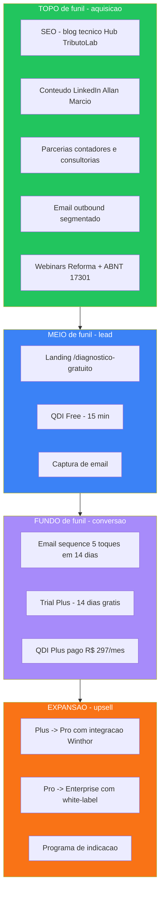
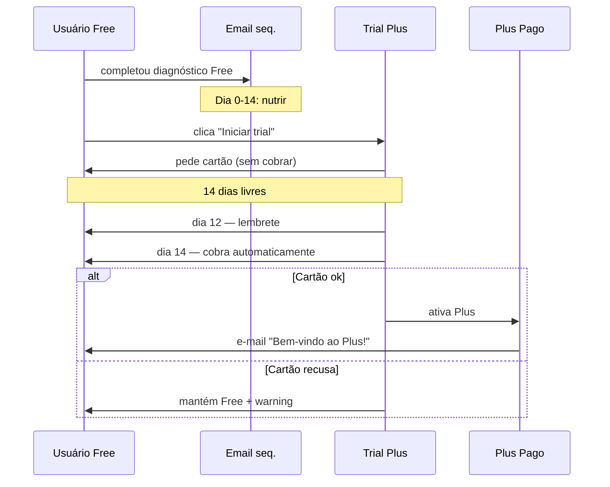
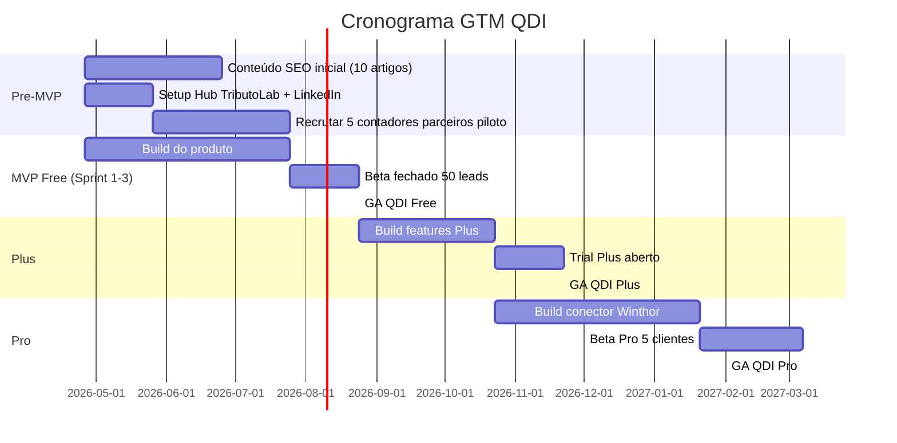

# 06 — Funil de Conversão e Go-to-Market

## 1. Resposta Direta

A estratégia de crescimento do QDI segue **funil PLG (Product-Led Growth) com 4 estágios**: **Topo (SEO + Conteúdo + LinkedIn) → Meio (Diagnóstico Free) → Fundo (Trial Plus) → Expansão (Pro/Enterprise)**. As **3 alavancas principais de aquisição** são: (a) **conteúdo SEO ancorado em LC 214/2025 e ABNT NBR 17301** (autoridade técnica), (b) **parcerias com escritórios contábeis** (white-label/comissão) e (c) **personal branding do Allan** via Hub TributoLab. Métricas-chave: **CAC < R$ 200**, **conversão Free→Plus ≥ 2%**, **LTV > 12× CAC**.

## 2. Funil de Conversão (visão macro)

## 3. Topo de Funil — Canais de Aquisição

### 3.1. SEO + Conteúdo Técnico (canal principal)

**Tese:** Reforma Tributária gera busca massiva por termos técnicos. Quem publicar **primeiro e mais profundo** captura tráfego orgânico de altíssima intenção.

**Conteúdo a produzir (priorizado por volume de busca):**

| Tipo | Volume estimado | Quantidade Q3 2026 | Foco |
|------|------------------|---------------------|------|
| Artigos de blog (1.500+ palavras) | 5-10k/mês | 24 artigos | Termos técnicos LC 214 |
| Glossário interativo | 50k buscas/mês | 1 página densa | "O que é cClassTrib?", "Como calcular CBS?" |
| Calculadoras públicas | 20k buscas/mês | 3 calculadoras simples | "Estimativa de CBS na sua receita" |
| Videos curtos LinkedIn | n/a | 12 videos | Tópicos polêmicos / didáticos |
| Webinar mensal | 200-500 inscritos | 3 webinars | "Reforma para CFOs" |
| Manifesto técnico /metodologia | n/a | 1 página densa | Transparência radical (SEO) |

**Palavras-chave priorizadas:**

| Palavra-chave | Volume mensal estimado | Concorrência | Prioridade QDI |
|---------------|--------------------------|--------------|----------------|
| "diagnóstico reforma tributária" | 1.200 | Média (Cosmos) | **Crítico** |
| "como se preparar reforma tributária" | 4.800 | Alta (BMS, Sovos) | Alta |
| "cClassTrib" | 2.400 | Baixa | **Crítico** (gap) |
| "ABNT NBR 17301" | 600 | Baixa | **Crítico** (gap) |
| "calculadora CBS IBS" | 3.600 | Média | Alta |
| "split payment Brasil" | 1.800 | Média | Média |
| "LC 214/2025" | 8.400 | Alta (Planalto) | Média |
| "compliance tributário" | 2.400 | Média | Alta |

**Estratégia:** dominar **palavras-chave de baixa concorrência e alto valor** primeiro (cClassTrib, ABNT 17301), depois escalar para termos competitivos.

### 3.2. Personal Branding (Hub TributoLab + Allan Marcio)

**Tese:** Allan já tem autoridade técnica em Winthor/Oracle e contabilidade. O Hub TributoLab + posicionamento Allan Marcio criam funil orgânico via LinkedIn + YouTube.

**Cadência de conteúdo:**

| Canal | Frequência | Tipo de conteúdo |
|-------|-----------|------------------|
| LinkedIn (Allan Marcio) | 3x/semana | Posts técnicos curtos (300-500 palavras) sobre Reforma |
| LinkedIn (TributoLab) | 2x/semana | Recortes de artigos do blog + cases |
| YouTube TributoLab | 1x/semana | Videos de 5-10 min explicando dispositivos da LC 214 |
| Newsletter TributoLab | 1x/semana | Curadoria de notícias + tutoriais |

**KPI personal branding:**
- 5.000 seguidores LinkedIn em 6 meses (de partida atual)
- 1.000 inscritos YouTube em 6 meses
- 3.000 inscritos newsletter em 6 meses
- Taxa de cliques newsletter → QDI Free: 20%

### 3.3. Parcerias com Escritórios Contábeis

**Tese:** Escritórios de contabilidade têm **base de clientes corporativos** que precisam de diagnóstico. QDI oferece ferramenta white-label + comissão de revenda.

**Modelo de parceria:**

| Tier de Parceiro | Critério | Comissão | Suporte |
|------------------|----------|-----------|---------|
| **Bronze** | 10-50 clientes Plus | 20% recorrente | Auto-atendimento |
| **Prata** | 50-200 clientes Plus | 30% recorrente | Manager dedicado |
| **Ouro** | 200+ clientes Plus | 35% recorrente + co-marketing | White-label total |

**Canal de captação de parceiros:**
- LinkedIn outreach segmentado (sócios de escritórios médios)
- Webinars exclusivos para contadores
- Programa "Contador-Embaixador" com 10 escritórios pioneiros (early adopters)

**Meta:** 50 parceiros ativos até Q2 2027.

### 3.4. Outbound Segmentado (B2B Tradicional)

**Tese:** Para tier Pro e Enterprise, vendas B2B tradicional funciona. CFOs de R$ 100M+ raramente convertem orgânico — precisam de ABM (Account-Based Marketing).

**Lista-alvo (Q4 2026 — 200 contas):**
- Empresas R$ 100M+ no Brasil (≈ 50.000 empresas elegíveis)
- Filtro setor: Comércio, Indústria, Serviços B2B (≈ 30.000)
- Filtro UF: SP, RJ, MG, RS, PR, SC (≈ 18.000)
- Top 200 priorizadas por: pesquisa LinkedIn (cargo CFO/Diretor Financeiro/Diretor Fiscal) + checagem se já tem ERP TOTVS/SAP/Oracle

**Cadência outbound:**
- LinkedIn (mensagem + post engagement) → 1ª resposta
- E-mail personalizado (3 toques em 14 dias) → demo
- Call de descoberta (30 min)
- Demo Pro (45 min) com case relevante
- Trial Pro (30 dias)

**Meta:** 5 deals Pro fechados em 90 dias.

## 4. Meio de Funil — Conversão para Lead

### 4.1. Landing Page de Diagnóstico

URL: `/diagnostico-gratuito` ou domínio próprio `diagnostico.tributiq.com.br`

**Estrutura da landing (otimizada para conversão):**

| Seção | Conteúdo | Objetivo |
|-------|----------|----------|
| Hero | Headline forte + CTA único + screenshot do dashboard | Atenção em 5s |
| Prova social | Logos de parceiros + métrica ("5.000 empresas diagnosticadas") | Confiança |
| Como funciona | 3 passos visuais (15 min total) | Reduzir objeção de tempo |
| O que você recebe | Lista visual dos 4 outputs (score, plano, PDF, dashboard) | Mostrar valor |
| Por que confiar | Manifesto público + base legal + ABNT 17301 | Diferenciação |
| FAQ | 5 dúvidas frequentes (segurança, LGPD, gratuidade) | Tirar objeções |
| CTA final | Botão grande "Iniciar diagnóstico de 15 minutos" | Conversão |

**A/B testing prioritário:**
- Versões de headline (problema-cêntrica vs. solução-cêntrica)
- Versões de prova social (números vs. logos)
- Posição do CTA (acima da dobra vs. final)

### 4.2. Otimização do Diagnóstico Free

**Pontos de fricção a otimizar:**

| Friction | Métrica atual (estimada) | Meta |
|----------|---------------------------|------|
| Abandonar antes de iniciar (landing) | 70% | 50% |
| Abandonar entre Etapas 2-3 (perfil → questionário) | 30% | 15% |
| Abandonar no meio do questionário | 20% | 10% |
| Abandonar antes de capturar e-mail | 15% | 5% |

**Ações:**
- Indicador de progresso visível em todas as etapas
- "Salvar e continuar depois" (link mágico via e-mail) em qualquer ponto
- Linguagem coloquial PT-BR (não jargão tributário sem explicação)
- Tooltip explicativo em todo termo técnico (cClassTrib, IBS, ABNT)
- Skip opcional em até 20% das perguntas (sem prejudicar score significativamente)

## 5. Fundo de Funil — Conversão para Pago

### 5.1. Sequência de E-mails Pós-Free (5 toques em 14 dias)

| Dia | Tema | Objetivo | CTA |
|-----|------|----------|-----|
| **0** | Relatório entregue | Engajar | "Acesse seu dashboard + baixe o PDF" |
| **1** | Educação: "O que é cClassTrib?" | Autoridade | "Ler artigo completo" |
| **3** | "Quanto sua empresa pagaria a mais?" | Despertar urgência financeira | "Iniciar 14 dias grátis Plus" |
| **7** | Case anônimo: empresa similar economizou R$ X | Prova social | "Iniciar 14 dias grátis Plus" |
| **14** | "Última chance: trial Plus expira" | Escassez | "Ativar trial agora" |

**Métricas esperadas:**
- Open rate: 35-50%
- Click rate: 8-15%
- Trial start: 5-8% dos que abriram

### 5.2. Mecânica do Trial Plus

**Política:**
- Sem cobrança no Dia 0 (apenas pré-autorização)
- Cancelamento no app (sem precisar ligar)
- Reembolso integral nos primeiros 7 dias (mesmo após cobrança)

### 5.3. Triggers Comportamentais In-App

| Comportamento | Trigger automático |
|---------------|---------------------|
| 3+ logins em 30 dias (Free) | E-mail "Vejo que você usa muito o QDI — que tal Plus?" |
| Tentativa de re-diagnóstico antes de 30 dias | Pop-up oferecendo trial Plus |
| Score Geral < 30 (Crítico) | E-mail "Score crítico — Plus calcula exposição em R$" |
| Compartilhamento do PDF Free | E-mail "Quer compartilhar a versão Plus com seu time?" |
| 60 dias sem login | E-mail "Sua empresa atualizou? Refaça o diagnóstico" |

## 6. Métricas-Chave de Funil

### 6.1. Métricas de Aquisição (Topo)

| Métrica | Meta MVP (90d) | Meta GA (180d) |
|---------|------------------|------------------|
| Visitas únicas /mês | 5.000 | 30.000 |
| % via SEO orgânico | 30% | 60% |
| % via LinkedIn | 25% | 20% |
| % via parceiros | 15% | 25% |
| % via outbound | 5% | 10% |
| % direto/referral | 25% | 15% |

### 6.2. Métricas de Lead (Meio)

| Métrica | Meta MVP | Meta GA |
|---------|----------|---------|
| Conversão landing → diagnóstico iniciado | 15% | 25% |
| Conversão diagnóstico iniciado → finalizado | 40% | 60% |
| Conversão finalizado → captura de e-mail | 50% | 70% |
| Diagnósticos finalizados/mês | 50 | 1.000 |

### 6.3. Métricas de Conversão (Fundo)

| Métrica | Meta GA |
|---------|---------|
| Conversão Free → Trial Plus | 5% |
| Conversão Trial → Plus pago | 40% |
| Conversão Plus → Pro | 10% (no 6º mês) |
| Conversão Pro → Enterprise | 10% (no 12º mês) |
| Conversão líquida Free → Plus pago | 2% |

### 6.4. Métricas de Negócio

| Métrica | Meta GA Q1 2027 |
|---------|------------------|
| MRR (Monthly Recurring Revenue) | R$ 30.000 |
| CAC (Customer Acquisition Cost) | < R$ 200 |
| LTV (Lifetime Value) | > R$ 2.400 (12+ meses Plus) |
| Razão LTV/CAC | > 12× |
| Payback period | < 3 meses |
| Churn mensal Plus | < 5% |
| Churn mensal Pro | < 2% |
| NPS Plus | > 50 |

## 7. Programa de Indicação

### 7.1. Mecânica simples

| Cliente atual | Indica | Recompensa |
|----------------|--------|-------------|
| Plus | Plus | 30 dias grátis |
| Plus | Pro | 3 meses grátis |
| Pro | Pro | 3 meses grátis |
| Pro | Enterprise | 6 meses grátis |
| Enterprise | Enterprise | comissão + co-marketing |

### 7.2. Implementação

- Link único compartilhável (UTM tracking)
- Dashboard de indicações no app
- Notificação automática quando indicação converte
- Crédito automático na próxima fatura

## 8. Posicionamento de Marca

### 8.1. Tagline

> *"O diagnóstico tributário que você merecia ter de graça."*

### 8.2. Tom de Voz

- **Direto** (sem rodeios corporativos)
- **Tecnicamente rigoroso** (citação dispositivo a dispositivo)
- **Empático com PME** (sem talk down)
- **Sem promessas exageradas** (compliance > otimização milagrosa)

### 8.3. Identidade Visual

A definir com Allan, baseada em `06_LOGOMARCAS/MARCAS_ECOSISTEMA_REFORMA/QDI-NB1-logo-completo.png`.

Diretrizes preliminares:
- Cores: paleta Tributiq (azul institucional + verde de score positivo + vermelho de criticidade)
- Tipografia: Inter (UI) + JetBrains Mono (números/score)
- Iconografia: Lucide (open-source consistente)
- Estilo: clean, executivo, sem "techbro" gradients

## 9. Cronograma de Lançamento

## 10. Riscos do GTM

| Risco | Probabilidade | Impacto | Mitigação |
|-------|---------------|---------|-----------|
| Cosmos Advisors saturar SEO antes do QDI | Média | Alto | Atacar palavras-chave gap (cClassTrib, ABNT) |
| Parcerias contadores não escalarem | Média | Médio | Diversificar canais (LinkedIn + outbound) |
| Conversão Free→Plus < 2% | Média | Crítico | Pricing dinâmico; aumentar gatilhos contextuais |
| Allan não conseguir manter cadência conteúdo | Alta | Alto | Contratar redator técnico após Q4 2026 |
| Big Four lançar ferramenta digital concorrente | Baixa | Crítico | Acelerar moats (Winthor, ABNT) |
| LGPD/regulação aumentar custo de ops | Baixa | Médio | DPO já contratado; políticas claras desde dia 1 |

## 11. Decisões Pendentes (validar com Allan)

| # | Decisão | Sua escolha |
|---|---------|-------------|
| 1 | Investir em Google Ads no GA? | Sugestão: não no MVP; reavaliar em Q1 2027 |
| 2 | Cobrar setup Pro (R$ 2.500 integração Winthor)? | Sugestão: sim, recupera custo de campo |
| 3 | Permitir e-mails @gmail no Free? | Sugestão: sim no Free, não no Plus+ |
| 4 | Trial Plus pede cartão ou não? | Sugestão: sim, reduz fraude e aumenta conversão pós-trial |
| 5 | Programa Bronze a partir de quantos clientes? | Sugestão: 10 clientes Plus pagantes |
| 6 | Quem redige os 24 artigos Q3 2026? | Sugestão: Allan + Claude pair (4-6h/semana) |

## 12. Próximo Passo

Após validação dos 6 documentos desta pasta, o passo lógico é:

1. **Aprovar a estratégia** (responder nesta sessão com ajustes)
2. **Redigir ADR-009** (Modelo de Score do QDI) — fixa pesos
3. **Iniciar Sprint 1** (no scaffold `018-QUALIDIAGIQ/`) — 3 horas/dia conforme dual-track
4. **Em paralelo**, começar a produção dos primeiros 5 artigos SEO (Q-FISC-001 vira artigo, etc.)

---

> **Fim da estratégia.** Volte para [`README.md`](README.md) para visão consolidada.
