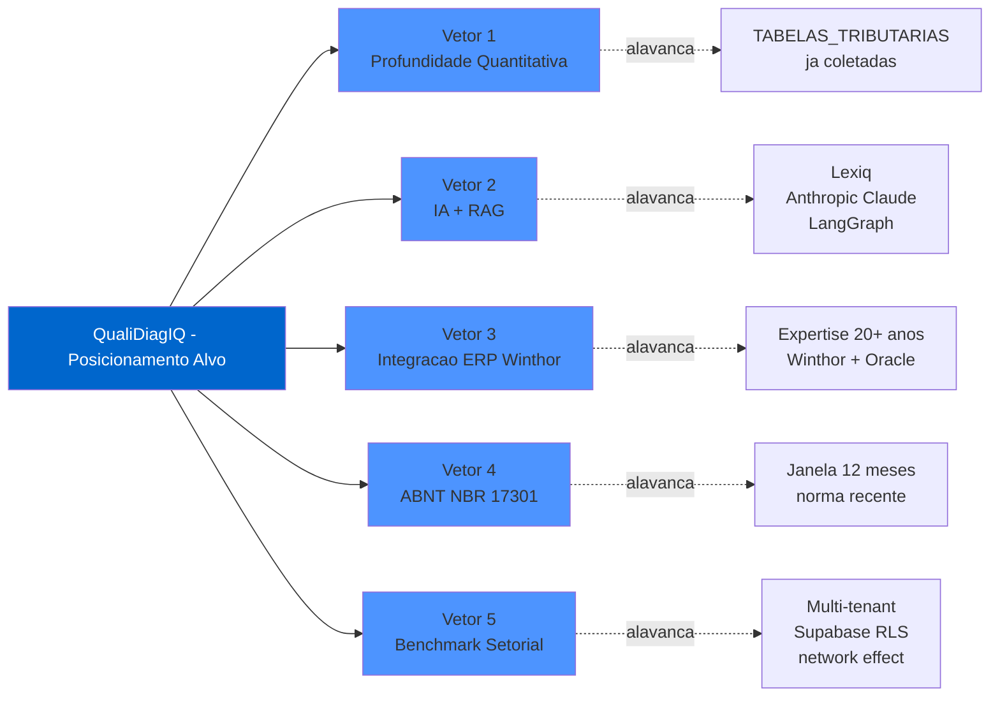
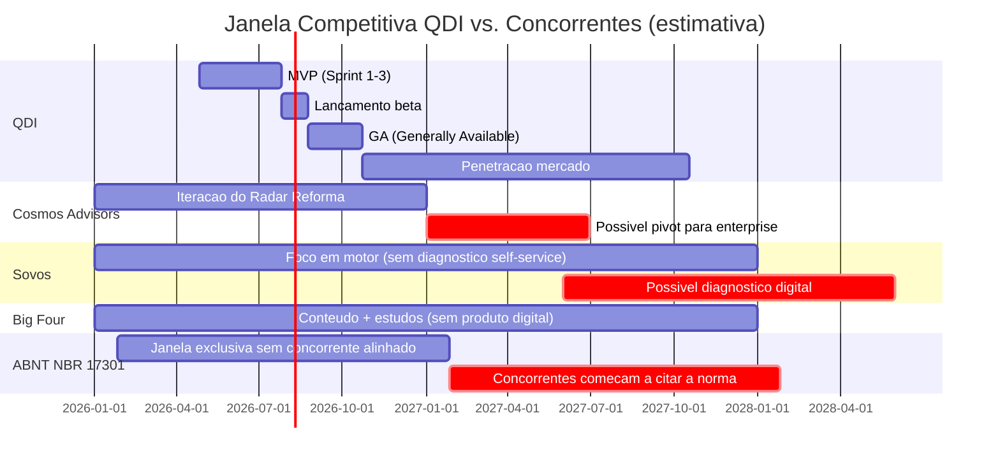

# Gap Analysis — Oportunidades Competitivas para o QualiDiagIQ

> **Insumo de Product Discovery** — derivado da matriz comparativa de 7 concorrentes
> **Data:** 2026-04-26
> **Documento companheiro:** `02_BENCHMARK_CONCORRENTES/00_MATRIZ_COMPARATIVA.md`
> **Próximo passo:** alimentar `recomendacoes_prd_qdi.md`

---

## 1. Resposta Direta

A análise de 7 concorrentes (Cosmos Advisors, BMS, Sovos, PwC, Fiscoplan, Peers, ABNT NBR 17301) revela que **o quadrante "Diagnóstico digital + IA + integração ERP" está vazio** no mercado brasileiro de Reforma Tributária. O QDI deve ocupar esse vazio com **5 vetores de diferenciação combinados** que, isoladamente, já existem em concorrentes esparsos, mas **nenhum competidor reúne todos**.

---

## 2. Cinco Vetores de Diferenciação Competitiva

Cada vetor é um eixo arquitetural-comercial que diferencia o QDI estruturalmente. Combinar os 5 cria barreira de entrada (moat).

### 🎯 Vetor 1 — Profundidade Quantitativa Tributária

**Lacuna observada:** todos os concorrentes (incluindo Cosmos) ficam em análise qualitativa. Linguagem é "alto/médio/baixo impacto", "carga estimada", "necessidade de ajuste".

**Proposta QDI:**
- Simulador real de CBS+IBS+IS por SKU/categoria, integrado às TABELAS_TRIBUTARIAS já coletadas (cClassTrib, cCredPres, CST, NCM, CFOP).
- Cálculo de **fluxo de caixa 2026–2033** com sensibilidade a três cenários de alíquota (otimista, realista, pessimista).
- **Estimativa de exposição em R$** por gap detectado (Fiscoplan e BMS apontam gaps; QDI quantifica).
- **Crédito recuperável estimado** de PIS/COFINS pré-CBS na transição.

**Insumos disponíveis:** TABELAS_TRIBUTARIAS/99_normalizado/csv/ (cClassTrib, cCredPres, NCM, CFOP); LC 214/2025; NT 2025.002.

**Impacto comercial:** transforma o QDI de "calculadora de risco percebido" em **calculadora de risco financeiro**, abrindo conversa direta com CFOs.

---

### 🤖 Vetor 2 — IA / LLM Embarcada com RAG sobre Base Legal Versionada

**Lacuna observada:** **zero concorrentes** declaram uso de IA/LLM, RAG ou agentes. Em 2026 isso já é desvantagem narrativa — em 2027 será desvantagem competitiva absoluta.

**Proposta QDI:**
- **RAG (Retrieval-Augmented Generation)** sobre Lexiq (base legal versionada do ecossistema Tributiq): EC 132/2023, LC 214/2025, LC 225/2026, INs RFB, NTs CGNFS-e e CGSEFAZ.
- **LLM (Anthropic Claude / OpenAI)** gera **plano de ação personalizado** em tom apropriado por persona (CFO, contador, dono).
- **Classificação automática de NCM** para empresas que enviarem catálogo de produtos.
- **Chatbot tributário** durante o questionário ("o que é cClassTrib?") com citação dispositivo a dispositivo.
- **LangGraph** para orquestração de fluxos de estado (questionário adaptativo + simulação + geração de relatório).

**Insumos disponíveis:** Anthropic Claude já mapeado no projeto; LangChain/LangGraph na stack padrão (`project_014_saas_reforma.md`); pgvector no Supabase; TABELAS_TRIBUTARIAS já normalizadas para chunking.

**Impacto comercial:** posiciona o QDI como **único concorrente "IA-native"** em diagnóstico tributário — diferencial decisivo para CIO/CTO da empresa-cliente.

---

### 🔌 Vetor 3 — Integração ERP Nativa (Winthor → TOTVS → SAP)

**Lacuna observada:** **zero concorrentes** integram ERP. Todos dependem de respostas auto-declaradas pelo usuário, com risco de viés de auto-relato.

**Proposta QDI:**
- **Conector nativo Winthor** (primeiro, alavancando 20+ anos de expertise Allan em Oracle/Winthor).
- Roadmap: TOTVS Protheus, SAP Business One, Sankhya.
- **Diagnóstico baseado em dados reais**: leitura de XMLs das últimas 12 NF-e, mapa de NCM/CST efetivo, análise de uso de regimes especiais, créditos acumulados, faturamento por UF.
- **MCP (Model Context Protocol)** para que o LLM acesse dados Oracle/Winthor com governança.

**Insumos disponíveis:** skill `winthor-oracle-agent` já mapeada (`/var/folders/.../skills/winthor-oracle-agent/`); ADR-006 já estabelece padrão Anti-Corruption Layer para adapters; agente de IA Winthor é projeto matriz.

**Impacto comercial:** **moat técnico defensável** — concorrentes como Cosmos (low-code) não conseguem replicar; Sovos (enterprise) é caro demais para PME. QDI ocupa o vazio.

---

### 📜 Vetor 4 — Aderência Normativa ABNT NBR 17301 + Programa Confia

**Lacuna observada:** ABNT NBR 17301 foi publicada em janeiro/2026. **Nenhum concorrente** ancora seu diagnóstico nela. Janela de oportunidade pura: ~12 meses até concorrentes notarem.

**Proposta QDI:**
- **Score de aderência ABNT NBR 17301** como saída do diagnóstico, em escala de maturidade (PDCA por eixo: Plan/Do/Check/Act).
- **7 eixos da norma** como dimensões do questionário (políticas internas, riscos fiscais, controles operacionais, registros, comunicação, monitoramento, melhoria contínua).
- **Pré-auditoria Programa Confia** — posiciona QDI como ponte para o modelo cooperativo do fisco (relação fisco × contribuinte renovada).
- **Relatório de gaps ABNT NBR 17301** com plano de remediação.
- **Trilha de prontidão** para futura certificação por organismos acreditados.

**Insumos disponíveis:** análise completa em `02_BENCHMARK_CONCORRENTES/07_abnt_nbr_17301_compliance.md`.

**Impacto comercial:** discurso comercial **único e legítimo**: "diagnóstico ABNT NBR 17301-aderente, alinhado ao Programa Confia da Receita Federal". Argumento direto para CFO + Jurídico.

---

### 📊 Vetor 5 — Benchmark Setorial Anônimo (vantagem multi-tenant)

**Lacuna observada:** nenhum concorrente entrega comparação relativa com pares. Todos dão score absoluto. Cosmos chega perto, mas isolado.

**Proposta QDI:**
- A cada empresa diagnosticada, sua resposta entra (anonimamente) no banco multi-tenant.
- Para cada cliente, gerar **score absoluto + score relativo ao setor + porte + UF**.
- "Sua empresa está no **percentil 35** entre varejistas do Sul de mesmo porte."
- Aproveitar dados PwC como **âncora externa** ("83% das empresas esperam alto impacto — você está entre os 17%").
- Atualização do benchmark a cada nova empresa diagnosticada (network effect: quanto mais clientes, mais valioso).

**Insumos disponíveis:** Supabase RLS já é stack padrão; multi-tenant desde o dia 1 é princípio arquitetural transversal (`project_014_saas_reforma.md`).

**Impacto comercial:** **network effect próprio do SaaS multi-tenant** — quanto mais empresas usam o QDI, mais útil ele fica. Cosmos (cliente único por sessão) e consultorias (1:1) não conseguem replicar.

---

## 3. Vetores Secundários (úteis mas não decisivos)

| Vetor | Descrição | Prioridade |
|-------|-----------|-----------|
| Setorialização varejo | Submódulo ICMS-ST → IBS/CBS, Order to Cash, sortimento | Médio (Peers tem; QDI deve igualar e superar) |
| Cronograma 2026-2033 | Estender ações para todo o período de transição | Médio (BMS tem; copiar) |
| Heatmap visual + cronograma | 3 visualizações analíticas | Médio (Cosmos tem; copiar) |
| Trilha educacional integrada | Microlearning conectado ao diagnóstico via Hub TributoLab | Baixo (mas barato — alavanca conteúdo Allan Marcio) |
| White-label para contadores | Versão revendável por escritórios contábeis | Baixo (canal futuro — Tributalis e parcerias) |
| Templates de documentos prontos | Políticas, ITs, ADRs gerados automaticamente | Médio (lead magnet adicional) |

---

## 4. Matriz de Diferenciação Pareada (QDI × cada concorrente)

| Concorrente | Em que QDI ganha | Em que concorrente ainda ganha | QDI deve neutralizar |
|-------------|-------------------|--------------------------------|----------------------|
| **Cosmos Advisors** | Stack robusto, IA, integração ERP, ABNT, benchmark relativo | Time-to-market (já está rodando), SEO de "Radar Reforma" | Lançar lead magnet com nome forte, SEO desde dia 1 |
| **BMS Projetos** | Produto digital, escala, IA | Marca consolidada (3.500 clientes), capilaridade | Ofertar QDI como ferramenta complementar a consultorias (parceria) |
| **Sovos Brazil** | Foco diagnóstico, preço (gratuito), simplicidade | Stack enterprise, presença global | Não competir em cálculo contínuo (escopo Sovos); vender pré-Sovos |
| **PwC Brasil** | Produto, escala, integração | Autoridade reputacional Big Four | Citar dados PwC como âncora; coopetição via parceria de research |
| **Fiscoplan** | Produto digital, IA, ABNT | Especialização em recuperação de créditos | Adicionar módulo recuperação como expansão (QFC) |
| **Peers Consulting** | Produto, escala, ABNT, IA | Profundidade setorial varejo, network corporativo | Profundizar QDI no varejo desde MVP |
| **ABNT NBR 17301** | Aplicação prática, automação | Autoridade normativa | Citar a norma como framework — não competir, alinhar-se |

---

## 5. Diagrama de Diferenciação

**Observação arquitetural crítica:** cada vetor alavanca um ativo já existente no ecossistema — não exige construção do zero. Isso reduz risco e tempo de execução.

---

## 6. Riscos Estratégicos

| # | Risco | Probabilidade | Impacto | Mitigação |
|---|-------|---------------|---------|-----------|
| 1 | Cosmos Advisors evoluir stack para enterprise antes do QDI lançar | Média | Alto | Acelerar MVP em 90 dias; lock-in via integração Winthor |
| 2 | Big Four (PwC, EY, KPMG) lançar ferramenta digital | Baixa | Crítico | Diferenciação via PME + integração ERP — Big Four não atende esse perfil |
| 3 | Sovos lançar diagnóstico self-service no Brasil | Baixa | Alto | Ancoragem em ABNT NBR 17301 + Programa Confia (foco BR exclusivo) |
| 4 | LC 214/2025 sofrer alteração radical em 2026/2027 | Média | Alto | RAG versionado por data de vigência (já é princípio do projeto) |
| 5 | ABNT NBR 17301 não pegar tração no mercado | Média | Médio | Não depender 100% — diferencial mas não único |
| 6 | Allan ter limitação de tempo (3h/dia + saúde) | Alta | Crítico | Cronograma realista + dual-track 70/30 com QMI (ADR-008); validação curta a cada sprint |

---

## 7. Janela Competitiva Estimada

**Janelas-chave para o QDI:**
- **Q2-Q3 2026:** janela de MVP — concorrentes ainda iterando.
- **Q4 2026 – Q2 2027:** janela ABNT NBR 17301 exclusiva.
- **Q3 2027 em diante:** competição mais intensa — vetor 3 (Winthor) e vetor 5 (benchmark) viram moat.

---

## 8. Próximo Passo

Documento companheiro: `matriz_decisao_features_qdi.md` — converte os 5 vetores e 6 secundários em **lista priorizada de features (Must / Should / Could)** para o PRD do QDI.
