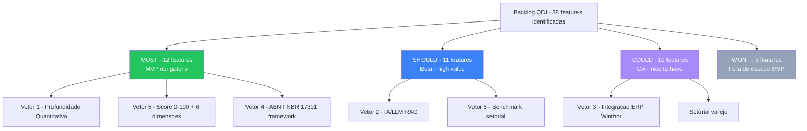
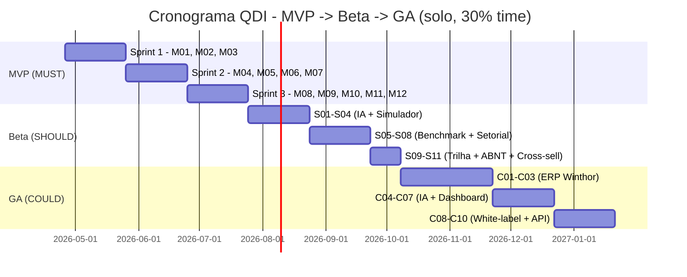

# Matriz de Decisão de Features do QualiDiagIQ — MoSCoW

> **Insumo direto do PRD do QDI** — converte os vetores de diferenciação do `gap_analysis_oportunidades.md` em lista priorizada
> **Framework:** MoSCoW (Must / Should / Could / Won't) + scoring RICE quando aplicável
> **Horizonte:** MVP (Sprint 1-3 = ~90 dias) → Beta (30 dias) → GA (60 dias)

---

## 1. Visão Geral — 4 Camadas de Priorização

---

## 2. Camada MUST (MVP — 12 features)

São funcionalidades **sem as quais o QDI não pode ser lançado**. Cobrem o questionário básico, o motor de score e a entrega de relatório.

| # | Feature | Origem | RICE Score | Esforço (dias) |
|---|---------|--------|------------|----------------|
| M01 | **Wizard de questionário adaptativo** (segmento × regime × porte × UF) | Cosmos C1 + PwC C4 | 9.0 | 8 |
| M02 | **Motor de score 0-100 com 6+ dimensões** (Fiscal, Estratégica, Contábil, Financeira, Operacional, Tecnológica, Compliance/ABNT) | Cosmos C1 + ABNT C7 | 9.5 | 10 |
| M03 | **Pesos transparentes por pergunta** + ponderação por dimensão (manifesto público) | Cosmos C1 (transparência) | 7.5 | 3 |
| M04 | **Relatório PDF executivo** (output principal — 1 página executivo + 6 páginas técnicas) | Fiscoplan C5 + Cosmos C1 | 8.5 | 8 |
| M05 | **Heatmap de criticidade** + duas outras visualizações (radar + ranking de gaps) | Cosmos C1 | 7.0 | 5 |
| M06 | **Cronograma de implementação** com 5 fases temporais (curto / médio / longo / 36-60m / 60-96m) | BMS C2 + Cosmos C1 | 7.5 | 4 |
| M07 | **Recomendações priorizadas** geradas a partir das respostas (regras determinísticas, sem LLM ainda) | BMS C2 + Fiscoplan C5 | 8.0 | 6 |
| M08 | **Ancoragem legal por bullet** (LC 214/2025, EC 132/2023, NTs) com citação dispositivo a dispositivo | BMS C2 | 7.0 | 4 |
| M09 | **Lead magnet self-service** com captura mínima (e-mail + CNPJ + segmento + regime + porte + UF) | Cosmos C1 + Fiscoplan C5 | 8.5 | 3 |
| M10 | **Multi-tenant Supabase com RLS** | Princípio arquitetural Tributiq | 9.0 | 5 |
| M11 | **Eixos ABNT NBR 17301** como espinha do questionário (PDCA + 7 pilares) | ABNT C7 | 8.5 | 6 |
| M12 | **Checklist final de 10 itens binários** (modelo BMS + ABNT) | BMS C2 + ABNT C7 | 6.5 | 2 |

**Total MUST:** 12 features · ~64 dias de desenvolvimento puro · cabe em 1 sprint trimestral solo (Sprint 1-3).

---

## 3. Camada SHOULD (Beta — 11 features)

Funcionalidades de **alta diferenciação** que entram após o MVP rodar com primeiros clientes.

| # | Feature | Origem | RICE | Esforço (dias) |
|---|---------|--------|------|----------------|
| S01 | **LLM (Claude/OpenAI) gerando plano de ação personalizado** com tom por persona | Vetor 2 (IA) | 9.0 | 7 |
| S02 | **RAG sobre Lexiq** para FAQ contextual durante questionário | Vetor 2 (IA) | 7.5 | 6 |
| S03 | **Simulador IBS+CBS+IS por categoria** (não por SKU ainda) com cenários (otimista/realista/pessimista) | Vetor 1 (Quantitativo) | 9.5 | 10 |
| S04 | **Estimativa de exposição em R$** por gap detectado | Vetor 1 + Fiscoplan | 8.5 | 5 |
| S05 | **Score relativo ao setor** (benchmark anônimo entre tenants) | Vetor 5 + PwC âncora | 9.0 | 5 |
| S06 | **Análise ICMS-ST → IBS/CBS** com cálculo de capital de giro afetado | Peers C6 | 8.0 | 6 |
| S07 | **Templates de documentos prontos** (política compliance, IT, plano remediação) gerados via LLM | Vetor 2 + Fiscoplan | 7.0 | 4 |
| S08 | **Setorialização varejo profunda** (subsegmentos: supermercado, e-commerce, drogaria, atacarejo) | Peers C6 | 8.0 | 7 |
| S09 | **Microlearning integrado** (link para Hub TributoLab) | Sovos C3 (capacitação) | 5.5 | 3 |
| S10 | **Gating ABNT NBR 17301**: relatório de aderência detalhado + plano de remediação | ABNT C7 + Vetor 4 | 8.0 | 5 |
| S11 | **Funil cross-sell QDI → QFI/QMI** (recomendação de módulos do ecossistema) | Tributiq strategy | 7.5 | 3 |

**Total SHOULD:** 11 features · ~61 dias.

---

## 4. Camada COULD (GA — 10 features)

Funcionalidades **de diferenciação avançada** ou **escalabilidade** — entram após validação com clientes pagantes.

| # | Feature | Origem | RICE | Esforço (dias) |
|---|---------|--------|------|----------------|
| C01 | **Conector ERP Winthor nativo** (leitura XML últimas 12 NF-e) | Vetor 3 + skill winthor-oracle-agent | 9.5 | 15 |
| C02 | **Análise de fluxo de caixa 2026-2033** com sensibilidade a alíquotas | Vetor 1 + BMS | 8.0 | 8 |
| C03 | **Crédito recuperável estimado** (PIS/COFINS pré-CBS na transição) | Fiscoplan + Vetor 1 | 7.5 | 6 |
| C04 | **Classificação automática de NCM** via LLM | Vetor 2 (IA) | 7.0 | 5 |
| C05 | **Order to Cash sob split payment** | Peers C6 | 7.5 | 7 |
| C06 | **Conector ERP TOTVS Protheus** | Vetor 3 expansão | 8.5 | 10 |
| C07 | **Dashboard navegável** com simulação ajustável de premissas em tempo real | Cosmos C1 (output) | 7.5 | 6 |
| C08 | **White-label para contadores/consultorias** (Tributalis primeiro; BMS/Peers como canais) | Vetor 5 expansão | 7.0 | 8 |
| C09 | **Pré-auditoria certificadora ABNT NBR 17301** (preparação formal para certificação) | Vetor 4 expansão | 6.5 | 5 |
| C10 | **API pública QDI** para parceiros consumirem score | Tributiq strategy | 6.0 | 4 |

**Total COULD:** 10 features · ~74 dias.

---

## 5. Camada WON'T (fora de escopo MVP)

Funcionalidades **fora do escopo do QDI** que pertencem a outros módulos do ecossistema ou ao roadmap futuro.

| # | Feature | Por que fica fora? | Para onde vai? |
|---|---------|---------------------|----------------|
| W01 | Apuração CBS/IBS contínua | Escopo do QAI | QualiApuraIQ |
| W02 | Split payment orquestrador | Escopo do QFC | QualiFinCredIQ |
| W03 | Auditoria contínua de motores tributários | Escopo do QMI | QualiMixIQ |
| W04 | Defesa de autos de infração | Fora do ecossistema | Consultoria parceira (Fiscoplan-like) |
| W05 | Recuperação ativa de créditos pré-CBS | Outro produto Tributiq (RestituIQ — fora do Reforma) | RestituIQ |

---

## 6. Mapeamento RICE Score (top 15)

Reach × Impact × Confidence ÷ Effort — top 15 features por valor:

| Rank | Feature | RICE | Camada |
|------|---------|------|--------|
| 1 | M02 — Motor de score 0-100 com 7 dimensões | 9.5 | MUST |
| 2 | C01 — Conector ERP Winthor | 9.5 | COULD |
| 3 | S03 — Simulador IBS+CBS+IS | 9.5 | SHOULD |
| 4 | M10 — Multi-tenant Supabase RLS | 9.0 | MUST |
| 5 | M01 — Wizard adaptativo | 9.0 | MUST |
| 6 | S01 — LLM plano de ação personalizado | 9.0 | SHOULD |
| 7 | S05 — Score relativo benchmark setorial | 9.0 | SHOULD |
| 8 | M04 — Relatório PDF executivo | 8.5 | MUST |
| 9 | M11 — Eixos ABNT NBR 17301 | 8.5 | MUST |
| 10 | M09 — Lead magnet self-service | 8.5 | MUST |
| 11 | C06 — Conector TOTVS Protheus | 8.5 | COULD |
| 12 | S04 — Estimativa de exposição R$ | 8.5 | SHOULD |
| 13 | M07 — Recomendações priorizadas | 8.0 | MUST |
| 14 | C02 — Fluxo caixa 2026-2033 | 8.0 | COULD |
| 15 | S06 — ICMS-ST → IBS/CBS | 8.0 | SHOULD |

---

## 7. Estimativa de Cronograma (solo, ~3h/dia)

Considerando o perfil de Allan (3h/dia úteis, ~15h/semana, dual-track 70% QMI / 30% QDI):

- **Tempo dedicado QDI:** ~4,5h/semana
- **Velocity estimada:** 1 dia de feature MUST = ~2 semanas calendário (incluindo testes + docs)

**Marcos:**
- **MVP:** 90 dias (Q3 2026)
- **Beta:** +75 dias (Q4 2026)
- **GA:** +105 dias (Q1 2027)

---

## 8. Critérios de Aprovação por Camada

### MUST (lançamento beta)
- [ ] Todos os 12 itens implementados e testados (cobertura unit ≥ 80%)
- [ ] Score 0-100 calibrado contra 5 cases de referência (varejo, indústria, serviços, agro, saúde)
- [ ] Relatório PDF aprovado por 3 contadores externos (validação qualitativa)
- [ ] Manifesto técnico público (pesos das perguntas) revisado por advogado tributarista
- [ ] Aderência a 7 eixos da ABNT NBR 17301 declarada e auditável
- [ ] LGPD: consentimento + termos de uso + política de privacidade

### SHOULD (lançamento GA)
- [ ] LLM com guardrails (sem citação válida = resposta rejeitada)
- [ ] Simulador IBS+CBS+IS validado contra Calculadora Oficial RFB (`04_PESQUISA/APIS_GOVERNAMENTAIS/CALCULADORA_RFB/`)
- [ ] Benchmark setorial com mínimo 100 empresas no banco para 5 setores principais

### COULD (expansão pós-GA)
- [ ] Conector Winthor com testes de integração contra Oracle 11g/19c
- [ ] White-label com 3 contadores parceiros piloto
- [ ] API pública com OpenAPI 3.1 + rate limiting

---

## 9. Decisões Pendentes (precisam validação Allan)

| # | Decisão | Opções | Recomendação inicial |
|---|---------|--------|----------------------|
| D1 | **Stack frontend** | Next.js 14 / Remix / SvelteKit | Next.js 14 (mais maduro p/ SaaS) |
| D2 | **Geração de PDF** | WeasyPrint / Puppeteer / ReportLab | WeasyPrint (Python-native, alinhado ao stack QDI Python) |
| D3 | **Modelo comercial MVP** | 100% gratuito / Freemium (pago avançado) / Pago direto | Freemium — gratuito básico + pago enterprise |
| D4 | **Captura de lead** | E-mail + CNPJ obrigatórios desde dia 1 / Anônimo + e-mail só no relatório | E-mail só no relatório (menos atrito) |
| D5 | **Idioma** | Apenas pt-BR / pt-BR + en (futuro) | pt-BR exclusivo no MVP |

---

## 10. Próximo Passo

Documento companheiro: `recomendacoes_prd_qdi.md` — converte esta matriz em **estrutura de PRD pronta para preencher** + decisões arquiteturais finais.
