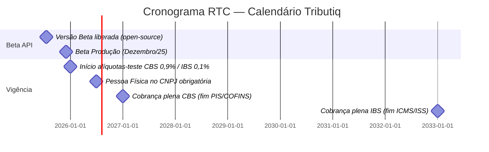
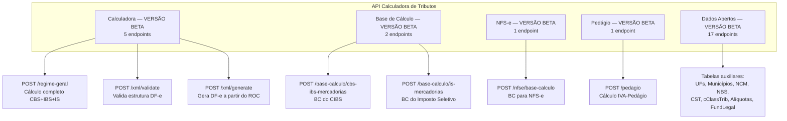

# 00 — Visão Geral: Calculadora de Tributos do Consumo

## 1. O que é

A **Calculadora de Tributos do Consumo** é o **motor de cálculo oficial** da Receita Federal do Brasil (RFB) para a **Reforma Tributária sobre o Consumo (RTC)**, implementada pela **Lei Complementar nº 214/2025** e pela **Emenda Constitucional nº 132/2023**.

Ela calcula:
- **CBS** — Contribuição sobre Bens e Serviços (federal, substitui PIS/COFINS)
- **IBS** — Imposto sobre Bens e Serviços (estadual + municipal, substitui ICMS/ISS)
- **IS** — Imposto Seletivo (sobre bens/serviços nocivos à saúde/meio ambiente, substitui parte do IPI)

> **Citação oficial (RFB, 18/07/2025):**
> _"A Calculadora de Tributos é o motor de cálculo oficial da Reforma Tributária sobre o Consumo, desenvolvido pela Receita Federal. Com conteúdo normativo embarcado, a ferramenta transforma a complexidade da nova legislação em lógica computacional padronizada, auditável e transparente."_

## 2. Quem opera

| Ator | Papel |
|---|---|
| **Receita Federal do Brasil (RFB)** | Desenvolve e mantém o motor; define lógica de cálculo |
| **Comitê Gestor do IBS (CGIBS)** | Edita normas conjuntas (criado pela LC 218/2025) |
| **Serpro** | Operação de infraestrutura digital (Portal Nacional da Tributação sobre Bens e Serviços) |
| **Estados, DF, Municípios** | Co-gestão do IBS via CGIBS |

## 3. Cronograma da Reforma (relevante para a API)



**Texto oficial (Orientações 2026 — RFB, 12/12/2025):**
> _"Considerando que o ano de 2026 será o ano de teste da CBS e do IBS, o contribuinte que emitir documentos fiscais ou declaração de regimes específicos observando as normas e notas vigentes, estará dispensado de recolhimento do IBS e da CBS."_

**Alíquotas-teste 2026** (LC 214/2025 art. 343):
- CBS: **0,9%**
- IBS: **0,1%** (sendo 0,05% IBS-UF + 0,05% IBS-Município, na prática)
- Caráter **meramente informativo** (sem recolhimento se obrigações acessórias cumpridas)

## 4. Modalidades de Acesso

| Modalidade | Descrição | Quando usar |
|---|---|---|
| **Simulador Web** | UI online em `piloto-cbs.tributos.gov.br` | Validação manual / treinamento |
| **REST API** (este projeto) | OpenAPI 3.1 em `consumo.tributos.gov.br:18016` | Integração ERP/SaaS de baixo/médio volume |
| **Componente Offline** | Download de JAR/binário para execução local | ERPs com volume alto, sigilo total |
| **Assistente de Emissão** | Geração automática dos grupos CBS/IBS no XML do DF-e | Inicialmente para NF-e; evolui para NFC-e, CT-e, NFS-e |

## 5. Documentos Fiscais Eletrônicos Suportados

A API aceita **8 tipos de DF-e** nos endpoints `/calculadora/xml/validate` e `/calculadora/xml/generate`:

| Sigla | Documento | Uso |
|---|---|---|
| `nfe` | Nota Fiscal Eletrônica | Mercadorias (B2B) |
| `nfce` | Nota Fiscal de Consumidor Eletrônica | Varejo (B2C) |
| `nfse` | Nota Fiscal de Serviço Eletrônica | Serviços (substitui modelos municipais) |
| `cte` | Conhecimento de Transporte Eletrônico | Transporte de cargas |
| `cte-simplificado` | CT-e Simplificado | Transporte simplificado |
| `bpe` | Bilhete de Passagem Eletrônico | Transporte de passageiros |
| `bpe-tm` | BP-e Transporte Metropolitano | Metrô/ônibus urbano |
| `nf3e` | NF de Energia Elétrica Eletrônica | Concessionárias de energia |

Outros DF-e citados na orientação RFB (a serem adicionados): NFCom, NFS-e Via (Pedágio), NF-ABI, NFAg, BP-e Aéreo, NF-e Gás, DeRE.

## 6. Estrutura Funcional dos 5 Grupos da API



## 7. Conceito-chave: ROC (Recibo da Operação de Consumo)

O contrato de cálculo gira em torno do **ROC — Recibo da Operação de Consumo** (`schema: ROCDomain`). É o objeto de saída do `/calculadora/regime-geral` e o objeto de entrada do `/calculadora/xml/generate`. Estrutura:

```
ROCDomain
 ├── objetos[]               (lista de itens calculados)
 │    └── ObjetoDomain
 │         ├── tributos      (TributosDomain → IBSCBS + IS)
 │         └── ...
 └── total                   (ValoresTotaisDomain → totalizadores)
      └── tributos           (TributosTotaisDomain)
           ├── gIBSCBSTot    (totais IBS+CBS)
           └── gISTot        (totais Imposto Seletivo)
```

**Analogia para Allan:** o ROC é equivalente ao **objeto `TFDPrecalcResult` ou `TPCNotaFiscalCalculo`** que você já viu em rotinas Delphi de cálculo no Winthor — um agregado serializável com a memória de cálculo + totalizadores.

## 8. Princípios Arquiteturais Embutidos

A própria RFB declara que a Calculadora segue:

1. **Tax-as-a-Service (TaaS)** — modelo público/aberto, sem acoplamento ao operador.
2. **Administração Tributária 3.0 (OCDE)** — automação, cooperação, conformidade assistida.
3. **Open Source** — código fonte previsto para disponibilização pública.
4. **Sistemas naturais** — embarcado nos sistemas do contribuinte, sem necessidade de conexão online (modo offline).
5. **Conteúdo normativo embarcado** — regras de cálculo dentro do próprio motor; atualização vem da RFB.

## 9. Próximos Documentos

- [`01-endpoints.md`](01-endpoints.md) — referência completa de cada um dos 27 endpoints
- [`02-schemas.md`](02-schemas.md) — catálogo dos 63 schemas (DTOs)
- [`03-exemplos-payload.md`](03-exemplos-payload.md) — payloads JSON anotados
- [`04-integracao-tributiq.md`](04-integracao-tributiq.md) — como integrar ao monorepo Tributiq
- [`05-referencias.md`](05-referencias.md) — links oficiais e legislação

