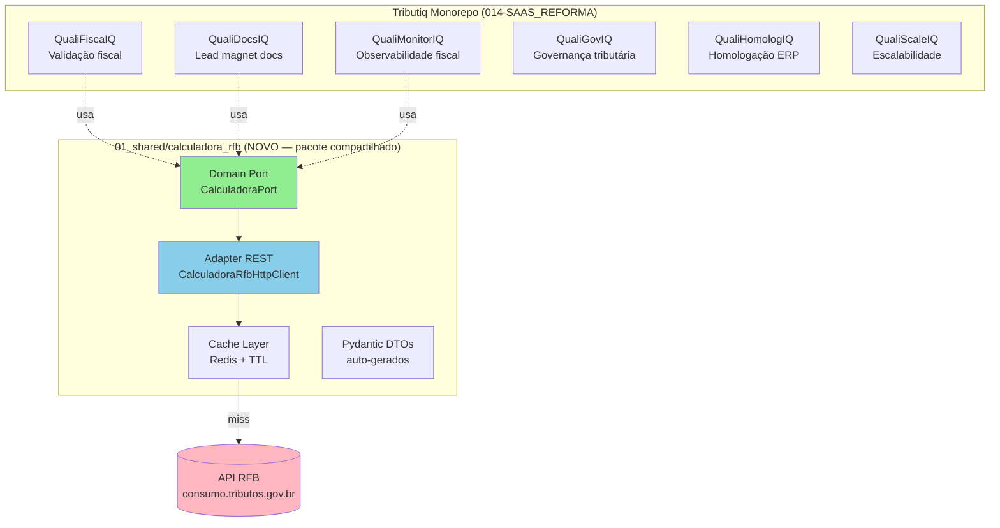

# 04 — Integração ao Monorepo Tributiq

> **Princípio condutor:** isolar o domínio do Tributiq da volatilidade do Beta da API oficial via **Hexagonal Architecture (Ports & Adapters)**.

---

## 1. Onde a Calculadora se encaixa no ecossistema Tributiq



**Decisão arquitetural:** criar um **pacote compartilhado** em `01_shared/calculadora_rfb/` para que **todos os 6 produtos Quali*IQ** consumam a Calculadora pela mesma porta — DRY e governança centralizada.

---

## 2. Estrutura sugerida no monorepo

```
014-SAAS_REFORMA/
└── 01_shared/
    └── calculadora_rfb/                  ← NOVO PACOTE
        ├── __init__.py
        ├── domain/
        │   └── ports/
        │       └── calculadora_port.py   ← Protocol/ABC
        ├── application/
        │   └── use_cases/
        │       ├── calcular_regime_geral_uc.py
        │       ├── consultar_aliquota_uc.py
        │       └── validar_xml_uc.py
        ├── infrastructure/
        │   ├── http/
        │   │   ├── client.py             ← httpx + tenacity
        │   │   └── circuit_breaker.py
        │   ├── cache/
        │   │   └── redis_cache.py
        │   ├── dto/
        │   │   └── generated.py          ← gerado por datamodel-code-generator
        │   └── config.py                 ← Pydantic Settings
        └── tests/
            ├── contract/
            │   └── test_openapi_snapshot.py
            └── integration/
                └── test_real_api.py      ← marcador @pytest.mark.live
```

---

## 3. Port (interface de domínio) — Clean Architecture

```python
# 01_shared/calculadora_rfb/domain/ports/calculadora_port.py
from typing import Protocol
from datetime import date
from decimal import Decimal
from dataclasses import dataclass


@dataclass(frozen=True)
class ResultadoCalculo:
    """Resultado canônico do cálculo, INDEPENDENTE da API externa.
    Os 6 produtos Quali*IQ consomem este DTO; mudanças no contrato
    externo não vazam para o domínio."""
    base_calculo_cibs: Decimal
    valor_ibs: Decimal
    valor_cbs: Decimal
    valor_is: Decimal
    memoria_calculo: str
    payload_completo: dict  # ROC original (audit trail)


class CalculadoraPort(Protocol):
    """Porta de domínio para o motor de cálculo da RTC.

    Implementações conhecidas:
    - CalculadoraRfbHttpAdapter   (REST online)
    - CalculadoraOfflineAdapter   (componente local)
    - CalculadoraFakeAdapter      (testes)
    """

    def calcular_regime_geral(self, operacao: dict) -> ResultadoCalculo: ...

    def consultar_aliquota_uniao(self, data_ref: date) -> Decimal: ...

    def consultar_aliquota_uf(self, codigo_uf: int, data_ref: date) -> Decimal: ...

    def consultar_aliquota_municipio(
        self, codigo_municipio: int, data_ref: date
    ) -> Decimal: ...

    def validar_xml_dfe(self, xml: bytes, tipo: str, subtipo: str) -> dict: ...

    def health_check(self) -> dict: ...
```

**Analogia para Allan (Delphi):** Esta `Protocol` é equivalente a uma **`IInterface`** no Delphi (ex: `ICalculadoraTributos`), com múltiplas implementações concretas (`TCalculadoraRESTAdapter`, `TCalculadoraOfflineAdapter`). O DI Container do Tributiq (FastAPI Depends) injeta a implementação correta conforme `settings.calculadora_mode`.

---

## 4. Adapter HTTP (infraestrutura) — pontos críticos

```python
# 01_shared/calculadora_rfb/infrastructure/http/client.py
import httpx
from tenacity import retry, stop_after_attempt, wait_exponential, retry_if_exception_type
from .circuit_breaker import CircuitBreaker
from ..config import CalculadoraSettings

class CalculadoraRfbHttpClient:
    """Adapter HTTP para a API oficial da RFB.

    Responsabilidades:
    - Mapear DTOs internos ↔ DTOs externos
    - Retry com backoff exponencial
    - Circuit Breaker (failover para componente offline)
    - Métricas Prometheus (latência, taxa de erro)
    - Cache de Dados Abertos
    """

    def __init__(self, settings: CalculadoraSettings, breaker: CircuitBreaker):
        self._http = httpx.Client(
            base_url=str(settings.base_url),
            timeout=httpx.Timeout(settings.timeout_s, connect=5.0),
            headers={"User-Agent": "Tributiq/1.0 (+https://tributiq.com.br)"},
            verify=True,  # certificado da Receita
        )
        self._breaker = breaker

    @retry(
        stop=stop_after_attempt(3),
        wait=wait_exponential(multiplier=1, min=2, max=10),
        retry=retry_if_exception_type(httpx.HTTPError),
    )
    def _post(self, path: str, json: dict) -> dict:
        with self._breaker:
            r = self._http.post(path, json=json)
            if r.status_code >= 400:
                from ..exceptions import CalculadoraError
                raise CalculadoraError(r.json())
            return r.json()
```

> ⚠️ **Atenção à porta `:18016`** — abrir egress no firewall da VPS Hetzner/HostDime. Em ambientes corporativos com proxy, configurar `HTTPS_PROXY` no httpx.

---

## 5. Materialização das tabelas (Dados Abertos) no Supabase

**Justificativa:** consultar `/dados-abertos/cClassTrib` a cada emissão de NF-e seria caro (latência + risco de indisponibilidade). Materializamos local no Postgres do Supabase com refresh diário.

### Schema Postgres (multi-tenant via RLS)

```sql
-- Tabela de cache de dados abertos (PUBLIC — sem RLS pois é dado público)
CREATE SCHEMA IF NOT EXISTS rfb;

CREATE TABLE rfb.classificacao_tributaria (
    codigo               varchar(6) PRIMARY KEY,
    descricao            text NOT NULL,
    tipo_aliquota        varchar(50),
    nomenclatura         varchar(50),
    tratamento_tributario text,
    incompativel_suspensao boolean,
    exige_grupo_desoneracao boolean,
    possui_percentual_reducao boolean,
    indica_apropriacao_credito_cbs boolean,
    indica_apropriacao_credito_ibs boolean,
    indica_credito_presumido_fornecedor boolean,
    indica_credito_presumido_adquirente boolean,
    credito_operacao_antecedente text,
    percentual_reducao_cbs    numeric(5,2),
    percentual_reducao_ibs_uf numeric(5,2),
    percentual_reducao_ibs_mun numeric(5,2),
    data_atualizacao     date NOT NULL,
    sincronizado_em      timestamptz NOT NULL DEFAULT now()
);

CREATE INDEX idx_class_trib_data ON rfb.classificacao_tributaria(data_atualizacao);

CREATE TABLE rfb.aliquota (
    escopo               varchar(10) NOT NULL CHECK (escopo IN ('UNIAO','UF','MUN')),
    codigo               int,                        -- código UF ou Município (NULL p/ União)
    data_vigencia        date NOT NULL,
    aliquota_referencia  numeric(8,4) NOT NULL,
    aliquota_propria     numeric(8,4) NOT NULL,
    forma_aplicacao      varchar(20) CHECK (forma_aplicacao IN ('SUBSTITUICAO','ACRESCIMO','DECRESCIMO')),
    PRIMARY KEY (escopo, codigo, data_vigencia)
);

CREATE TABLE rfb.versao_sincronizacao (
    id                   bigserial PRIMARY KEY,
    versao_app           text NOT NULL,
    versao_db            text NOT NULL,
    data_versao_db       date NOT NULL,
    sincronizado_em      timestamptz NOT NULL DEFAULT now()
);
```

### Edge Function de sincronização (cron diário)

```typescript
// supabase/functions/sync-calculadora-rfb/index.ts
import { createClient } from "@supabase/supabase-js";

const RFB_BASE = "https://consumo.tributos.gov.br:18016/servico/calcular-tributos-consumo/api";

Deno.serve(async () => {
  const supabase = createClient(
    Deno.env.get("SUPABASE_URL")!,
    Deno.env.get("SUPABASE_SERVICE_ROLE_KEY")!,
  );
  const dataIso = new Date().toISOString().slice(0, 10);

  // 1) Health-check
  const versao = await (await fetch(`${RFB_BASE}/calculadora/dados-abertos/versao`)).json();

  // 2) Sincronizar classificações tributárias CBS/IBS
  const classes = await (await fetch(
    `${RFB_BASE}/calculadora/dados-abertos/classificacoes-tributarias/cbs-ibs?data=${dataIso}`
  )).json();

  const { error } = await supabase
    .schema("rfb")
    .from("classificacao_tributaria")
    .upsert(classes.map((c: any) => ({
      codigo: c.codigo,
      descricao: c.descricao,
      tipo_aliquota: c.tipoAliquota,
      nomenclatura: c.nomenclatura,
      tratamento_tributario: c.descricaoTratamentoTributario,
      incompativel_suspensao: c.incompativelComSuspensao,
      // ... demais campos
      data_atualizacao: c.dataAtualizacao,
    })));

  if (error) throw error;

  // 3) Registrar versão
  await supabase.schema("rfb").from("versao_sincronizacao").insert({
    versao_app: versao.versaoApp,
    versao_db: versao.versaoDb,
    data_versao_db: versao.dataVersaoDb,
  });

  return new Response(JSON.stringify({ ok: true, totalClasses: classes.length }));
});
```

Agendar via `supabase functions deploy sync-calculadora-rfb` + cron `0 3 * * *` (03h diário).

---

## 6. Padrão de uso dentro de um produto Quali*IQ

Exemplo no **QualiFiscaIQ**:

```python
# 02_products/qualifiscaiq/src/application/use_cases/validar_emissao_nfe_uc.py
from shared.calculadora_rfb.domain.ports import CalculadoraPort, ResultadoCalculo

class ValidarEmissaoNfeUseCase:
    def __init__(self, calculadora: CalculadoraPort):
        self._calculadora = calculadora

    def execute(self, nfe_dto: NfeDTO) -> ResultadoValidacao:
        # 1. Monta a OperacaoInput a partir do DTO interno
        operacao = self._mapear_operacao(nfe_dto)

        # 2. Chama a calculadora oficial (porta — Adapter resolve "como")
        resultado: ResultadoCalculo = self._calculadora.calcular_regime_geral(operacao)

        # 3. Compara com o que o usuário declarou na NF
        divergencias = self._comparar(nfe_dto.valores_declarados, resultado)

        return ResultadoValidacao(
            divergencias=divergencias,
            audit_trail=resultado.payload_completo,
        )
```

**Wiring no FastAPI (DI):**

```python
# 02_products/qualifiscaiq/src/main.py
from fastapi import Depends, FastAPI
from shared.calculadora_rfb.infrastructure.http.client import CalculadoraRfbHttpClient

app = FastAPI()

def get_calculadora() -> CalculadoraPort:
    # Em produção: HTTP. Em CI: Fake.
    return CalculadoraRfbHttpClient(...)

@app.post("/validar-nfe")
def validar(nfe: NfeDTO, cli: CalculadoraPort = Depends(get_calculadora)):
    uc = ValidarEmissaoNfeUseCase(cli)
    return uc.execute(nfe)
```

---

## 7. Observabilidade (Prometheus + Grafana)

Métricas mínimas a expor pelo adapter:

| Métrica | Tipo | Labels |
|---|---|---|
| `calculadora_rfb_request_duration_seconds` | Histogram | `endpoint`, `status` |
| `calculadora_rfb_requests_total` | Counter | `endpoint`, `status` |
| `calculadora_rfb_circuit_breaker_state` | Gauge | — (0=closed, 1=open, 2=half) |
| `calculadora_rfb_cache_hit_ratio` | Gauge | `endpoint` |
| `calculadora_rfb_versao_db` | Gauge | `versao` (label dinâmico) |

Alertas sugeridos:
- `versao_db` muda → acionar sync manual + revisar testes de contrato
- `circuit_breaker_state == 1` por > 5 min → failover para componente offline
- `request_duration_seconds{quantile="0.95"} > 3s` → investigar backbone RFB

---

## 8. Roadmap de adoção (sprints sugeridos)

| Sprint | Entregável |
|---|---|
| S1 (1 sem) | Pacote `01_shared/calculadora_rfb` + `CalculadoraPort` + Pydantic DTOs gerados |
| S2 (1 sem) | `CalculadoraRfbHttpClient` com retry/circuit breaker + `consultar_versao` + `consultar_aliquota_*` |
| S3 (1 sem) | Schema Postgres `rfb.*` + Edge Function de sync + RLS bypass justificado (dado público) |
| S4 (1 sem) | `calcular_regime_geral` + testes de contrato (snapshot OpenAPI) |
| S5 (1 sem) | Integração no QFI: `ValidarEmissaoNfeUseCase` + dashboard Grafana |
| S6 (1 sem) | `validar_xml_dfe` + `gerar_xml_dfe` (fluxo completo emissão) |

---

## 9. ADR sugerido (a versionar em `04_governance/adr/`)

> **ADR-006 — Adoção da Calculadora Oficial RFB como motor primário de cálculo**
>
> **Status:** Proposed (26/04/2026)
> **Contexto:** A Reforma Tributária do Consumo (LC 214/2025) entrou em vigor em 01/01/2026 com alíquotas-teste. A RFB oferece uma Calculadora oficial open-source (REST + componente offline) com conteúdo normativo embarcado.
> **Decisão:** Adotar a Calculadora oficial como **motor primário** dos 6 produtos Quali*IQ. Construir um pacote compartilhado em `01_shared/calculadora_rfb` com porta de domínio (Hexagonal). Materializar tabelas de Dados Abertos no Supabase (cache diário).
> **Consequências:**
> - ✅ Conformidade automática com mudanças normativas (RFB atualiza o motor)
> - ✅ Auditabilidade (ROC + memória de cálculo nativa)
> - ✅ Redução de custo de manutenção fiscal interna
> - ⚠️ Dependência operacional da disponibilidade da API (mitigação: componente offline + circuit breaker)
> - ⚠️ Contrato em BETA (mitigação: testes de snapshot + alerta em mudanças de versão)
