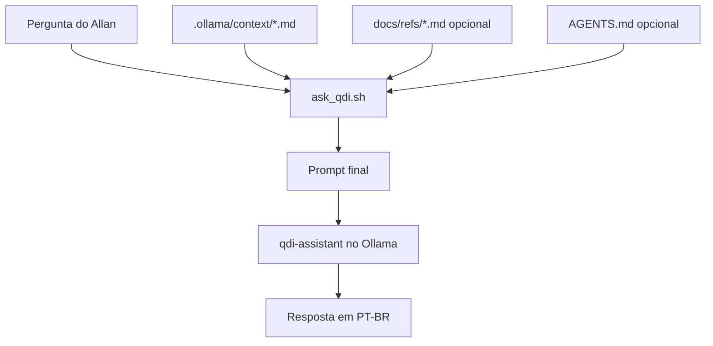

# 02 - Arquitetura da Memoria Local do QDI

## Desenho geral



## Arquivos criados

### `.ollama/Modelfile`

Modelo base usando `llama3:latest`.

Funcao:

- Define persona.
- Define stack.
- Define regras permanentes.
- Cria o modelo `qdi-assistant`.

Comando:

```bash
ollama create qdi-assistant -f .ollama/Modelfile
```

### `.ollama/Modelfile.qwen`

Variante usando `qwen2.5-coder:7b`.

Funcao:

- Melhor alternativa para tarefas de codigo quando este modelo existir no servidor Ollama.

Comando:

```bash
ollama create qdi-assistant -f .ollama/Modelfile.qwen
```

### `.ollama/context/qdi_context.md`

Resumo de negocio e dominio:

- Nome do produto.
- Objetivo.
- Perfil tecnico do Allan.
- Stack.
- Fora de escopo do MVP.

### `.ollama/context/architecture.md`

Resumo arquitetural:

- Clean Architecture.
- Camadas `domain`, `application`, `infrastructure`, `presentation`.
- Principios transversais Tributiq.
- Regras de modelagem.

### `.ollama/context/coding_rules.md`

Resumo operacional:

- Idioma.
- Python.
- FastAPI.
- Banco.
- Qualidade.
- Commits.

### `.ollama/scripts/ask_qdi.sh`

Script que monta o prompt final.

Uso enxuto:

```bash
.ollama/scripts/ask_qdi.sh "Explique a camada domain no QDI"
```

Uso completo:

```bash
.ollama/scripts/ask_qdi.sh --full "Compare esta decisao com o PRD-base"
```

## Modo enxuto vs modo completo

| Modo | Comando | O que inclui | Melhor uso |
|---|---|---|---|
| Enxuto | `ask_qdi.sh "pergunta"` | `.ollama/context/*.md` | Perguntas comuns e rapidas |
| Completo | `ask_qdi.sh --full "pergunta"` | Contexto + `AGENTS.md` + `docs/refs` | Decisoes que dependem do PRD |

## Observacao importante

O modo completo pode ficar lento em modelos locais porque envia muitos tokens. Para uso diario, o modo enxuto tende a ser melhor.
