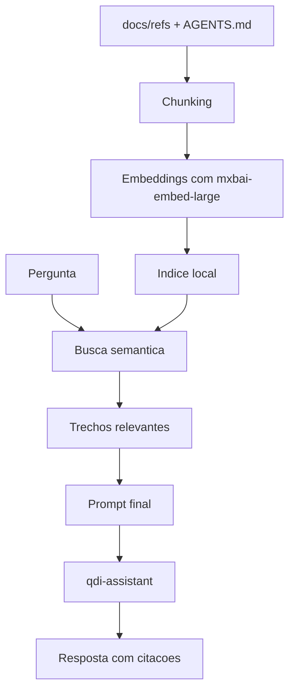

# 05 - Proximo Passo: RAG Local

## Por que RAG

A memoria atual funciona bem para regras e contexto resumido, mas documentos grandes como PRD, MoSCoW, Gap Analysis e matriz competitiva nao devem ser sempre enviados inteiros ao modelo.

O RAG resolve isso buscando apenas os trechos relevantes.

## Arquitetura sugerida



## Modelo de embeddings

O projeto ja possui:

```text
mxbai-embed-large:latest
```

Esse modelo pode gerar embeddings locais com Ollama.

## Estrutura futura recomendada

```text
.ollama-rag/
├── index/
├── chunks/
├── scripts/
│   ├── build_index.py
│   └── ask_rag.py
└── sources.yml
```

## Fontes iniciais

```yaml
sources:
  - AGENTS.md
  - docs/refs/00_INDICE.md
  - docs/refs/01_PRD_BASE.md
  - docs/refs/02_MOSCOW_FEATURES.md
  - docs/refs/03_GAP_ANALYSIS.md
  - docs/refs/06_MATRIZ_COMPETITIVA.md
```

## Regras para RAG do QDI

- Toda resposta normativa deve citar fonte.
- Se nao houver trecho recuperado com fonte confiavel, responder que a base e insuficiente.
- Guardar metadados: arquivo, titulo, secao, linha aproximada e data da fonte.
- Separar documento de negocio de documento legal.
- Nao misturar conhecimento geral do modelo com regra tributaria sem citar fonte.

## Analogia com Oracle

O RAG e como criar um indice funcional para consulta semantica. Em vez de fazer full scan em todos os documentos a cada pergunta, o sistema busca os blocos mais provaveis e passa apenas eles ao modelo.

## Proximo experimento pratico

Implementar um RAG local simples com:

- Python 3.12
- Ollama embeddings
- ChromaDB ou FAISS local
- `docs/refs/*.md` como fontes
- resposta final exigindo citacoes
