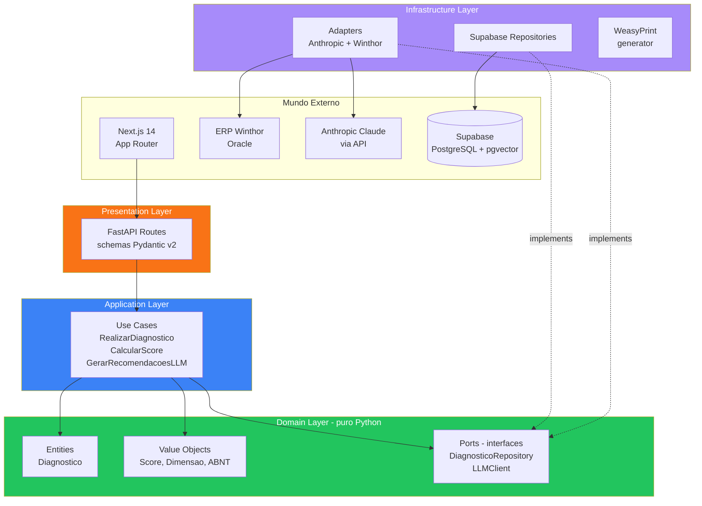
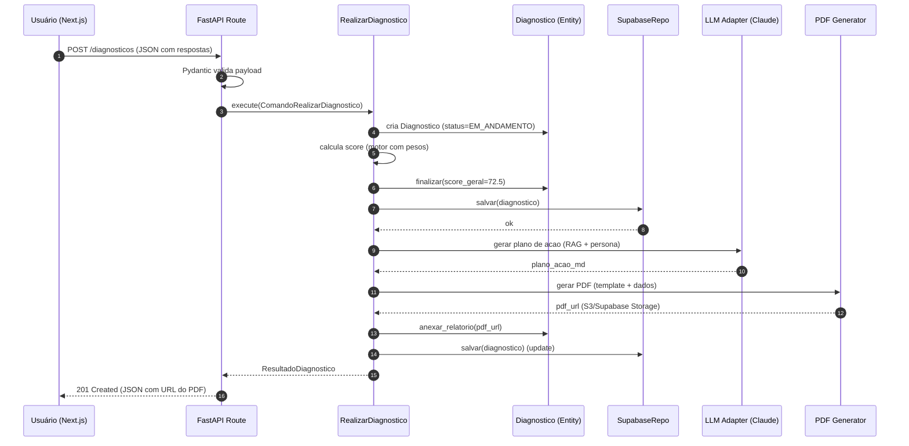

# Arquitetura — QualiDiagIQ (QDI)

## 1. Resposta Direta

QDI é um SaaS multi-tenant em **Clean Architecture** (4 camadas), com backend **Python 3.12 + FastAPI**, frontend **Next.js 14**, persistência **Supabase (PostgreSQL + RLS + pgvector)** e camada de IA com **Anthropic Claude + LangChain/LangGraph + RAG sobre Lexiq**. A separação rígida entre Domain (puro) e Infrastructure permite trocar Supabase, ERP-source ou LLM-vendor sem tocar nas regras de negócio.

## 2. Diagrama de Camadas (Clean Architecture)



## 3. Decisões Arquiteturais Não-Óbvias

| # | Decisão | Justificativa |
|---|---------|---------------|
| A1 | **Pydantic v2 só na presentation/infrastructure** | Domain permanece puro Python (dataclasses); facilita migração futura |
| A2 | **Supabase em vez de PostgreSQL puro** | RLS multi-tenant pronto; auth integrada; menos código |
| A3 | **WeasyPrint em vez de Puppeteer** | Python-native; sem chromium runtime; melhor footprint Docker |
| A4 | **LangGraph em vez de orquestração custom** | Estado de máquina rico; rollback de transições; observabilidade nativa |
| A5 | **Async-first (asyncio + asyncpg)** | I/O-bound (LLM, DB, ERP); essencial para latência sub-500ms P95 |
| A6 | **7ª dimensão (Compliance ABNT)** | Diferencial exclusivo do QDI; ancorada em ABNT NBR 17301:2026 |
| A7 | **Score 0-100 + percentil setorial** | Score absoluto (Cosmos faz) + relativo (Cosmos não faz) — moat multi-tenant |

## 4. Fluxo de Requisição Típica

Exemplo: **POST /api/v1/diagnosticos** (criar diagnóstico completo)



## 5. Stack Detalhada

| Camada | Lib | Versão | Por quê |
|--------|-----|--------|---------|
| Backend | FastAPI | 0.115+ | Async, OpenAPI auto, Pydantic v2 nativo |
| Validação | Pydantic | 2.7+ | Performance + tipos genéricos |
| Settings | pydantic-settings | 2.4+ | 12-factor app config |
| HTTP client | httpx | 0.27+ | Async, mTLS para APIs gov |
| ORM/DB | supabase-py | 2.7+ | + asyncpg para queries diretas |
| LLM | anthropic | 0.34+ | Cliente oficial Claude |
| Framework agente | LangChain | 0.3+ | + LangGraph para fluxos complexos |
| PDF | WeasyPrint | 62+ | HTML/CSS → PDF |
| Templates | Jinja2 | 3.1+ | Templates HTML/PDF |
| Testes | pytest | 8.3+ | + pytest-asyncio |
| Lint | ruff | 0.6+ | Substitui flake8 + isort |
| Format | black | 24.8+ | Padrão Python |
| Type check | mypy | 1.11+ | strict mode |
| Observabilidade | OpenTelemetry | 1.27+ | Traces, métricas, logs |
| Logs estruturados | structlog | 24.4+ | JSON em prod, pretty em dev |

## 6. Princípios Transversais

Todos do ecossistema Tributiq:

1. **Multi-tenant desde o dia 1** — RLS no PostgreSQL
2. **Versionamento normativo** — vigência sobreposta (LC 214/2025 vs LC 225/2026)
3. **Imutabilidade de evidências** — append-only + hash + WORM
4. **RAG com guardrails** — sem citação válida = resposta rejeitada
5. **Idempotência** — `Idempotency-Key` em APIs públicas
6. **Observabilidade end-to-end** — OpenTelemetry, `trace_id` em todos os logs
7. **Independência de ERP** — núcleo canônico + conectores isolados

## 7. Diagrama de Pastas

```
src/
├── domain/                          # ZERO dependência externa
│   ├── entities/
│   │   ├── __init__.py
│   │   └── diagnostico.py           # entidade-raiz
│   ├── value_objects/
│   │   ├── __init__.py
│   │   └── score.py                 # ScoreNumerico, Dimensao, etc.
│   ├── repositories/                # interfaces (ports)
│   │   ├── __init__.py
│   │   └── diagnostico_repository.py
│   └── events/                      # (Sprint 3+) domain events
│       └── __init__.py
│
├── application/
│   ├── use_cases/
│   │   ├── __init__.py
│   │   └── realizar_diagnostico.py
│   └── ports/                       # interfaces para serviços externos (LLM, PDF)
│       └── __init__.py
│
├── infrastructure/
│   ├── repositories/                # implementações concretas
│   │   ├── __init__.py
│   │   └── supabase_diagnostico_repository.py
│   ├── llm/                         # adapter Claude/OpenAI
│   │   └── __init__.py
│   ├── pdf/                         # WeasyPrint
│   │   └── __init__.py
│   └── erp/                         # (Sprint 4+) Winthor adapter
│       └── __init__.py
│
└── presentation/
    └── api/
        ├── main.py                  # entry point FastAPI
        ├── routes/
        │   ├── __init__.py
        │   └── diagnostico.py
        ├── schemas/                 # Pydantic schemas HTTP
        │   └── __init__.py
        └── middleware/              # tenant resolver, idempotency
            └── __init__.py
```

## 8. Próximo Passo

Ver [`02_dominio_qdi.md`](02_dominio_qdi.md) para detalhamento das entidades e value objects.
