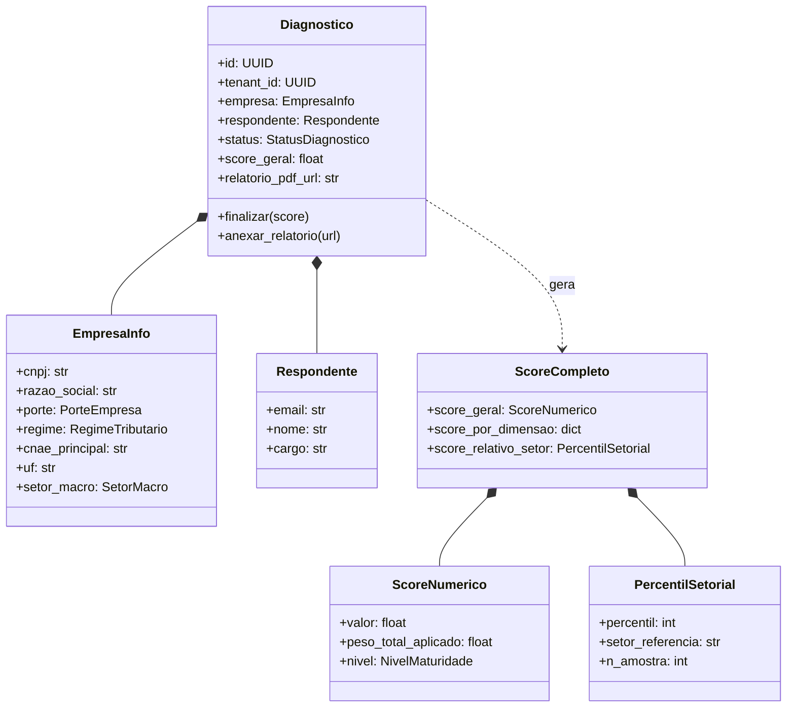
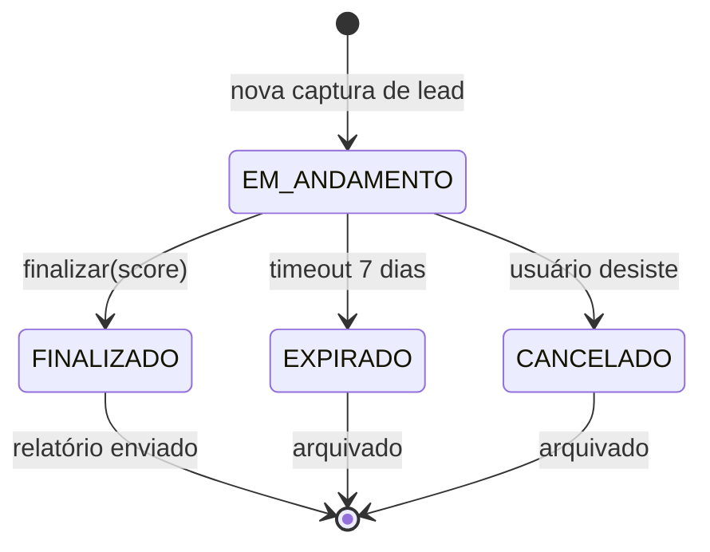

# Modelo de Domínio — QualiDiagIQ

## 1. Bounded Context

O QDI é um **Bounded Context** dentro do ecossistema Tributiq. Sua linguagem ubíqua:

| Termo | Significado preciso |
|-------|---------------------|
| **Diagnóstico** | Avaliação completa da prontidão de uma empresa para a Reforma Tributária |
| **Tenant** | Empresa-cliente isolada por RLS no Supabase |
| **Respondente** | Pessoa que conduz o diagnóstico (CFO, Contador, Dono) |
| **Score** | Pontuação 0-100 representando maturidade tributária |
| **Dimensão** | Eixo de avaliação (Fiscal, Financeira, ABNT etc.) — 7 dimensões |
| **Pergunta** | Item do questionário com peso explícito |
| **Resposta** | Valor coletado (binário, escala, múltipla escolha) |
| **Recomendação** | Ação acionável gerada a partir das respostas |
| **Maturidade** | Faixa qualitativa derivada do score (Crítico/Inicial/Intermediário/Avançado/Exemplar) |
| **Aderência ABNT** | Score de conformidade à NBR 17301 (PDCA × 7 eixos) |

## 2. Diagrama de Entidades-Chave



## 3. Agregado Diagnóstico (Aggregate Root)

**Aggregate Root:** `Diagnostico`
**Invariantes de domínio:**
1. Um diagnóstico só pode ser finalizado se `status == EM_ANDAMENTO`.
2. Score só existe após finalização.
3. `tenant_id` é imutável após criação (multi-tenant strict).
4. Diagnóstico expirado não pode ser modificado.
5. Score geral deve estar em [0, 100].

**Eventos de domínio (publicados pelo agregado):**
- `DiagnosticoIniciado` (criado)
- `DiagnosticoFinalizado` (dispara geração de PDF + e-mail)
- `DiagnosticoExpirado` (após 7 dias sem finalização)
- `RelatorioPDFAnexado` (dispara notificação ao respondente)

## 4. Ciclo de Vida do Diagnóstico



## 5. As 7 Dimensões Avaliadas

| # | Dimensão | Origem | Subitens (exemplos) |
|---|----------|--------|---------------------|
| 1 | **Fiscal** | Cosmos C1 | Apuração, créditos, tributação destino |
| 2 | **Estratégica** | Cosmos C1 | Posicionamento, mix, precificação |
| 3 | **Contábil** | Cosmos C1 | ECD, ECF, qualidade do plano de contas |
| 4 | **Financeira** | Cosmos C1 | Fluxo de caixa, capital de giro, EBITDA |
| 5 | **Operacional** | Cosmos C1 | Cadeia logística, suprimentos, processos |
| 6 | **Tecnológica** | Cosmos C1 | ERP, motor tributário, NF-e/NFC-e |
| 7 | **Compliance ABNT 17301** | **Diferencial QDI** | PDCA, 7 eixos da norma, Programa Confia |

## 6. Modelo de Pesos (transparente)

Cada pergunta tem:
- **Código** único (ex: `Q-FISC-001`)
- **Texto** da pergunta
- **Dimensão** a que pertence
- **Peso** numérico (0.0–10.0)
- **Condicional** (segmento, regime, porte, UF) — opcional
- **Base legal** (artigo, lei, NT) — opcional

**Exemplo:**
```yaml
codigo: Q-FISC-001
texto: "Sua empresa já mapeou o impacto do fim do ICMS-ST no seu mix de produtos?"
dimensao: FISCAL
peso: 8.5
condicional:
  segmento: [COMERCIO, INDUSTRIA]
  regime: [LUCRO_PRESUMIDO, LUCRO_REAL]
base_legal: "EC 132/2023 art. 156-A; LC 214/2025 art. 415"
```

**Score geral** = média ponderada dos scores por dimensão (com pesos de dimensão configuráveis).

## 7. Aderência ABNT NBR 17301 (dimensão 7)

A 7ª dimensão é especial: usa estrutura **PDCA × 7 eixos** da norma.

| Eixo da norma | Stage PDCA medido |
|---------------|-------------------|
| 1. Políticas internas | Plan |
| 2. Identificação e avaliação de riscos | Plan + Check |
| 3. Controles operacionais | Do |
| 4. Registros | Do + Check |
| 5. Canais de comunicação | Do |
| 6. Monitoramento contínuo | Check |
| 7. Melhoria sistemática | Act |

**Output específico:**
- Score PDCA por eixo (0-100)
- Lista de gaps com plano de remediação
- Relatório de aderência (preparação para certificação futura)

## 8. Multi-Tenant — RLS no Supabase

```sql
-- Toda tabela de domínio carrega tenant_id
-- e tem RLS habilitado

create policy tenant_isolation on qdi.diagnosticos
  using (tenant_id = current_setting('app.tenant_id', true)::uuid);
```

**Resolução do tenant na API:**
- Header obrigatório: `X-Tenant-ID`
- Middleware FastAPI seta `app.tenant_id` na sessão PostgreSQL
- RLS aplica filtro automaticamente em **todas** as queries — defesa em profundidade.

## 9. Domain Events

Implementados em Sprint 3+. Cada evento tem:
- `event_id` (UUID)
- `aggregate_id` (UUID do Diagnóstico)
- `event_type` (ex: `DiagnosticoFinalizado`)
- `payload` (JSON com dados do evento)
- `occurred_at` (timestamp UTC)
- `tenant_id` (multi-tenant)

**Padrão:** Outbox Table (transactional outbox) para garantir entrega ao broker (Redis Streams ou Kafka).

## 10. Próximo Passo

Ver [`_DEVELOPER/03_roadmap_sprint_1.md`](../_DEVELOPER/03_roadmap_sprint_1.md) para o plano detalhado dos primeiros 30 dias.
