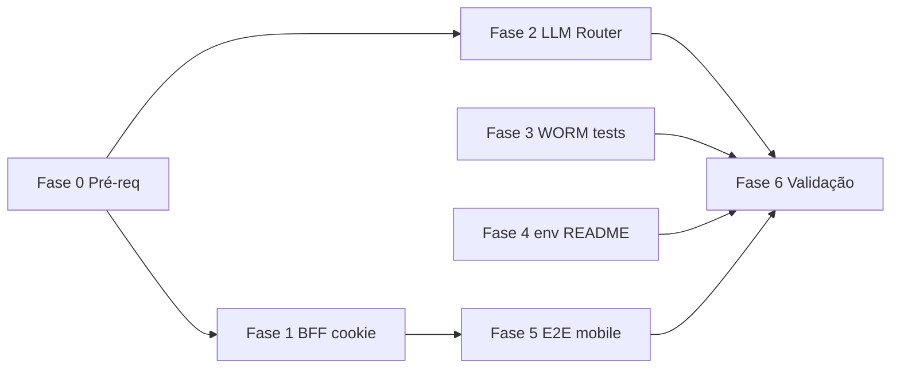

# Plano de execução — Sprint hardening (prompt `09_PROMPT_IMPLEMENTACAO_CURSOR`)

**Origem:** `_DEVELOPER/ANALISE_14052026_CODEX/09_PROMPT_IMPLEMENTACAO_CURSOR.md`  
**Uso:** marcar cada caixa `[ ]` → `[x]` à medida que conclui; não substitui ADR nem código — é rastreio operacional.

**Regras do prompt:** PT-BR em comentários/docstrings; Clean Architecture; Pydantic v2 para schemas HTTP; **sem** `git commit` / `git push` / `git rebase` pelo agente (revisão humana antes de versionar).

**Última actualização (Fase 1 — código):** 2026-05-13 — BFF `app/api/auth/*`, proxy `/api-backend` com Bearer a partir de cookie `qdi_painel_access`, `middleware` + clientes do painel com `temSessaoPainelParaApiCliente` / `cabecalhosAuthPainelOpcional` / `credentials: "include"`; ver `frontend/.env.local.example` e secção no `frontend/README.md`. Fase 0 (baseline completo) e smoke manual pós-login ficam para confirmação humana.

---

## Fase 0 — Pré-requisitos (antes de qualquer tarefa)

- [ ] **L0.1** Ler `AGENTS.md`, `docs/refs/01_PRD_BASE.md`, `02_MOSCOW_FEATURES.md`, `03_GAP_ANALYSIS.md`
- [ ] **L0.2** Ler `_DEVELOPER/ANALISE_14052026_CODEX/01_RESUMO_EXECUTIVO.md` … `06_PRIORIDADES_ROADMAP.md`
- [ ] **L0.3** Reabrir o prompt `09_PROMPT_IMPLEMENTACAO_CURSOR.md` e confirmar que não houve alteração de escopo desde o último sync
- [ ] **L0.4** Baseline local: `make lint` + `make type-check` + `make test` + `cd frontend && npm run lint && npm run build` (registar resultado / commit base)

**Critério de saída da fase 0:** baseline verde ou lista explícita de falhas pré-existentes acordadas.

---

## Fase 1 — Tarefa 1: sessão painel (BFF + cookie httpOnly)

*Concluir **antes** dos smoke tests mobile (Fase 5), pois altera o contrato de autenticação.*

### 1.1 Route Handlers Next.js

- [x] **1.1.1** `frontend/app/api/auth/login/route.ts` — chama FastAPI `/auth/login` no servidor
- [x] **1.1.2** Ao receber `access_token`, gravar cookie: `HttpOnly`, `Secure` (prod), `SameSite=Lax`, `Path=/`, `Max-Age` derivado do `exp` do JWT (com limite ao TTL configurado)
- [x] **1.1.3** `frontend/app/api/auth/logout/route.ts` — remove cookie de sessão
- [x] **1.1.4** `frontend/app/api/auth/session/route.ts` (opcional) — só dados não sensíveis (autenticado, nome/perfil quando possível)

### 1.2 UI e cliente

- [x] **1.2.1** `frontend/app/login/page.tsx` — login via `/api/auth/login`, não `/auth/login` directo ao backend
- [x] **1.2.2** Helper ou padrão para chamadas autenticadas do painel **sem** depender de `localStorage` para o token (proxy server-side quando possível)
- [x] **1.2.3** Reduzir ou eliminar uso de `ADMIN_TOKEN_STORAGE_KEY`; documentar fluxo legado se mantiver compatibilidade temporária

### 1.3 Middleware e UX

- [x] **1.3.1** `frontend/middleware.ts` — validar **presença do cookie real** de sessão (não só flag não-httpOnly)
- [x] **1.3.2** Token expirado → redirect `/login?sessao=expirada`
- [x] **1.3.3** Dashboard acessível após login (fluxo novo)
- [x] **1.3.4** Logout remove sessão de forma verificável

### 1.4 Ficheiros de referência do prompt

- [x] **1.4.1** Rever `frontend/lib/api/config.ts`, `frontend/lib/auth/session_cookie.ts` e alinhar com o desenho BFF

**Critérios de aceite (checklist final Fase 1):**

- [x] **A1** JWT **não** persistido em `localStorage` no fluxo novo de login
- [x] **A2** Dashboard continua acessível após login
- [x] **A3** Logout remove sessão
- [x] **A4** `make lint` / `npm run lint` relevantes ao âmbito — verde

**Gate após Fase 1:** `cd frontend && npm run build` + smoke manual login/dashboard (opcional mas recomendado).

---

## Fase 2 — Tarefa 2: LLM Router multi-provider

*Pode avançar em **paralelo conceitual** com a Fase 1; **não** acoplar roteamento LLM à sessão web/BFF.*

### 2.1 ADR e port (application)

- [ ] **2.1.1** Criar `docs/refs/ADR-00X_LLM_ROUTER_MULTI_PROVIDER.md` (substituir `00X` pelo número real) — contexto, decisão, matriz, consequências, compatibilidade com ADRs de IA/LLM existentes
- [ ] **2.1.2** Port `LLMService` em `src/application/ports/llm_service.py` — sem SDK externo, sem imports de infraestrutura
- [ ] **2.1.3** Garantir que o **domínio** não importa OpenAI, Anthropic, Ollama nem LangGraph

### 2.2 Infraestrutura

- [ ] **2.2.1** `src/infrastructure/adapters/llm_router.py` — selecção por config + tier/criticidade
- [ ] **2.2.2** Adapters isolados: OpenAI e Anthropic (falha clara se key/modelo em falta quando o tier exigir)
- [ ] **2.2.3** Integrar Ollama existente (`llm_langgraph_ollama`, `llm_ollama`) no router
- [ ] **2.2.4** `settings.py` + `.env.example` — variáveis do prompt (providers, tier default, flags `QDI_LLM_ALLOW_*`, Ollama URL/modelo, OpenAI, Anthropic); nomes alinhados ao padrão do projecto
- [ ] **2.2.5** Documentar Docker `OLLAMA_BASE_URL=http://host.docker.internal:11434` vs host `http://127.0.0.1:11434` (README operacional)

### 2.3 Política de roteamento

- [ ] **2.3.1** Implementar precedência de tier: use case → tenant/plano → `QDI_LLM_DEFAULT_TIER` → fallback (`local` dev/test, `standard` prod)
- [ ] **2.3.2** **Não** usar header HTTP público como fonte directa de tier premium (restrito a dev/test documentado se existir)
- [ ] **2.3.3** Matriz ambiente × tier (tabela do prompt) implementada **ou** coberta por testes unitários do router
- [ ] **2.3.4** Ollama indisponível (local): mensagem estável; POST diagnóstico não “morte” silenciosa indevida
- [ ] **2.3.5** Produção: OpenAI indisponível + Anthropic configurada + política → fallback premium permitido
- [ ] **2.3.6** Logs estruturados: `provider`, `model`, `tier`, `trace_id`, motivo de fallback — sem prompt sensível nem API keys
- [ ] **2.3.7** Guardrail Lexiq mantido (resposta sem âncora normativa → rejeição conforme desenho actual)

### 2.4 Presentation

- [ ] **2.4.1** `deps_infra_services.get_llm_service` entrega `LLMRouter` ou composição acordada, de forma previsível

### 2.5 Testes

- [ ] **2.5.1** `tests/unit/infrastructure/test_llm_router.py` (+ adapters OpenAI/Anthropic conforme ficheiros do prompt)
- [ ] **2.5.2** Ajustar `test_dependencies_extended.py` e testes Ollama existentes
- [ ] **2.5.3** Suíte local **sem** exigir `OPENAI_API_KEY` / `ANTHROPIC_API_KEY` reais (mocks/fakes)

**Critérios de aceite (resumo):**

- [ ] **A5** `get_llm_service` previsível com router/port
- [ ] **A6** ADR publicado com matriz
- [ ] **A7** Local: Ollama caminho recomendado; prod: OpenAI/Anthropic configuráveis sem mudar domínio
- [ ] **A8** Testes cobrem tiers, fallback e indisponibilidade

**Gate após Fase 2:** `make test` + `make type-check` com novos módulos.

---

## Fase 3 — Tarefa 3: integração idempotência / replay / WORM

- [ ] **3.1** Identificar contrato actual (`POST /diagnosticos/`, idempotency middleware, adapter Postgres)
- [ ] **3.2** Teste: `Idempotency-Key=A` cria diagnóstico finalizado
- [ ] **3.3** Teste: replay com mesma `A` → idempotente, sem mutação extra
- [ ] **3.4** Teste: mesma carga com `Idempotency-Key=B` → novo recurso ou falha previsível (conforme contrato)
- [ ] **3.5** Teste: update indevido em campos protegidos pós-finalização → bloqueado (WORM)
- [ ] **3.6** Teste: campos permitidos por versão otimista continuam válidos (se no contrato)
- [ ] **3.7** Se conflito UPSERT vs WORM: correcção **mínima** no adapter — **não** enfraquecer WORM só para passar teste

**Ficheiros candidatos:** `tests/integration/test_worm_postgres.py`, `tests/integration/test_mvp_gate_postgres.py`, `tests/unit/presentation/test_idempotency_middleware.py`

**Gate após Fase 3:** `make test` (inclui integração se aplicável ao CI local).

---

## Fase 4 — Tarefa 4: harmonizar env local do frontend

- [ ] **4.1** Criar ou actualizar `frontend/.env.local.example` (sem segredos) — alinhar `NEXT_PUBLIC_API_URL=/api-backend`, `API_PROXY_TARGET` (ex. `60000`), DPO público conforme prompt
- [ ] **4.2** Actualizar `frontend/README.md` — compose, host local, proxy `/api-backend`
- [ ] **4.3** Validar que nenhum segredo entrou em ficheiro versionado

**Gate após Fase 4:** `cd frontend && npm run build` (com env de exemplo documentado, não necessariamente com `.env.local` no repo).

---

## Fase 5 — Tarefa 5: smoke tests mobile (Playwright)

*Executar **depois** da **Fase 1** estável; actualizar specs se middleware/login mudou.*

- [ ] **5.1** Config mobile em `frontend/playwright.config.ts` (ou equivalente)
- [ ] **5.2** `frontend/e2e/mobile-smoke.spec.ts` — `/wizard` (sem overflow horizontal, CTA visível, avançar primeiro passo)
- [ ] **5.3** `/login` — formulário e botão visíveis em viewport móvel
- [ ] **5.4** `/dashboard` — sem sessão → redirect login; com mock de sessão → layout básico não quebra (se já existir padrão)
- [ ] **5.5** Smoke **sem** backend real para o cenário simples (salvo specs integradas já existentes)

**Gate após Fase 5:** `cd frontend && npm run test:e2e` (ou script acordado).

---

## Fase 6 — Validação final obrigatória (prompt)

Marcar só quando **todas** as fases em escopo estiverem concluídas.

- [ ] **V1** `make lint`
- [ ] **V2** `make type-check`
- [ ] **V3** `make test-domain`
- [ ] **V4** `make test`
- [ ] **V5** `cd frontend && npm run test:unit`
- [ ] **V6** `cd frontend && npm run build`
- [ ] **V7** Se Playwright alterado: `cd frontend && npm run test:e2e`

---

## Entrega ao controlador (humano)

Antes do commit/push (feitos por ti, conforme política do repo), preparar:

1. Resumo objectivo das alterações  
2. Lista de ficheiros tocados  
3. Testes corridos e resultado  
4. Riscos residuais  
5. Próximos passos sugeridos  

---

## Mapa de dependências (visão rápida)

- **Fase 1** bloqueia **Fase 5** (contrato de sessão).  
- **Fase 2** pode correr em paralelo a **Fase 1** (equipa / agente separado), sem misturar código BFF com router.  
- **Fase 3** e **Fase 4** são em grande parte independentes de **Fase 2**, desde que não partilhem PR gigante sem critério.

---

**Última actualização:** plano gerado para acompanhamento incremental; alinhar número do ADR (`00X`) ao índice real em `docs/refs/00_INDICE.md` quando criares o ADR.
