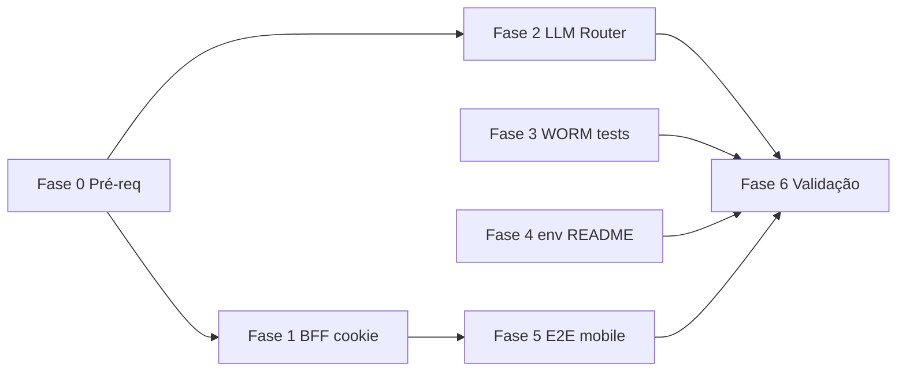

# Plano de execução — Sprint hardening (prompt `09_PROMPT_IMPLEMENTACAO_CURSOR`)

**Origem:** `_DEVELOPER/ANALISE_14052026_CODEX/09_PROMPT_IMPLEMENTACAO_CURSOR.md`  
**Uso:** marcar cada caixa `[ ]` → `[x]` à medida que conclui; não substitui ADR nem código — é rastreio operacional.

**Regras do prompt:** PT-BR em comentários/docstrings; Clean Architecture; Pydantic v2 para schemas HTTP; **sem** `git commit` / `git push` / `git rebase` pelo agente (revisão humana antes de versionar).

**Última actualização (Fase 1 — código):** 2026-05-13 — BFF `app/api/auth/login` + **`/api/auth/cadastro`**, proxy `/api-backend` com Bearer a partir de cookie `qdi_painel_access`, `middleware` + clientes do painel com `temSessaoPainelParaApiCliente` / `cabecalhosAuthPainelOpcional` / `credentials: "include"`; E2E Playwright: `e2e/helpers/mock_bff_painel_auth.ts`, `NEXT_PUBLIC_API_URL=/api-backend` no `playwright.config.ts`; ver `frontend/.env.local.example` e `frontend/README.md`. Fase 0 (baseline completo) e smoke manual pós-login ficam para confirmação humana.

**Última actualização (Fase 3–4 — rastreio):** 2026-05-14 — contrato idempotência/WORM consolidado no plano; teste «mesma chave, corpo diferente»; Fase 4 marcada concluída; **3.7** fechado com regressão UPSERT vs WORM em `test_worm_postgres`. *(Fase 2 LLM router ADR-021 e Fase 5 E2E mobile em commits anteriores.)*

---

## Fase 0 — Pré-requisitos (antes de qualquer tarefa)

- [ ] **L0.1** Ler `AGENTS.md`, `docs/refs/01_PRD_BASE.md`, `02_MOSCOW_FEATURES.md`, `03_GAP_ANALYSIS.md`
- [ ] **L0.2** Ler `_DEVELOPER/ANALISE_14052026_CODEX/01_RESUMO_EXECUTIVO.md` … `06_PRIORIDADES_ROADMAP.md`
- [ ] **L0.3** Reabrir o prompt `09_PROMPT_IMPLEMENTACAO_CURSOR.md` e confirmar que não houve alteração de escopo desde o último sync
- [ ] **L0.4** Baseline local: `make lint` + `make type-check` + `make test` + `cd frontend && npm run lint && npm run build` (registar resultado / commit base)

**Critério de saída da fase 0:** baseline verde ou lista explícita de falhas pré-existentes acordadas.

---

## Fase 1 — Tarefa 1: sessão painel (BFF + cookie httpOnly)

*Concluir **antes** dos smoke tests mobile (Fase 5), pois altera o contrato de autenticação.*

### 1.1 Route Handlers Next.js

- [x] **1.1.1** `frontend/app/api/auth/login/route.ts` — chama FastAPI `/auth/login` no servidor
- [x] **1.1.2** Ao receber `access_token`, gravar cookie: `HttpOnly`, `Secure` (prod), `SameSite=Lax`, `Path=/`, `Max-Age` derivado do `exp` do JWT (com limite ao TTL configurado)
- [x] **1.1.3** `frontend/app/api/auth/logout/route.ts` — remove cookie de sessão
- [x] **1.1.4** `frontend/app/api/auth/session/route.ts` (opcional) — só dados não sensíveis (autenticado, nome/perfil quando possível)

### 1.2 UI e cliente

- [x] **1.2.1** `frontend/app/login/page.tsx` — login via `/api/auth/login`, não `/auth/login` directo ao backend; **`frontend/app/cadastro/page.tsx`** via `/api/auth/cadastro`
- [x] **1.2.2** Helper ou padrão para chamadas autenticadas do painel **sem** depender de `localStorage` para o token (proxy server-side quando possível)
- [x] **1.2.3** Reduzir ou eliminar uso de `ADMIN_TOKEN_STORAGE_KEY`; documentar fluxo legado se mantiver compatibilidade temporária

### 1.3 Middleware e UX

- [x] **1.3.1** `frontend/middleware.ts` — validar **presença do cookie real** de sessão (não só flag não-httpOnly)
- [x] **1.3.2** Token expirado → redirect `/login?sessao=expirada`
- [x] **1.3.3** Dashboard acessível após login (fluxo novo)
- [x] **1.3.4** Logout remove sessão de forma verificável

### 1.4 Ficheiros de referência do prompt

- [x] **1.4.1** Rever `frontend/lib/api/config.ts`, `frontend/lib/auth/session_cookie.ts` e alinhar com o desenho BFF

**Critérios de aceite (checklist final Fase 1):**

- [x] **A1** JWT **não** persistido em `localStorage` nos fluxos novos de **login** e **cadastro**
- [x] **A2** Dashboard continua acessível após login
- [x] **A3** Logout remove sessão
- [x] **A4** `make lint` / `npm run lint` relevantes ao âmbito — verde

**Gate após Fase 1:** `cd frontend && npm run build` + smoke manual login/dashboard (opcional mas recomendado).

---

## Fase 2 — Tarefa 2: LLM Router multi-provider

*Pode avançar em **paralelo conceitual** com a Fase 1; **não** acoplar roteamento LLM à sessão web/BFF.*

### 2.1 ADR e port (application)

- [x] **2.1.1** ADR-021 em `.github/adr/ADR-021-llm-router-multi-tier.md` — router, tier observável, cruzamento ADR-003/007
- [x] **2.1.2** Port `LlmServicePort` em `src/application/ports/llm_service.py` — **ABC** + `@abstractmethod` (sem SDK)
- [x] **2.1.3** Garantir que o **domínio** não importa OpenAI, Anthropic, Ollama nem LangGraph *(inalterado)*

### 2.2 Infraestrutura

- [x] **2.2.1** `src/infrastructure/adapters/llm_router.py` — fábrica por `QDI_LLM_BACKEND` + log `tier` (`QDI_LLM_DEFAULT_TIER`)
- [x] **2.2.2** Adapters isolados: OpenAI e Anthropic (falha clara se key/modelo em falta quando o tier exigir)
- [x] **2.2.3** Integrar Ollama existente (`llm_langgraph_ollama`, `llm_ollama`) no router
- [x] **2.2.4** `settings.py` + `.env.example` — `QDI_LLM_DEFAULT_TIER` (sem flags `QDI_LLM_ALLOW_*` neste incremento)
- [x] **2.2.5** ADR-021 + `.env.example` (Ollama host vs Docker) — README raiz já documenta compose

### 2.3 Política de roteamento

- [x] **2.3.1** Implementar precedência de tier (observabilidade): use case (parâmetro router + log plano em `RealizarDiagnostico`) → JWT (`qdi_llm_tier` / `perfil_conta`) → `QDI_LLM_DEFAULT_TIER` → fallback `APP_ENV` — **sem** alterar `QDI_LLM_BACKEND` (ADR-021)
- [x] **2.3.2** **Não** usar header HTTP público como fonte directa de tier premium (restrito a dev/test documentado se existir) — ver ADR-021 § decisão (4)
- [x] **2.3.3** Router coberto por `tests/unit/infrastructure/test_llm_router.py` (matriz mínima openai / anthropic / http_ollama / langgraph)
- [x] **2.3.4** Falha de LLM (incl. excepção não tratada no adapter): mensagem estável; POST diagnóstico não aborta — `RealizarDiagnostico` + adapters (Ollama/Anthropic/OpenAI devolvem mensagem em erro HTTP)
- [x] **2.3.5** Produção: OpenAI indisponível (sem chave) + Anthropic configurada + política ``QDI_LLM_OPENAI_FALLBACK_ANTHROPIC`` → fallback Anthropic; caso contrário LangGraph local ou erro em produção conforme validador
- [x] **2.3.6** Logs estruturados: `llm_router_resolvido` + `llm_backend_*_sem_api_key` com `tier`, `adapter`, modelos, `ollama_host` — sem prompt nem keys
- [x] **2.3.7** Guardrail Lexiq mantido (`filtrar_resposta_recomendacao_llm` em adapters cloud + Ollama)

### 2.4 Presentation

- [x] **2.4.1** `deps_infra_services.get_llm_service` delega em `build_llm_adapter_from_settings` (router)

### 2.5 Testes

- [x] **2.5.1** `tests/unit/infrastructure/test_llm_router.py`
- [x] **2.5.2** `test_dependencies_extended.py` (patch logger em `llm_router`)
- [x] **2.5.3** Suíte local **sem** keys reais *(mocks existentes)*

**Critérios de aceite (resumo):**

- [x] **A5** `get_llm_service` delega no router (`build_llm_adapter_from_settings`)
- [x] **A6** ADR-021 publicado (`.github/adr/`)
- [x] **A7** Local: Ollama inalterado; prod: Anthropic ou OpenAI Chat via `QDI_LLM_BACKEND` + segredos
- [x] **A8** Testes do router + regressão `get_llm_service` *(fallback anthropic/openai sem chave)*

**Gate após Fase 2:** `make test` + `make type-check` com novos módulos.

---

## Fase 3 — Tarefa 3: integração idempotência / replay / WORM

*Contrato e rastreio — testes: `tests/unit/presentation/test_idempotency_middleware.py`, `tests/integration/test_worm_postgres.py`, `tests/integration/test_idempotency_cleanup_postgres.py`, `tests/unit/infrastructure/test_postgres_idempotency_backend.py`.*

- [x] **3.1** Contrato: `IdempotencyMiddleware` (`src/presentation/api/middleware/idempotency.py`) + `idempotency_*` (`postgres_backend.py`) + WORM SQL (`0006`, `0012`, `0025`); POST `/diagnosticos/` exige header
- [x] **3.2** `Idempotency-Key` + mock UC → 201 e corpo de diagnóstico finalizado (`test_idempotency_middleware`)
- [x] **3.3** Replay mesma chave → `X-Idempotent-Replay: true`, UC 1× (`test_post_diagnostico_replay_retorna_header_e_nao_reexecuta_use_case`)
- [x] **3.4** Chave B distinta → nova execução (`test_post_diagnostico_chaves_idempotencia_distintas_executa_duas_vezes`); mesma chave e **corpo JSON diferente** → replay da 1.ª resposta (`test_post_diagnostico_mesma_chave_corpo_json_diferente_replay_primeira_resposta`)
- [x] **3.5** UPDATE score pós-finalizado bloqueado (`test_worm_postgres`); aceite LGPD imutável após finalizado
- [x] **3.6** `relatorio_pdf_url` + `versao_otimista` + M12 permitidos com `WHERE versao_otimista` (`test_worm_bloqueia_mutacao_de_evidence_pos_finalizado`)
- [x] **3.7** UPSERT vs WORM — `INSERT … ON CONFLICT DO UPDATE` que altera evidência (ex.: `score_geral`) em `finalizado` falha no trigger; regressão: `test_worm_bloqueia_upsert_que_tenta_mutar_evidencia_pos_finalizado` (`tests/integration/test_worm_postgres.py`). Evolução de colunas em `_UPSERT_SQL` do adapter Postgres exige rever lista WORM nas migrações.

**Ficheiros candidatos:** `tests/integration/test_worm_postgres.py`, `tests/integration/test_mvp_gate_postgres.py`, `tests/unit/presentation/test_idempotency_middleware.py`

**Gate após Fase 3:** `make test` (inclui integração se aplicável ao CI local).

---

## Fase 4 — Tarefa 4: harmonizar env local do frontend

- [x] **4.1** `frontend/.env.local.example` — `NEXT_PUBLIC_API_URL=/api-backend`, `API_PROXY_TARGET` (60000), DPO comentado
- [x] **4.2** `frontend/README.md` — compose, proxy `/api-backend`, E2E mocks
- [x] **4.3** Sem segredos em ficheiros versionados de exemplo *(revisão manual em PR)*

**Gate após Fase 4:** `cd frontend && npm run build` (com env de exemplo documentado, não necessariamente com `.env.local` no repo).

---

## Fase 5 — Tarefa 5: smoke tests mobile (Playwright)

*Executar **depois** da **Fase 1** estável; actualizar specs se middleware/login mudou.*

- [x] **5.1** Config mobile em `frontend/playwright.config.ts` — projectos `chromium-desktop` (ignora `mobile-smoke`) + `chromium-mobile` (só `mobile-smoke`); `reuseExistingServer` fora de CI para não colidir com dev local
- [x] **5.2** `frontend/e2e/mobile-smoke.spec.ts` — `/wizard`: overflow horizontal verificado no `main` (conteúdo; header global pode ser mais largo que o viewport em alguns breakpoints); CTA «Próxima Etapa»; avanço passo 1 → «Perfil da Empresa»
- [x] **5.3** `/login` — campos e botão visíveis (Pixel 5)
- [x] **5.4** `/dashboard` — sem sessão → `/login`; com mock BFF + lista vazia → painel estável
- [x] **5.5** Cenários **sem** backend real (mocks BFF + `GET …/diagnosticos`)

**Gate após Fase 5:** `cd frontend && npm run test:e2e` (inclui mobile) ou `npm run test:e2e:mobile` só viewport móvel.

---

## Fase 6 — Validação final obrigatória (prompt)

Marcar só quando **todas** as fases em escopo estiverem concluídas.

- [ ] **V1** `make lint`
- [ ] **V2** `make type-check`
- [ ] **V3** `make test-domain`
- [ ] **V4** `make test`
- [ ] **V5** `cd frontend && npm run test:unit`
- [ ] **V6** `cd frontend && npm run build`
- [ ] **V7** Se Playwright alterado: `cd frontend && npm run test:e2e`

---

## Entrega ao controlador (humano)

Antes do commit/push (feitos por ti, conforme política do repo), preparar:

1. Resumo objectivo das alterações  
2. Lista de ficheiros tocados  
3. Testes corridos e resultado  
4. Riscos residuais  
5. Próximos passos sugeridos  

---

## Mapa de dependências (visão rápida)

- **Fase 1** bloqueia **Fase 5** (contrato de sessão).  
- **Fase 2** pode correr em paralelo a **Fase 1** (equipa / agente separado), sem misturar código BFF com router.  
- **Fase 3** e **Fase 4** são em grande parte independentes de **Fase 2**, desde que não partilhem PR gigante sem critério.

---

**Última actualização:** plano gerado para acompanhamento incremental; Fase 5 E2E mobile acrescentada 2026-05-14; alinhar número do ADR (`00X`) ao índice real em `docs/refs/00_INDICE.md` quando criares o ADR.
