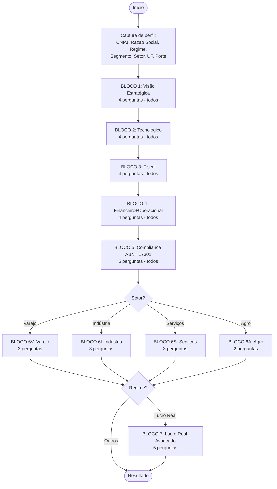

# 08 — Questionário Definitivo do QDI Free v1.0

> **Documento canônico** que define exatamente quais questões o QDI Free v1.0 vai apresentar.
> **Antecedentes:** `05_PERGUNTAS_E_DIMENSOES.md` (estratégico) + `07_ANALISE_PROTOTIPO_OBSERVADO.md` (análise UX).
> **Status:** baseline para implementação no Sprint 1; sujeita à validação por 3 contadores externos antes do GA.
> **Próximo passo:** virar arquivo `db/seeds/perguntas_v1.yaml` no scaffold `018-QUALIDIAGIQ/`.

---

## 1. Resposta Direta

O questionário definitivo do **QDI Free v1.0** combina **21 perguntas núcleo** (respondidas por todos) + **9 perguntas setoriais condicionais** (varejo/indústria/serviços/agro) + **5 perguntas avançadas só para Lucro Real** + perguntas adicionais mantidas para maturidade e ABNT nos arquivos de catálogo, totalizando **37 perguntas no JSON de produção** (`src/infrastructure/questionario/data/perguntas_mvp.json`; versão manifesto **v1-doc-05-full-37**). Cliente típico responde **22-28 perguntas em 12-15 minutos**, com cobertura balanceada das 7 dimensões e ancoragem em **LC 214/2025, EC 132/2023, NT 2025.002 e ABNT NBR 17301:2026**.

## 2. Estrutura do Questionário



**Distribuição por cliente típico:**

| Cenário | Núcleo | Setorial | Regime Avançado | Total |
|---------|--------|----------|------------------|-------|
| Varejo Lucro Real | 21 | 3 | 5 | **29** |
| Indústria Lucro Real | 21 | 3 | 5 | **29** |
| Serviços Lucro Presumido | 21 | 3 | 0 | **24** |
| Agro Simples Nacional | 21 | 2 | 0 | **23** |
| Comércio Lucro Presumido | 21 | 3 | 0 | **24** |

**Tempo médio estimado:** 12-15 min (questões binárias/ternárias respondidas em ~30s cada).

## 3. Perfil de Captura Inicial (Tela 1)

| Campo | Tipo | Obrigatório | Validação |
|-------|------|-------------|-----------|
| Nome completo | string | Sim | Mín. 3 caracteres |
| Nome da empresa (razão social) | string | Sim | Mín. 3 caracteres |
| CNPJ | string | Não (Free) / Sim (Plus) | 14 dígitos + algoritmo Receita Federal |
| Regime tributário | enum | Sim | Simples / Presumido / Real / MEI |
| Segmento | enum | Sim | Comércio / Indústria / Serviços / Agro |
| Setor de atuação | enum | Sim | Lista de ~30 setores derivada da CNAE |
| Faturamento anual | enum | Sim | até R$ 360k / até R$ 4.8M / até R$ 100M / até R$ 500M / R$ 500M+ |
| UF | enum | Sim | 27 UFs |

## 4. Bloco 1 — Visão Estratégica (4 perguntas, peso dimensão = 1.0)

### Q-EST-001 (era Q1 do protótipo)
**Texto:** "Sua empresa já iniciou um plano estruturado de transição para a Reforma Tributária?"
- **Tipo:** Ternária (Sim / Parcialmente / Não)
- **Peso:** 7.5
- **Condicional:** todos
- **Base legal:** EC 132/2023; LC 214/2025
- **Por que importa:** sinaliza maturidade estratégica geral da empresa
- **Trigger Plus:** se "Não" → "Plus gera plano estruturado em 30s via IA"

### Q-EST-002 (era Q3 do protótipo)
**Texto:** "O time fiscal e contábil já mapeou como o novo modelo de créditos e débitos pode afetar o resultado financeiro e a formação de preços?"
- **Tipo:** Ternária
- **Peso:** 8.0
- **Condicional:** todos
- **Base legal:** LC 214/2025 art. 28-32 (não-cumulatividade)
- **Trigger Plus:** se "Não" → "Plus calcula impacto exato em R$ na margem"

### Q-EST-003 (era Q10 do protótipo)
**Texto:** "Sua empresa já revisou suas margens e políticas de preço considerando a tributação no destino e a possibilidade de preços diferenciados por região?"
- **Tipo:** Ternária
- **Peso:** 7.5
- **Condicional:** todos
- **Base legal:** LC 214/2025 art. 5º (princípio do destino)

### Q-EST-004 (era Q8 do protótipo — reclassificada)
**Texto:** "Os contratos comerciais e de prestação de serviços já foram revisados para garantir que os tributos sejam corretamente repassados ou ajustados durante a transição?"
- **Tipo:** Ternária
- **Peso:** 7.0
- **Condicional:** todos
- **Base legal:** LC 214/2025 art. 415 (transição); Código Civil art. 478 (onerosidade excessiva)
- **Trigger Plus:** se "Parcialmente" → "Plus oferece template de minuta de revisão"

---

## 5. Bloco 2 — Tecnológico (4 perguntas, peso dimensão = 1.3)

### Q-TEC-001 (era Q2 do protótipo)
**Texto:** "Seu ERP e sistemas fiscais já estão sendo adaptados para o novo modelo de apuração do IBS e da CBS?"
- **Tipo:** Ternária
- **Peso:** 9.0
- **Condicional:** todos
- **Base legal:** LC 214/2025 art. 12-15; NT 2025.002
- **Trigger Plus:** "Pro conecta direto ao seu Winthor/TOTVS"

### Q-TEC-002 (NOVA — adicionada na evolução)
**Texto:** "Seu sistema fiscal está pronto para os novos campos da NF-e (cClassTrib, cCredPres) e validações da NT 2025.002?"
- **Tipo:** Ternária
- **Peso:** 9.0
- **Condicional:** todos (todos emitem NF-e ou recebem)
- **Base legal:** NT 2025.002; Manual NF-e v6.0+
- **Tooltip:** "cClassTrib é o código de Classificação Tributária introduzido pela Reforma. Sem ele, sua NF-e será rejeitada após a transição."

### Q-TEC-003 (era Q5 do protótipo — reposicionada)
**Texto:** "Sua equipe financeira/TI já estimou o impacto da mudança na forma de recolhimento dos impostos (split payment, retenções automáticas)?"
- **Tipo:** Ternária
- **Peso:** 8.5
- **Condicional:** todos
- **Base legal:** LC 214/2025 art. 200-220 (split payment)
- **Tooltip:** "Split payment = recolhimento automático no momento da liquidação; sai da empresa antes de chegar."

### Q-TEC-004 (NOVA — para serviços, mas relevante a todos)
**Texto:** "Sua empresa monitora ativamente as Notas Técnicas e cronogramas oficiais do CGNFS-e e CGSEFAZ para a transição?"
- **Tipo:** Ternária
- **Peso:** 7.0
- **Condicional:** todos (com peso menor para Simples)
- **Base legal:** NTs 003-007 do CGNFS-e; NT 2025.002 SEFAZ

---

## 6. Bloco 3 — Fiscal (4 perguntas, peso dimensão = 1.5 — MAIOR)

### Q-FISC-001 (era Q4 do protótipo)
**Texto:** "A empresa já avaliou como seus benefícios fiscais e regimes especiais (incentivos estaduais, municipais ou federais) podem ser afetados pela transição até 2033?"
- **Tipo:** Ternária
- **Peso:** 8.5
- **Condicional:** todos
- **Base legal:** ADCT EC 132/2023 art. 130-134 (Fundo de Compensação); LC 214/2025 art. 384-410

### Q-FISC-002 (era Q12 do protótipo)
**Texto:** "Sua empresa já avaliou como a extinção de regimes especiais (como Reporto, Recap, crédito presumido) pode impactar o planejamento tributário de médio prazo?"
- **Tipo:** Ternária
- **Peso:** 7.5
- **Condicional:** todos
- **Base legal:** Lei 11.196/05 (Reporto); Lei 11.488/07 (Recap); LC 214/2025 art. 392

### Q-FISC-003 (era Q13 do protótipo)
**Texto:** "A gestão de créditos de ICMS, PIS e COFINS acumulados está sendo monitorada para evitar perdas antes da transição completa?"
- **Tipo:** Ternária
- **Peso:** 8.5
- **Condicional:** todos
- **Base legal:** Lei 10.637/02; Lei 10.833/03; LC 87/96; LC 214/2025 art. 130-145
- **Trigger Plus:** "Plus estima R$ recuperáveis com base em DCTF/EFD"

### Q-FISC-004 (NOVA — específica Imposto Seletivo)
**Texto:** "Sua empresa identifica produtos sujeitos ao Imposto Seletivo (combustíveis, bebidas alcoólicas, fumo, veículos, ativos minerais) em seu mix de produtos/serviços?"
- **Tipo:** Ternária + opção "Não se aplica ao meu negócio"
- **Peso:** 6.5
- **Condicional:** Setor Comércio, Indústria, Agro
- **Base legal:** EC 132/2023 art. 153, VIII; LC 214/2025 art. 432-450

---

## 7. Bloco 4 — Financeiro + Operacional (4 perguntas, peso dimensão = 1.0)

### Q-FIN-001 (era Q11 do protótipo)
**Texto:** "A gestão de estoques e os regimes de reposição já foram avaliados para evitar perda de créditos tributários na transição?"
- **Tipo:** Ternária
- **Peso:** 7.5
- **Condicional:** todos exceto Serviços puros
- **Base legal:** LC 214/2025 art. 130-135 (transição de créditos)

### Q-OPER-001 (era Q6 do protótipo)
**Texto:** "A empresa possui processos claros para rastrear e controlar créditos tributários entre compras, vendas e serviços?"
- **Tipo:** Ternária
- **Peso:** 8.0
- **Condicional:** todos
- **Base legal:** LC 214/2025 art. 28 (não-cumulatividade plena)

### Q-OPER-002 (era Q7 do protótipo — reclassificada)
**Texto:** "As operações entre filiais, fornecedores e clientes já foram simuladas considerando o novo critério de tributação no destino e seus impactos financeiros e logísticos?"
- **Tipo:** Ternária
- **Peso:** 7.5
- **Condicional:** todos com Médio porte ou superior
- **Base legal:** LC 214/2025 art. 5º (destino); art. 415 (transição)

### Q-OPER-003 (era Q9 do protótipo)
**Texto:** "Sua empresa já iniciou treinamentos internos para gestores e equipes sobre o IBS, CBS, IS e seus efeitos operacionais e financeiros?"
- **Tipo:** Ternária
- **Peso:** 6.5
- **Condicional:** todos
- **Base legal:** Pesquisa PwC (93% Contabilidade + 83% TI lideram equipes)

---

## 8. Bloco 5 — Compliance ABNT NBR 17301 (5 perguntas, peso dimensão = 1.2 — DIFERENCIAL EXCLUSIVO)

> **Apresentação UX especial:** este bloco tem uma tela introdutória educativa: *"Você sabia que existe agora uma norma ABNT específica para compliance tributário? A ABNT NBR 17301:2026 estabelece o padrão pelo qual sua empresa pode certificar sua governança fiscal. Vamos avaliar sua aderência."*

### Q-ABNT-001 — Eixo 1 (Plan)
**Texto:** "Sua empresa possui política interna formal de Compliance Tributário (escrita, aprovada pela alta gestão e divulgada às equipes)?"
- **Tipo:** Escala 1-5 (1 = inexistente; 5 = formal, atualizada, treinada)
- **Peso:** 8.5
- **Condicional:** todos
- **Base legal:** ABNT NBR 17301:2026 cap. 5.1
- **Trigger Plus:** se ≤2 → "Plus gera template editável de Política de Compliance Tributário"

### Q-ABNT-002 — Eixo 2 (Plan + Check)
**Texto:** "A empresa identifica e avalia periodicamente os riscos fiscais (mensal, trimestral ou semestral)?"
- **Tipo:** Escala 1-5
- **Peso:** 8.5
- **Condicional:** todos
- **Base legal:** ABNT NBR 17301:2026 cap. 6.1; ISO 31000

### Q-ABNT-003 — Eixos 3+4 (Do)
**Texto:** "Os controles operacionais sobre obrigações tributárias estão documentados (Instruções de Trabalho, fluxos, ITs)?"
- **Tipo:** Escala 1-5
- **Peso:** 9.0
- **Condicional:** todos
- **Base legal:** ABNT NBR 17301:2026 cap. 7.1
- **Trigger Pro:** se ≤2 → "Pro entrega pré-auditoria completa com plano de remediação"

### Q-ABNT-004 — Eixo 6 (Check)
**Texto:** "A empresa monitora obrigações tributárias de forma contínua (não apenas no fechamento mensal/trimestral)?"
- **Tipo:** Escala 1-5
- **Peso:** 8.0
- **Condicional:** todos
- **Base legal:** ABNT NBR 17301:2026 cap. 9

### Q-ABNT-005 — Eixo 7 (Act) + Programa Confia
**Texto:** "Existe mecanismo formal de melhoria contínua dos processos tributários (revisões periódicas, ações corretivas, lessons learned)?"
- **Tipo:** Escala 1-5
- **Peso:** 7.5
- **Condicional:** todos
- **Base legal:** ABNT NBR 17301:2026 cap. 10; Programa Confia da Receita Federal

---

## 9. Bloco 6 — Setoriais Condicionais (2-3 perguntas por setor)

### 9.1. Bloco 6V — Varejo e Atacado (3 perguntas)

**Apresentado se:** Setor de Atuação ∈ {Varejo, Atacado, Atacarejo, Supermercado, E-commerce, Magazine, Drogaria}

#### Q-VAREJO-001 (era Q14 do protótipo)
**Texto:** "No Varejo e Atacado, a empresa já analisou o impacto do novo modelo de créditos e débitos na margem de lucro e na precificação de produtos?"
- **Tipo:** Ternária
- **Peso:** 8.0
- **Base legal:** LC 214/2025 art. 28; Convênios ICMS atuais
- **Trigger Plus:** "Plus calcula nova margem por SKU/categoria"

#### Q-VAREJO-002 (NOVA)
**Texto:** "Sua operação tem alto volume de produtos atualmente sob ICMS-Substituição Tributária, e você já avaliou o impacto do fim desse regime?"
- **Tipo:** Ternária
- **Peso:** 9.0
- **Base legal:** Convênios ICMS; LC 214/2025 art. 60-65
- **Tooltip:** "ICMS-ST será extinto na transição; muda profundamente o capital de giro varejista"

#### Q-VAREJO-003 (NOVA)
**Texto:** "Sua empresa avaliou impacto na cesta básica e em produtos com alíquota reduzida (saúde, educação, agro) que comercializa?"
- **Tipo:** Ternária + "Não comercializo esses produtos"
- **Peso:** 6.5
- **Base legal:** LC 214/2025 art. 9º (cesta básica); art. 137 (saúde); art. 145 (educação)

### 9.2. Bloco 6I — Indústria (3 perguntas)

**Apresentado se:** Segmento = Indústria

#### Q-IND-001
**Texto:** "Sua indústria já avaliou impacto na cadeia de suprimentos com a tributação no destino (fornecedores, CDs, transferências entre filiais)?"
- **Tipo:** Ternária
- **Peso:** 8.5
- **Base legal:** LC 214/2025 art. 5º; art. 50

#### Q-IND-002
**Texto:** "Sua empresa monitora os impactos da extinção do IPI (exceto Zona Franca de Manaus) sobre seu mix de produtos?"
- **Tipo:** Ternária + "Não se aplica"
- **Peso:** 7.0
- **Base legal:** EC 132/2023 art. 153, IV; LC 214/2025 art. 451-460

#### Q-IND-003
**Texto:** "Sua indústria já avaliou impactos da Contribuição sobre Bens e Serviços (CBS) na cadeia produtiva (insumos, tributos sobre energia, créditos)?"
- **Tipo:** Ternária
- **Peso:** 8.0
- **Base legal:** LC 214/2025 art. 12-15

### 9.3. Bloco 6S — Serviços (3 perguntas)

**Apresentado se:** Segmento = Serviços

#### Q-SERV-001
**Texto:** "Sua emissão de NFS-e está sendo adequada ao novo layout RTC (NTs 003 a 007 do CGNFS-e)?"
- **Tipo:** Ternária
- **Peso:** 9.0
- **Base legal:** NTs 003-007 do CGNFS-e

#### Q-SERV-002
**Texto:** "Sua empresa já avaliou o impacto da nova alíquota IBS+CBS sobre serviços (que pode ser maior que ISS+PIS+COFINS atual)?"
- **Tipo:** Ternária
- **Peso:** 8.5
- **Base legal:** LC 214/2025 art. 12-15; pesquisa setorial

#### Q-SERV-003
**Texto:** "Sua empresa atua em setor com alíquota diferenciada (saúde, educação, transporte coletivo) e já avaliou os benefícios?"
- **Tipo:** Ternária + "Não se aplica"
- **Peso:** 6.5
- **Base legal:** LC 214/2025 art. 137 (saúde), 145 (educação), 156 (transporte)

### 9.4. Bloco 6A — Agro (2 perguntas)

**Apresentado se:** Segmento = Agro

#### Q-AGRO-001
**Texto:** "Sua empresa do agro já avaliou impactos da redução de alíquota de 60% (regime diferenciado da Reforma) sobre produtos agropecuários?"
- **Tipo:** Ternária
- **Peso:** 8.5
- **Base legal:** LC 214/2025 art. 138-141

#### Q-AGRO-002
**Texto:** "Sua empresa avalia impactos do crédito presumido ao produtor rural pessoa física e da apropriação por agroindústrias?"
- **Tipo:** Ternária
- **Peso:** 7.5
- **Base legal:** LC 214/2025 art. 165-170

---

## 10. Bloco 7 — Lucro Real Avançado (5 perguntas, condicional)

**Apresentado se:** Regime = Lucro Real **e** Faturamento > R$ 100M

### Q-REAL-001
**Texto:** "Sua empresa avaliou reestruturações societárias (filiais, holding, fusões, cisões) considerando a transição tributária?"
- **Tipo:** Ternária
- **Peso:** 7.5
- **Base legal:** Pesquisa PwC (31% empresas avaliam reestruturação); Lei 6.404/76 art. 226

### Q-REAL-002
**Texto:** "Sua empresa atua como substituto tributário no novo modelo CBS/IBS e já preparou os controles necessários?"
- **Tipo:** Ternária + "Não se aplica"
- **Peso:** 7.0
- **Base legal:** LC 214/2025 art. 60-65

### Q-REAL-003
**Texto:** "Sua tesouraria projetou cenários de fluxo de caixa 2026-2033 com sensibilidade às alíquotas de transição?"
- **Tipo:** Ternária
- **Peso:** 8.0
- **Base legal:** Cronograma transição EC 132/2023; LC 214/2025 art. 384-410
- **Trigger Plus:** "Plus simula 3 cenários (otimista/realista/pessimista) com sensibilidade ajustável"

### Q-REAL-004
**Texto:** "Sua empresa avaliou impactos da Reforma sobre Imposto sobre a Renda da Pessoa Jurídica (IRPJ) e Contribuição Social sobre o Lucro Líquido (CSLL)?"
- **Tipo:** Ternária
- **Peso:** 6.5
- **Base legal:** Lei 9.430/96; CPC 32

### Q-REAL-005
**Texto:** "A empresa tem governança contratual para Cláusulas de Repactuação Tributária em contratos longos (> 12 meses)?"
- **Tipo:** Ternária
- **Peso:** 7.0
- **Base legal:** Código Civil art. 478; jurisprudência STJ sobre onerosidade excessiva

---

## 11. Algoritmo de Cálculo de Score

### 11.1. Conversão de respostas em pontos

| Tipo | Sim | Parcialmente | Não | Não se aplica |
|------|-----|--------------|-----|----------------|
| **Ternária** | 100 | 50 | 0 | (excluído) |
| **Escala 1-5** | 1=0; 2=25; 3=50; 4=75; 5=100 | — | — | — |

### 11.2. Score por dimensão

```python
def score_dimensao(respostas_dimensao: list[Resposta]) -> float:
    """
    Score 0-100 da dimensão = média ponderada.

    Fórmula:
        score = sum(pontos_obtidos × peso) / sum(peso)
    """
    soma_pontos = sum(r.pontos × r.pergunta.peso for r in respostas_dimensao)
    soma_pesos = sum(r.pergunta.peso for r in respostas_dimensao)
    return soma_pontos / soma_pesos if soma_pesos > 0 else 0
```

### 11.3. Score Geral

```python
def score_geral(scores_por_dimensao: dict[Dimensao, float]) -> float:
    """
    Score geral = média ponderada dos scores por dimensão.

    Pesos de dimensão:
        Fiscal: 1.5
        Tecnológica: 1.3
        Compliance ABNT: 1.2
        Estratégica: 1.0
        Contábil: 1.0
        Financeira: 1.0
        Operacional: 1.0
    """
    pesos = {
        Dimensao.FISCAL: 1.5,
        Dimensao.TECNOLOGICA: 1.3,
        Dimensao.COMPLIANCE_ABNT: 1.2,
        Dimensao.ESTRATEGICA: 1.0,
        Dimensao.CONTABIL: 1.0,
        Dimensao.FINANCEIRA: 1.0,
        Dimensao.OPERACIONAL: 1.0,
    }
    soma = sum(scores_por_dimensao[d] × pesos[d] for d in pesos)
    soma_pesos = sum(pesos.values())  # = 7.0
    return soma / soma_pesos
```

### 11.4. Score ABNT especial (PDCA)

Além do score por dimensão, o bloco ABNT gera **score PDCA específico** com 4 valores:

| Estágio PDCA | Calculado a partir de |
|--------------|------------------------|
| **Plan** | Q-ABNT-001 + Q-ABNT-002 |
| **Do** | Q-ABNT-003 |
| **Check** | Q-ABNT-002 + Q-ABNT-004 |
| **Act** | Q-ABNT-005 |

Esse score PDCA aparece como **gráfico próprio no relatório** — diferencial exclusivo do QDI.

## 12. Saída Esperada (output do Free)

### 12.1. Score Geral

```
Score Geral: 47/100 — Nível "Inicial"
```

### 12.2. Score por Dimensão (radar)

```
Fiscal:               55/100 (Intermediário)
Estratégica:          40/100 (Inicial)
Contábil:             50/100 (Intermediário)
Financeira:           35/100 (Inicial)
Operacional:          60/100 (Intermediário)
Tecnológica:          25/100 (Crítico)
Compliance ABNT:      30/100 (Inicial) ← diferencial exclusivo do QDI
```

### 12.3. Score PDCA ABNT

```
Plan:    35/100
Do:      40/100
Check:   25/100
Act:     20/100
```

### 12.4. Top 5 Gaps Críticos

Identificados automaticamente pelas perguntas com `pontos × peso < 200`:

```
1. Q-TEC-002 (cClassTrib) — Crítico
   Base legal: NT 2025.002
   "Plus calcula impacto exato em R$"

2. Q-ABNT-003 (Controles operacionais) — Crítico
   Base legal: ABNT NBR 17301 cap. 7.1
   "Pro entrega pré-auditoria completa"

3. ...
```

## 13. Validação Externa Recomendada

Antes do GA do QDI Free, este questionário deve ser revisado por:

| Revisor | Foco | Critério |
|---------|------|----------|
| **Contador externo (PME)** | Clareza para empresas pequenas | Compreensão sem ajuda de tributarista |
| **Contador externo (Lucro Real)** | Profundidade técnica | Diferenciação real entre tiers |
| **Advogado tributarista** | Base legal | Citações dispositivo a dispositivo corretas |

## 14. Próximos Passos para Implementação

| # | Passo | Responsável | Tempo |
|---|-------|--------------|-------|
| 1 | Validar este questionário com Allan | Allan | 30 min |
| 2 | Validar com 3 contadores externos | Allan + parceiros | 1 semana |
| 3 | Redigir ADR-009 (Modelo de Score do QDI) | Allan + Claude | 1 dia |
| 4 | Implementar como YAML em `db/seeds/perguntas_v1.yaml` | Allan + Claude | 1 dia |
| 5 | Implementar motor de score em `src/application/use_cases/calcular_score.py` | Allan + Claude | 2 dias |
| 6 | Implementar wizard adaptativo em `frontend/app/diagnostico/` | Allan + Claude | 4 dias |
| 7 | Calibração inicial com 5 cases sintéticos | Allan + Claude | 1 dia |

## 15. Volume Total

- **37 perguntas no arquivo de catálogo** (motor adaptativo por perfil; volume efetivo de resposta 22–28 conforme empresa)
- **22-28 perguntas respondidas por cliente** (depende de setor + regime e catálogo filtrado)
- **12-15 minutos de execução** (target)
- **7 dimensões avaliadas** com 21 níveis de granularidade
- **Score 0-100 + PDCA ABNT + top 5 gaps + recomendações**

---

> **Este documento é o blueprint do QDI Free v1.0.** Após validação Allan + 3 contadores, vira ADR-009 + arquivo YAML pronto para implementação.
