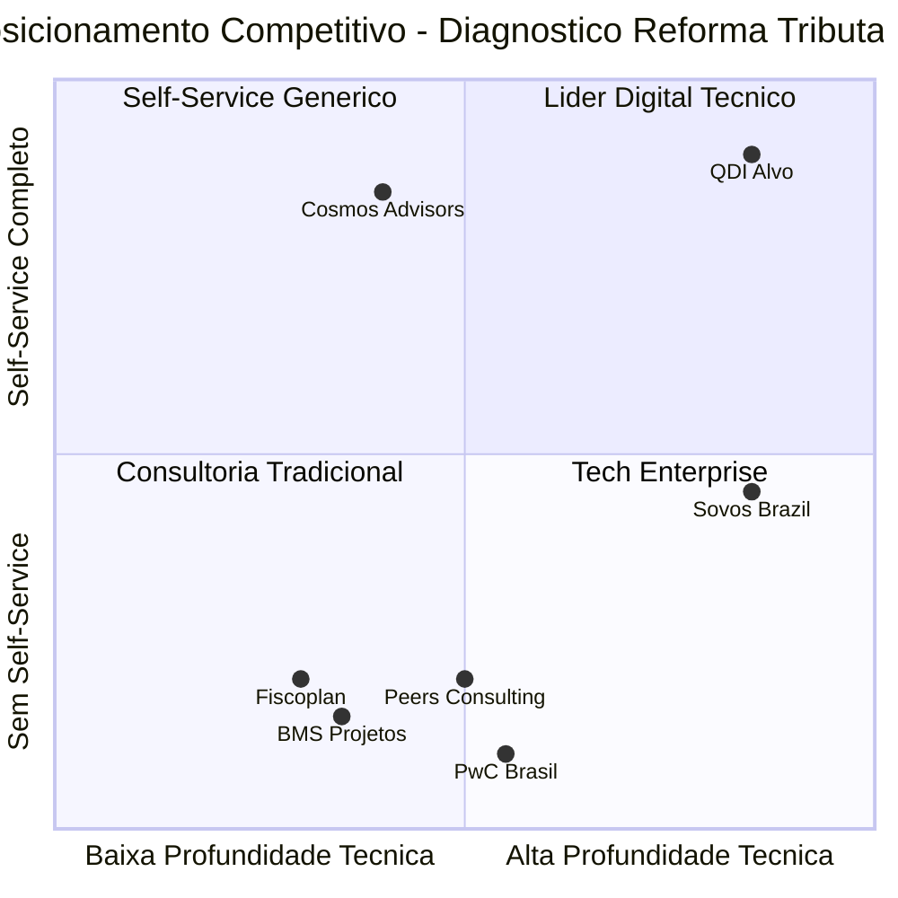

# 00 — Matriz Comparativa de Concorrentes (consolidado)

> **Síntese cruzada dos 7 concorrentes/referências** analisados em `02_BENCHMARK_CONCORRENTES/`
> **Fonte:** documentos individuais 01–07
> **Data:** 2026-04-26
> **Aplicabilidade:** insumo direto do PRD do **QualiDiagIQ (QDI)** — base para gap analysis (`03_GAP_ANALYSIS_QDI/`)

---

## 1. Painel Sintético — Identificação e Tipologia

| Sigla | Concorrente | Tipo | Origem | Foco principal |
|-------|-------------|------|--------|----------------|
| C1 | **Cosmos Advisors** — Radar Reforma | **Ferramenta digital (SaaS gratuito)** | BR (2020) | Diagnóstico self-service 5 min |
| C2 | **BMS Projetos** | Consultoria tributária | BR (3.500 clientes) | Metodologia 4 fases × 15 ações |
| C3 | **Sovos Brazil** | **SaaS fiscal global** | EUA (mais de 70 países) | Motor tributário + plataforma S1 |
| C4 | **PwC Brasil** | Big Four — pesquisa de mercado | Global | Estudo "Tributos no Centro" |
| C5 | **Fiscoplan** | Consultoria fiscal | BR (Juiz de Fora-MG) | Auditoria fiscal 4 etapas |
| C6 | **Peers Consulting** | Consultoria de transformação | BR | Setorial varejo |
| C7 | **ABNT NBR 17301** | Norma técnica brasileira | ABNT/RFB (2026) | Framework de compliance tributário |

---

## 2. Matriz Cruzada — 15 Dimensões Comparativas

| # | Dimensão | C1 Cosmos | C2 BMS | C3 Sovos | C4 PwC | C5 Fiscoplan | C6 Peers | C7 ABNT 17301 | **QDI (alvo)** |
|---|----------|-----------|--------|----------|--------|--------------|----------|---------------|----------------|
| 1 | **Produto digital self-service** | ✅ Sim | ❌ Não | 🟡 Parcial (não é diagnóstico) | ❌ Não | ❌ Não | ❌ Não | N/A | ✅ Sim |
| 2 | **Score numérico (0-100)** | ✅ Sim | ❌ Não | ❌ Não | ❌ Não | ❌ Não | ❌ Não | N/A | ✅ Sim |
| 3 | **Modelo comercial** | Freemium/Lead | Consultoria | SaaS pago | Estudo | Consultoria | Consultoria | Norma | Freemium → SaaS |
| 4 | **Tempo de execução prometido** | 5 min | Set/2025–2033 | Não declarado | N/A | Não declarado | Não declarado | N/A | 5–15 min + 30s relatório |
| 5 | **Adaptatividade (perguntas condicionais)** | ✅ Sim (segmento + regime) | ❌ Não | ❌ Não | ❌ Não | ❌ Não | ❌ Não | N/A | ✅ Sim (segmento + regime + porte + UF) |
| 6 | **Ancoragem ABNT NBR 17301** | ❌ Não | ❌ Não | ❌ Não | ❌ Não | ❌ Não | ❌ Não | ✅ Self | ✅ Sim (diferencial) |
| 7 | **Integração ERP nativa** | ❌ Não | ❌ Não | 🟡 "Integrações ERP" genérico | ❌ Não | ❌ Não | ❌ Não | N/A | ✅ Sim (Winthor → TOTVS → SAP) |
| 8 | **IA / LLM declarada** | ❌ Não | ❌ Não | ❌ Não | ❌ Não | ❌ Não | ❌ Não | N/A | ✅ Sim (RAG + LangGraph) |
| 9 | **Ancoragem legal explícita (LC 214, EC 132)** | ❌ Não | ✅ Sim | 🟡 Genérica | 🟡 Contextual | ❌ Não | ❌ Não | N/A | ✅ Sim (artigo a artigo) |
| 10 | **Setorialização** | 🟡 3 macro (Comércio/Indústria/Serviços) | ✅ Alto/Médio impacto | 🟡 Cita setores | 🟡 Cita Agro/Consumo | 🟡 Genérico | ✅ Varejo profundo | N/A | ✅ CNAE/setor + subsegmentos |
| 11 | **Framework PDCA / ciclo de melhoria** | ❌ Não | ❌ Não | ❌ Não | ❌ Não | ❌ Não | 🟡 Implícito | ✅ Self | ✅ Sim (espinha dorsal) |
| 12 | **Cobertura temporal** | 18 meses | 2025–2033 | Não declarado | N/A | Não declarado | Não declarado | N/A | 2026–2033 |
| 13 | **Output principal** | Relatório + heatmap + cronograma | Diagnóstico + 10 itens checklist | Suite produtos (TaxRules, Events, Intelligence) | Release + 19 estatísticas | Relatório auditoria | Diagnóstico personalizado | Norma certificável | Dashboard + PDF + simulador |
| 14 | **Lead magnet self-service** | ✅ Sim (diagnóstico gratuito) | 🟡 Newsletter | 🟡 Artigo | ❌ Release | 🟡 Calculadora + ebook | 🟡 PDF gated | N/A | ✅ Sim (diagnóstico interativo + relatório completo) |
| 15 | **Stack técnico declarado** | Lovable.app (no-code) | Não disponível | API-first proprietário | N/A | Não disponível | Não disponível | N/A | FastAPI + Supabase + Next.js |

**Legenda:** ✅ Sim · ❌ Não · 🟡 Parcial · N/A Não Aplicável

---

## 3. Posicionamento Visual no Mapa Competitivo

**Interpretação do mapa:**
- **Quadrante 1 (alto técnico + alto self-service):** **vazio hoje** — espaço-alvo do QDI.
- **Quadrante 2:** Cosmos ocupa sozinho — mas com stack low-code (limite técnico).
- **Quadrante 3:** consultorias tradicionais (BMS, Fiscoplan, Peers, PwC).
- **Quadrante 4:** Sovos com stack robusto, mas sem foco em diagnóstico self-service.

---

## 4. Padrões Observados

### 4.1. Convergências (todos concordam)

| Tema | Cobertura |
|------|-----------|
| Reforma exige diagnóstico inicial obrigatório | 7/7 |
| Áreas avaliadas convergem em Fiscal + TI + Comercial + Operacional | 7/7 |
| Janela crítica é 2026-2027 para preparação | 6/7 (exceto ABNT que não datatempora) |
| Ancoragem legal mínima em EC 132/2023 + LC 214/2025 | 5/7 (Cosmos, Fiscoplan e Peers omitem) |
| Equipes multidisciplinares são essenciais | 6/7 |

### 4.2. Divergências (cada um defende algo único)

| Concorrente | Tese-âncora própria |
|-------------|----------------------|
| Cosmos | "Score 0-100 + heatmap + 5 minutos" |
| BMS | "Jornada de 8 anos com 15 ações" |
| Sovos | "Ecossistema integrado API-first" |
| PwC | "83% das empresas esperam alto impacto" (autoridade quantitativa) |
| Fiscoplan | "Auditoria gera economia, não custo" |
| Peers | "Risco fiscal vira vantagem competitiva no varejo" |
| ABNT | "Idioma comum entre fisco e contribuinte (PDCA + Confia)" |

### 4.3. Ausências universais (lacunas competitivas)

Nenhum dos 7 concorrentes oferece:

1. **Simulador numérico real CBS+IBS+IS por SKU/categoria** — todos usam linguagem qualitativa.
2. **Integração ERP nativa** com leitura de dados reais — todos dependem de respostas auto-declaradas.
3. **Score relativo benchmark setorial anônimo** — comparação com pares de mesmo porte/setor.
4. **Aderência ABNT NBR 17301** declarada e operacionalizada — apenas o C7 cita-se a si mesma.
5. **IA/LLM** para gerar plano de ação personalizado.
6. **RAG sobre base legal versionada** (LC 214, LC 225, NTs).
7. **Análise quantitativa de fluxo de caixa 2026-2033** com sensibilidade a alíquotas.
8. **Análise específica ICMS-ST → IBS/CBS** com cálculo de capital de giro afetado.
9. **Trilha educacional integrada** ao diagnóstico.
10. **White-label para contadores/consultorias** revenderem o diagnóstico.

→ **10 vetores de diferenciação** disponíveis para o QDI ocupar.

---

## 5. Modelo de Maturidade da Concorrência

### Estágio 1 — Conteúdo (consultorias tradicionais)
**Concorrentes:** BMS, Fiscoplan, Peers
**Característica:** publicam artigos didáticos como lead magnet textual; entrega depende de projeto humano.

### Estágio 2 — Pesquisa de mercado (Big Four)
**Concorrentes:** PwC
**Característica:** publicam estudos quantitativos com autoridade reputacional; sem produto digital.

### Estágio 3 — SaaS fiscal enterprise (vendor global)
**Concorrentes:** Sovos
**Característica:** suite integrada com motor + monitoring + analytics; foco em grandes clientes; sem ferramenta self-service de diagnóstico.

### Estágio 4 — Diagnóstico digital self-service (gap atual)
**Concorrentes:** Cosmos Advisors (sozinho)
**Característica:** ferramenta gratuita com score; stack low-code (Lovable.app).

### Estágio 5 — Diagnóstico digital + IA + integração ERP (vazio)
**Alvo do QDI.**
**Característica:** unifica self-service + score + IA + integração ERP + RAG legal + benchmark setorial + aderência ABNT NBR 17301.

---

## 6. Tabela-Síntese Strengths × Weaknesses do Conjunto

| Forças coletivas (o que o mercado já fez bem) | Fraquezas coletivas (gaps a explorar) |
|----------------------------------------------|---------------------------------------|
| Estrutura em 4 fases (BMS) — boa para wizard | Score quantitativo sem benchmark relativo (apenas Cosmos tem score, sem comparativo) |
| Checklist 7 componentes (Sovos) — bom para questionário | Nenhum integra ERP — todos dependem de auto-declaração |
| Heatmap visual + cronograma (Cosmos) — bom para output | Nenhum cita ABNT NBR 17301 (publicada em jan/2026) |
| Estatísticas robustas (PwC) — boas para benchmark | Nenhum usa IA/LLM declarada |
| 4 etapas auditoria (Fiscoplan) — boas para checklist | Nenhum simula numericamente CBS+IBS+IS por SKU |
| Setorialização varejo (Peers) — boa para verticalização | Nenhum oferece white-label para contadores |
| Norma + PDCA (ABNT) — bom framework | Stack low-code (Cosmos) limita evolução técnica |

---

## 7. Convergência → Decisões de Produto QDI

A matriz cruzada confirma 5 decisões fundacionais do QDI:

1. **Score numérico 0-100 com 6+ dimensões + benchmark relativo setorial** — copiar Cosmos + adicionar benchmark (PwC dá os dados).
2. **Cronograma temporal 3-6 / 6-12 / 12-18 / 18-36 / 36-96 meses** — estender o de Cosmos até 2033 (BMS dá referência completa).
3. **Aderência ABNT NBR 17301 como pilar transversal** — diferencial exclusivo no mercado.
4. **Integração ERP nativa (Winthor primeiro)** — único do mercado.
5. **IA/LLM para plano de ação personalizado + RAG sobre LC 214** — único do mercado.

→ Esses cinco pilares formam a **proposta de valor única do QDI** em relação ao conjunto analisado.

---

**Próximo documento:** `03_GAP_ANALYSIS_QDI/gap_analysis_oportunidades.md` — aprofunda os 10 vetores de diferenciação em ações concretas.
